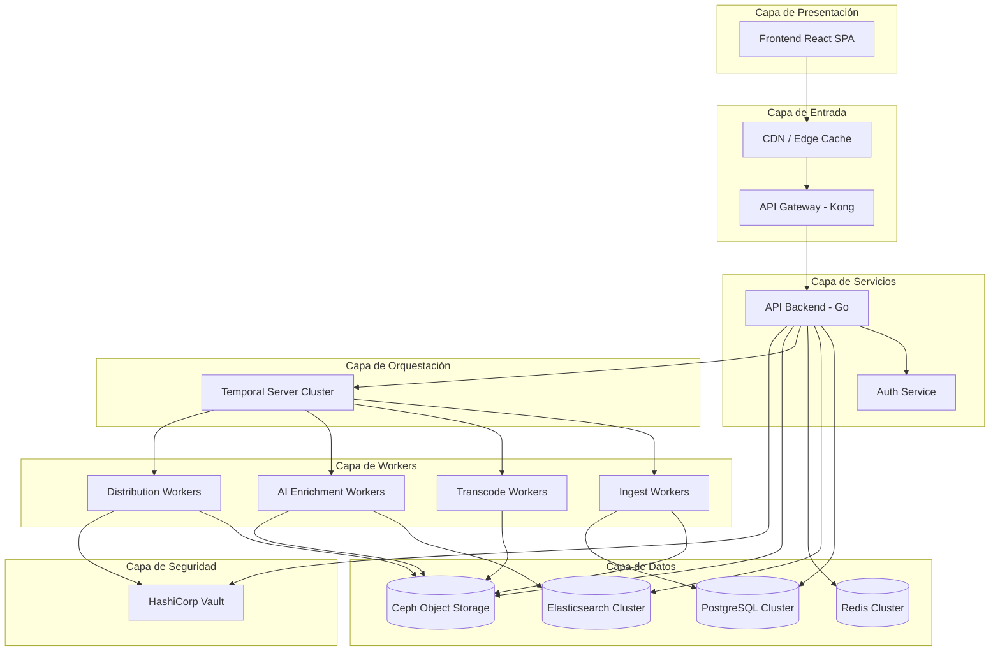
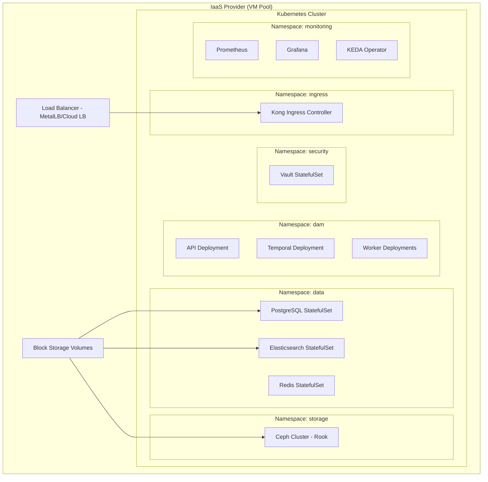
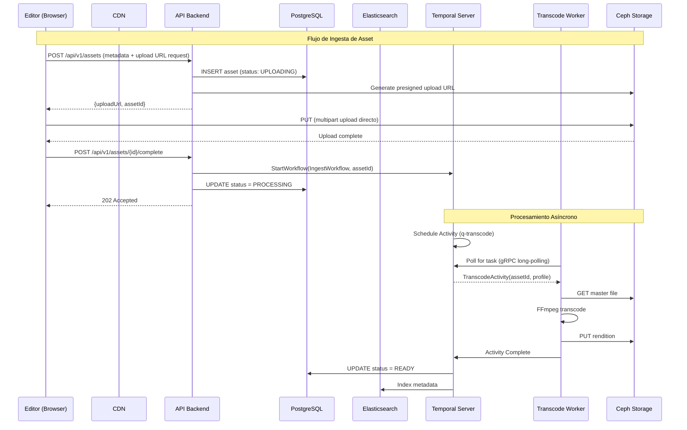
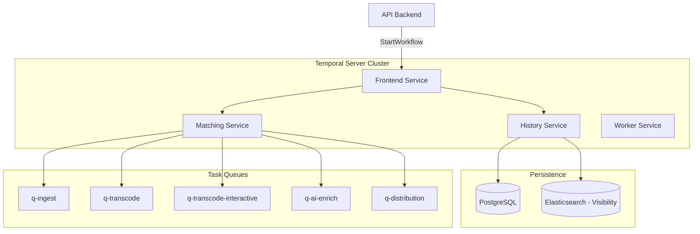
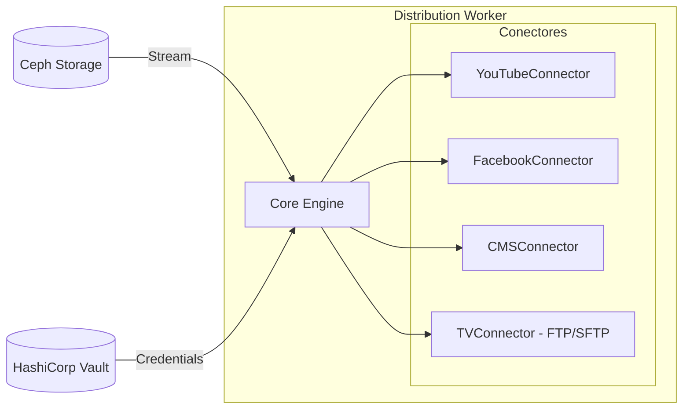
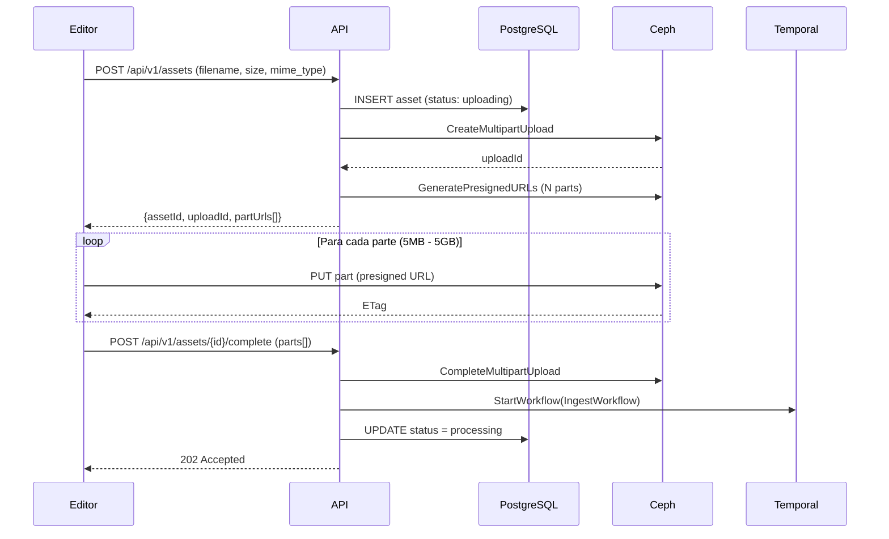
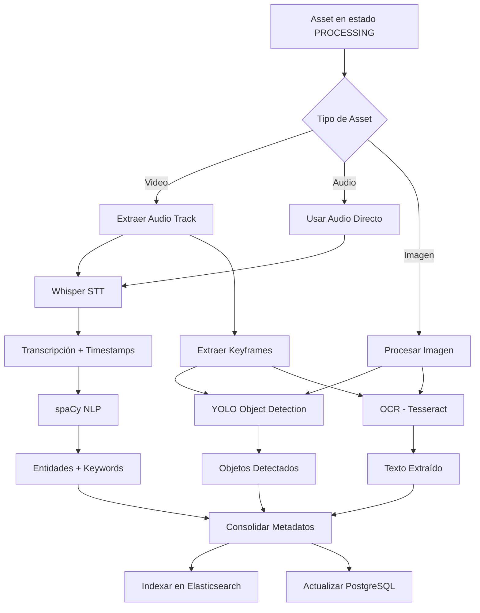
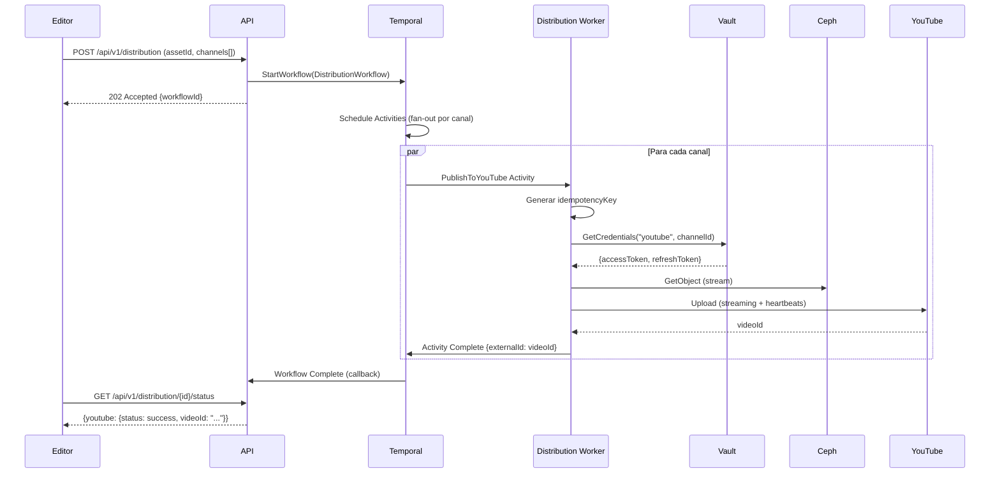
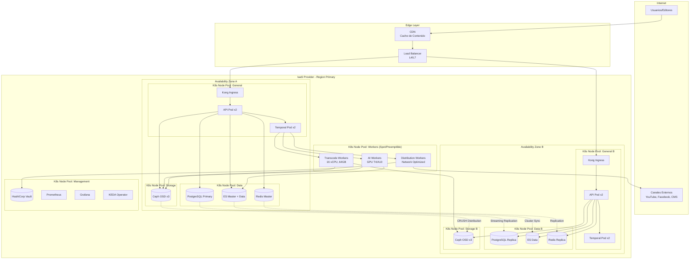

# Plataforma de Gestión de Activos Digitales (DAM) para Medios de Comunicación


**72.40 Ingeniería de Software**

---

**Alumnos:**

- Roman Berruti - 63533
- Tomás Pinausig - 63167
- Agostina Squillari - 64047

**Docentes:**

- Sotuyo Dodero, Juan Martín
- Mogni, Guido Matías

**Diciembre 2024**

---

## Índice

1. [Introducción](#1-introducción)
2. [Funcionalidad Requerida](#2-funcionalidad-requerida)
   - 2.1 Requerimientos Funcionales
   - 2.2 Requerimientos No Funcionales
3. [Atributos de Calidad](#3-atributos-de-calidad)
   - 3.1 Escalabilidad
   - 3.2 Performance
   - 3.3 Disponibilidad
   - 3.4 Confiabilidad
   - 3.5 Tolerancia a Fallos
   - 3.6 Interoperabilidad
   - 3.7 Seguridad
4. [Arquitectura del Sistema](#4-arquitectura-del-sistema)
   - 4.1 Vista General de la Arquitectura
   - 4.2 Deployment en Kubernetes sobre IaaS
   - 4.3 Overview de Servicios y Comunicación
   - 4.4 Frontend (Aplicación Web)
   - 4.5 API Gateway y Backend
   - 4.6 Base de Datos Relacional (PostgreSQL)
   - 4.7 Motor de Búsqueda e Indexación (Elasticsearch)
   - 4.8 Almacenamiento de Objetos (Ceph)
   - 4.9 Orquestación de Flujos de Trabajo (Temporal)
   - 4.10 Workers Especializados
   - 4.11 Gestión de Secretos (HashiCorp Vault)
   - 4.12 Caché y Sesiones (Redis)
   - 4.13 CDN y Entrega de Contenido
5. [Puntos Críticos del Sistema](#5-puntos-críticos-del-sistema)
   - 5.1 Ingesta de Archivos de Gran Tamaño
   - 5.2 Transcodificación y Generación de Renditions
   - 5.3 Enriquecimiento con Inteligencia Artificial
   - 5.4 Búsqueda Rápida sobre Millones de Activos
   - 5.5 Distribución Automatizada a Canales Externos
6. [Vista Física del Sistema](#6-vista-física-del-sistema)
   - 6.1 Diagrama de Infraestructura
   - 6.2 Topología de Red
   - 6.3 Especificaciones de Hardware
7. [Supuestos, Riesgos, No Riesgos y Trade-offs](#7-supuestos-riesgos-no-riesgos-y-trade-offs)
   - 7.1 Supuestos
   - 7.2 Riesgos
   - 7.3 No Riesgos
   - 7.4 Trade-offs
8. [Referencias](#8-referencias)

---

## 1. Introducción

Este trabajo define una arquitectura candidata para una Plataforma de Gestión de Activos Digitales (DAM) destinada a un grupo de medios de comunicación que administra millones de archivos de video, audio e imágenes. El objetivo del sistema es permitir el almacenamiento a largo plazo de activos originales (masters), la generación y gestión de versiones derivadas (renditions) para distintos canales, la indexación inteligente mediante metadatos y análisis de contenido con IA, y una búsqueda rápida para los editores. Asimismo, la plataforma automatiza la distribución multicanal (web, TV y redes sociales), garantizando recuperación eficiente de archivos grandes y escalabilidad ante el crecimiento continuo del volumen de datos.

La solución propuesta se diseña siguiendo el modelo 4+1 de documentación de arquitecturas, priorizando decisiones justificadas por atributos de calidad y considerando la restricción de evitar vendor lock-in mediante el uso exclusivo de infraestructura como servicio (IaaS).

Dadas estas características, el sistema presenta desafíos arquitectónicos significativos en términos de escalabilidad, performance, durabilidad y desacoplamiento, que motivan la definición de una arquitectura orientada a microservicios distribuidos y procesamiento asíncrono.

---

## 2. Funcionalidad Requerida

### 2.1 Requerimientos Funcionales

El sistema debe cumplir con los siguientes requerimientos funcionales, ordenados por prioridad:

1. **Almacenamiento de activos digitales:** Permitir el almacenamiento de archivos digitales de gran tamaño, incluyendo videos, audios e imágenes, garantizando su conservación a largo plazo con durabilidad de datos.
2. **Recuperación y descarga de activos:** Permitir la recuperación y descarga de activos digitales, incluyendo archivos de gran tamaño, facilitando su acceso para el uso editorial con tiempos de respuesta adecuados.
3. **Indexación inteligente con metadatos y análisis de IA:** Asociar metadatos descriptivos a cada activo digital y complementar dicha información mediante análisis automático del contenido utilizando técnicas de inteligencia artificial (transcripción, reconocimiento de objetos, OCR).
4. **Búsqueda rápida y eficiente:** Permitir a los usuarios realizar búsquedas rápidas y eficientes sobre el conjunto de activos digitales, utilizando tanto metadatos manuales como información derivada del análisis de contenido.
5. **Distribución automatizada multicanal:** Automatizar la distribución de los activos digitales a múltiples canales de salida, tales como plataformas web, televisión y redes sociales, con trazabilidad completa del proceso.

### 2.2 Requerimientos No Funcionales

1. **Escalabilidad masiva:** El sistema debe soportar millones de activos y un crecimiento continuo del volumen de datos, sin degradación significativa del servicio.
2. **Performance editorial:** La plataforma debe ofrecer tiempos de respuesta adecuados para uso editorial, tanto en búsquedas (sub-segundo) como en accesos de activos.
3. **Eficiencia en archivos grandes:** La recuperación de archivos grandes debe realizarse de manera eficiente y confiable, evitando esperas excesivas en los flujos de trabajo de los editores.
4. **Escalabilidad horizontal:** El sistema debe ser escalable horizontalmente, permitiendo aumentar la capacidad de almacenamiento y procesamiento sin afectar la operación normal.
5. **Durabilidad de datos:** La plataforma debe garantizar la conservación a largo plazo de los activos, evitando pérdida o corrupción de información.
6. **Alta disponibilidad:** El sistema debe asegurar una alta disponibilidad del servicio para los usuarios internos, minimizando interrupciones y manteniendo continuidad operativa ante fallas.
7. **Seguridad corporativa:** Debe contar con mecanismos de seguridad acordes a un entorno corporativo: control de accesos, protección de datos y trazabilidad de acciones relevantes.
8. **No vendor lock-in:** La solución debe limitarse a infraestructura (IaaS), evitando dependencias de servicios gestionados o propietarios que generen vendor lock-in.

---

## 3. Atributos de Calidad

Los atributos de calidad se presentan ordenados por prioridad según el impacto en el negocio y los requerimientos del sistema.

### 3.1 Escalabilidad (Prioridad: Crítica)

La escalabilidad es el atributo de calidad más crítico para la plataforma. El sistema debe administrar millones de archivos y acompañar un incremento constante a lo largo del tiempo. En el contexto de un DAM para medios, los archivos no se eliminan, sino que se conservan como parte del patrimonio digital, lo que exige que la arquitectura pueda crecer de manera sostenida, especialmente en términos de almacenamiento y procesamiento asociado al análisis de contenido y transcodificación.

**Justificación de negocio:** Un grupo de medios genera contenido continuamente. La incapacidad de escalar implicaría detener la ingesta de nuevo material o degradar el servicio existente, impactando directamente la operación editorial.

**Táctica arquitectónica:** Arquitectura de microservicios desplegada en Kubernetes con escalado horizontal automático basado en métricas de carga (KEDA).

### 3.2 Performance (Prioridad: Crítica)

El rendimiento es un atributo central dado que condiciona directamente la operación editorial. Se exige una "búsqueda rápida" y se marca como esencial la "velocidad de recuperación de archivos grandes". Para el editor, el valor del sistema está en poder localizar material relevante y obtener una previsualización rápidamente.

**Justificación de negocio:** Si la búsqueda tarda varios segundos o la recuperación de un video se vuelve impredecible, el flujo de trabajo se interrumpe y el DAM deja de ser una herramienta habilitante para convertirse en un cuello de botella operativo.

**Táctica arquitectónica:** Elasticsearch como motor de búsqueda optimizado, tiering de almacenamiento (hot/cold), CDN para entrega de contenido y caché Redis para metadatos frecuentes.

### 3.3 Disponibilidad (Prioridad: Alta)

La disponibilidad constituye uno de los atributos más críticos. La indisponibilidad del sistema impacta de manera directa en la capacidad de producir, editar y publicar contenidos. La plataforma DAM es utilizada de forma intensiva por editores, productores y sistemas automatizados de publicación que dependen del acceso continuo a los activos digitales.

**Justificación de negocio:** Dado que el contenido puede ser requerido en distintos momentos del día y para múltiples canales, no existen períodos prolongados de inactividad en los que una caída del sistema resulte aceptable.

**Táctica arquitectónica:** Replicación de todos los componentes stateful (PostgreSQL, Elasticsearch, Ceph), despliegue multi-zona y health checks automatizados.

### 3.4 Confiabilidad (Prioridad: Alta)

La confiabilidad es necesaria ya que la plataforma debe operar de manera consistente y predecible, minimizando fallas y errores a lo largo del tiempo. La confiabilidad se manifiesta especialmente en la correcta ejecución de flujos críticos como la ingesta de archivos, la generación de renditions, el análisis con IA, la indexación y la distribución multicanal.

**Justificación de negocio:** Dado que muchos procesos son asíncronos y de larga duración, el sistema debe garantizar que los trabajos no se pierdan, que puedan reintentarse de forma segura (idempotencia) y que los resultados sean consistentes.

**Táctica arquitectónica:** Temporal.io como orquestador de workflows con persistencia de estado, políticas de reintento exponencial y heartbeats para detección de fallos.

### 3.5 Tolerancia a Fallos (Prioridad: Alta)

Dada la complejidad del sistema y la cantidad de componentes involucrados, resulta fundamental que la falla de un componente individual no implique la caída total del sistema. La arquitectura debe permitir que el servicio continúe operando, aunque sea de manera degradada, ante fallas parciales.

**Justificación de negocio:** La tolerancia a fallos es especialmente relevante en un sistema que combina operaciones interactivas con procesos asíncronos de larga duración, donde la capacidad de aislar fallas y recuperar componentes sin interrumpir el resto del flujo resulta clave.

**Táctica arquitectónica:** Circuit breakers, bulkheads, retry policies con backoff exponencial y patrón Saga para compensaciones.

### 3.6 Interoperabilidad (Prioridad: Media)

La interoperabilidad es clave ya que la función principal del DAM es integrarse con distintos sistemas del ecosistema del grupo de medios. El DAM debe poder comunicarse con plataformas externas como sistemas de gestión de contenidos web, sistemas de emisión televisiva y servicios de publicación en redes sociales.

**Justificación de negocio:** Una adecuada interoperabilidad reduce la necesidad de intervenciones manuales, simplifica las integraciones y facilita la incorporación de nuevos canales de distribución a futuro.

**Táctica arquitectónica:** API REST documentada con OpenAPI, conectores modulares por canal de distribución y uso de protocolos estándar (S3, FTP/SFTP, OAuth 2.0).

### 3.7 Seguridad (Prioridad: Media)

La seguridad es fundamental en una plataforma DAM destinada a un entorno corporativo de medios de comunicación, ya que el sistema administra activos que representan propiedad intelectual de alto valor, incluyendo material inédito o sensible previo a su publicación.

**Justificación de negocio:** Resulta crítico controlar de manera estricta quién puede acceder, descargar, modificar o distribuir cada activo, de modo de prevenir accesos no autorizados y fugas de información.

**Táctica arquitectónica:** HashiCorp Vault para gestión de secretos, RBAC (Role-Based Access Control), cifrado en tránsito (TLS) y en reposo, y auditoría de acciones.

---

## 4. Arquitectura del Sistema

### 4.1 Vista General de la Arquitectura

La arquitectura propuesta sigue un patrón de microservicios orientados a eventos, con procesamiento asíncrono orquestado. Los componentes principales se organizan en capas lógicas:



**Diagrama 1: Vista de Componentes de Alto Nivel**

### 4.2 Deployment en Kubernetes sobre IaaS

Toda la infraestructura se despliega sobre Kubernetes, operando en un proveedor de IaaS. Se utilizan únicamente servicios de infraestructura (máquinas virtuales, redes, almacenamiento en bloque) para mantener la portabilidad y evitar vendor lock-in.

**CUALES IaaS!!!!!!????????**



**Diagrama 2: Vista de Deployment en Kubernetes**

#### 4.2.1 Configuración del Cluster Kubernetes

El cluster de Kubernetes se organiza en Node Pools especializados para optimizar el uso de recursos:

| Node Pool          | Especificación            | Propósito                                |
| ------------------ | -------------------------- | ----------------------------------------- |
| `pool-general`   | 8 vCPU, 32GB RAM           | API, Temporal, servicios generales        |
| `pool-transcode` | 16 vCPU, 64GB RAM          | Workers de transcodificación (CPU-bound) |
| `pool-ai`        | 8 vCPU, 64GB RAM + GPU     | Workers de IA (GPU-bound)                 |
| `pool-storage`   | 4 vCPU, 16GB RAM + SSD/HDD | Ceph OSDs                                 |
| `pool-data`      | 8 vCPU, 64GB RAM + NVMe    | PostgreSQL, Elasticsearch                 |

Se implementa Taints y Tolerations para garantizar que las cargas de trabajo se ejecuten en los nodos apropiados, evitando que procesos CPU-intensivos (transcodificación) compitan por recursos con servicios críticos (API, base de datos).

### 4.3 Overview de Servicios y Comunicación

La comunicación entre componentes sigue dos patrones principales:

1. **Comunicación Síncrona (Request-Response):** Para operaciones interactivas del usuario (búsquedas, consultas de metadatos, solicitudes de descarga), se utiliza HTTP/REST entre el frontend, API Gateway y el backend.
2. **Comunicación Asíncrona (Orquestación):** Para procesos de larga duración (ingesta, transcodificación, enriquecimiento IA, distribución), se utiliza Temporal como orquestador. Los workers se comunican con Temporal mediante gRPC utilizando un modelo de long-polling (pull).



**Diagrama 3: Flujo de Comunicación - Ingesta de Asset**

### 4.4 Frontend (Aplicación Web)

**Tecnología:** React 18 con TypeScript

**Justificación:**

- React es el framework de frontend más adoptado en la industria, con ecosistema maduro y amplia comunidad.
- TypeScript proporciona tipado estático que reduce errores en tiempo de desarrollo y mejora la mantenibilidad.
- El modelo de componentes facilita la construcción de interfaces complejas como la vista de biblioteca de medios, reproductores de video y editores de metadatos.

**Librerías principales:**

- **React Query (TanStack Query):** Para gestión de estado del servidor, caché de datos y sincronización con el backend.
- **Video.js:** Reproductor de video extensible compatible con HLS/DASH para previsualización de contenido.
- **React Hook Form:** Para formularios complejos de edición de metadatos.
- **Tailwind CSS:** Framework de utilidades CSS para diseño responsivo.

**Arquitectura del Frontend:**

```
src/
├── components/          # Componentes reutilizables
│   ├── MediaLibrary/   # Grid de assets con filtros
│   ├── VideoPlayer/    # Reproductor integrado
│   ├── MetadataEditor/ # Formularios de edición
│   └── SearchBar/      # Búsqueda con autocompletado
├── pages/              # Vistas principales
│   ├── Dashboard/
│   ├── AssetDetail/
│   └── Distribution/
├── hooks/              # Custom hooks (useAssets, useSearch)
├── services/           # Clientes API
└── store/              # Estado global (Zustand)
```

**Consideraciones de UX:**

- Carga progresiva de thumbnails con lazy loading para bibliotecas con miles de assets.
- Subida de archivos con barra de progreso y capacidad de reanudación.
- Previsualización de video con generación automática de waveforms para audio.

### 4.5 API Gateway y Backend

#### 4.5.1 API Gateway (Kong)

**Tecnología:** Kong Open Source

**Justificación:**

- Kong es un API Gateway de código abierto basado en NGINX, ampliamente adoptado en producción.
- Permite despliegue self-hosted sin dependencias de servicios gestionados.
- Soporte nativo para plugins de rate limiting, autenticación, logging y transformación de requests.

**Responsabilidades:**

- **Rate Limiting:** Protección contra abuso de API con límites por usuario/IP.
- **Autenticación:** Validación de tokens JWT antes de pasar requests al backend.
- **Routing:** Distribución de tráfico entre versiones de la API (canary releases).
- **SSL Termination:** Manejo de certificados TLS.

**Configuración de Rate Limiting:**

```yaml
apiVersion: configuration.konghq.com/v1
kind: KongPlugin
metadata:
  name: rate-limiting
config:
  minute: 100
  hour: 1000
  policy: redis
  redis_host: redis.dam.svc.cluster.local
```

#### 4.5.2 Backend API (Go)

**Tecnología:** Go 1.21 con framework Gin

**Justificación:**

- Go ofrece excelente rendimiento en operaciones I/O-bound, ideal para un servicio que coordina múltiples sistemas.
- Compilación a binario único simplifica el despliegue en contenedores.
- Goroutines y channels facilitan la gestión de concurrencia sin complejidad de threads.
- El framework Gin es minimalista y de alto rendimiento, ampliamente usado en producción.

**Estructura del Proyecto:**

```
cmd/
├── api/                    # Punto de entrada del servidor
└── migrate/                # Herramienta de migraciones
internal/
├── handler/                # Handlers HTTP (controllers)
│   ├── asset_handler.go
│   ├── search_handler.go
│   └── distribution_handler.go
├── service/                # Lógica de negocio
│   ├── asset_service.go
│   ├── search_service.go
│   └── workflow_service.go
├── repository/             # Acceso a datos
│   ├── postgres/
│   └── elasticsearch/
├── model/                  # Entidades de dominio
├── dto/                    # Data Transfer Objects
└── config/                 # Configuración
pkg/
├── storage/                # Cliente S3 para Ceph
├── temporal/               # Cliente Temporal
└── auth/                   # Middleware de autenticación
```

**Endpoints Principales:**

| Método   | Endpoint                             | Descripción                    |
| --------- | ------------------------------------ | ------------------------------- |
| `POST`  | `/api/v1/assets`                   | Iniciar carga de asset          |
| `PUT`   | `/api/v1/assets/{id}/complete`     | Marcar carga como completa      |
| `GET`   | `/api/v1/assets/{id}`              | Obtener metadata de asset       |
| `PATCH` | `/api/v1/assets/{id}`              | Actualizar metadata             |
| `GET`   | `/api/v1/assets/{id}/renditions`   | Listar renditions disponibles   |
| `POST`  | `/api/v1/search`                   | Búsqueda full-text             |
| `POST`  | `/api/v1/distribution`             | Iniciar distribución a canales |
| `GET`   | `/api/v1/distribution/{id}/status` | Estado de distribución         |

### 4.6 Base de Datos Relacional (PostgreSQL)

**Tecnología:** PostgreSQL 16 desplegado como StatefulSet en Kubernetes

**Justificación:**

- PostgreSQL es la base de datos relacional de código abierto más robusta y con mejor soporte para datos JSON.
- Cumple el rol de **fuente canónica (source of truth)** para el estado de los assets, control de estados, auditoría y metadatos técnicos.
- Soporte nativo para JSONB permite almacenar metadatos flexibles sin sacrificar consistencia transaccional.

**Responsabilidades:**

- Almacenamiento del catálogo de assets y su estado de ciclo de vida.
- Registro de renditions y su ubicación en storage.
- Metadatos técnicos extraídos (duración, codec, resolución).
- Configuración de canales de distribución.
- Auditoría de acciones de usuario.

**Modelo de Datos Principal:**

```sql
-- Tabla principal de assets
CREATE TABLE assets (
    id UUID PRIMARY KEY DEFAULT gen_random_uuid(),
    external_id VARCHAR(100) UNIQUE,
    type VARCHAR(20) NOT NULL CHECK (type IN ('video', 'audio', 'image')),
    status VARCHAR(30) NOT NULL DEFAULT 'uploading',
    title VARCHAR(500),
    description TEXT,
    original_filename VARCHAR(500) NOT NULL,
    mime_type VARCHAR(100) NOT NULL,
    file_size_bytes BIGINT NOT NULL,
    content_hash VARCHAR(128), -- SHA-256
    master_storage_key VARCHAR(500),
    technical_metadata JSONB, -- Salida de ffprobe/exiftool
    editorial_metadata JSONB, -- Tags manuales del editor
    created_by UUID REFERENCES users(id),
    created_at TIMESTAMP WITH TIME ZONE DEFAULT NOW(),
    updated_at TIMESTAMP WITH TIME ZONE DEFAULT NOW(),
    CONSTRAINT valid_status CHECK (status IN (
        'uploading', 'processing', 'ready', 'failed', 'archived'
    ))
);

-- Índices para queries frecuentes
CREATE INDEX idx_assets_status ON assets(status);
CREATE INDEX idx_assets_type ON assets(type);
CREATE INDEX idx_assets_created_at ON assets(created_at DESC);
CREATE INDEX idx_assets_content_hash ON assets(content_hash);

-- Tabla de renditions generadas
CREATE TABLE renditions (
    id UUID PRIMARY KEY DEFAULT gen_random_uuid(),
    asset_id UUID NOT NULL REFERENCES assets(id) ON DELETE CASCADE,
    profile_name VARCHAR(100) NOT NULL, -- ej: 'proxy_1080p', 'thumb_300px'
    status VARCHAR(30) NOT NULL DEFAULT 'pending',
    storage_key VARCHAR(500),
    storage_bucket VARCHAR(100),
    mime_type VARCHAR(100),
    file_size_bytes BIGINT,
    width INTEGER,
    height INTEGER,
    duration_ms INTEGER,
    bitrate_kbps INTEGER,
    created_at TIMESTAMP WITH TIME ZONE DEFAULT NOW(),
    UNIQUE(asset_id, profile_name)
);

-- Tabla de distribuciones
CREATE TABLE asset_distributions (
    id UUID PRIMARY KEY DEFAULT gen_random_uuid(),
    asset_id UUID NOT NULL REFERENCES assets(id),
    channel_type VARCHAR(50) NOT NULL,
    channel_id VARCHAR(100) NOT NULL,
    rendition_key VARCHAR(500) NOT NULL,
    external_id VARCHAR(500), -- ID en el sistema externo
    status VARCHAR(20) NOT NULL DEFAULT 'pending',
    error_message TEXT,
    started_at TIMESTAMP WITH TIME ZONE,
    completed_at TIMESTAMP WITH TIME ZONE,
    created_by UUID REFERENCES users(id),
    idempotency_key VARCHAR(500) UNIQUE NOT NULL,
    created_at TIMESTAMP WITH TIME ZONE DEFAULT NOW()
);

CREATE INDEX idx_distributions_asset ON asset_distributions(asset_id);
CREATE INDEX idx_distributions_status ON asset_distributions(status);
```

**Alta Disponibilidad:**

PostgreSQL se despliega con replicación streaming utilizando el operador CloudNativePG:

```yaml
apiVersion: postgresql.cnpg.io/v1
kind: Cluster
metadata:
  name: dam-postgres
spec:
  instances: 3
  primaryUpdateStrategy: unsupervised
  storage:
    size: 500Gi
    storageClass: fast-ssd
  postgresql:
    parameters:
      shared_buffers: "8GB"
      effective_cache_size: "24GB"
      max_connections: "200"
  backup:
    barmanObjectStore:
      destinationPath: "s3://dam-backups/postgres"
      endpointURL: "http://ceph-rgw.dam.svc.cluster.local"
```

### 4.7 Motor de Búsqueda e Indexación (Elasticsearch)

**Tecnología:** Elasticsearch 8.x self-hosted

**Justificación:**

- Elasticsearch es el motor de búsqueda más adoptado en la industria, con capacidades de búsqueda full-text, filtros facetados y agregaciones.
- Se utiliza como **vista derivada optimizada para lectura (read model)** que concentra metadatos enriquecidos (IA) y metadatos editoriales.
- Esta separación evita sobrecargar la DB con consultas complejas y permite que la experiencia editorial (búsquedas y facetas) escale horizontalmente.
- Adicionalmente, sirve como **Visibility Store para Temporal**, habilitando "Advanced Visibility" para queries complejos sobre millones de workflows.

**Unificación de Infraestructura:**

Un único cluster de Elasticsearch sirve para:

- Indexación de metadatos del DAM (índices `dam-assets-*`, `dam-transcript-segments-*`)
- Visibility Store de Temporal (índice `temporal_visibility_v1`)

Esta decisión reduce la complejidad operativa al mantener un único motor de búsqueda en lugar de dos tecnologías separadas.

**Estructura de Índices:**

| Índice                        | Documentos     | Propósito                                   |
| ------------------------------ | -------------- | -------------------------------------------- |
| `dam-assets-video-v1`        | 1 por video    | Metadatos enriquecidos de videos             |
| `dam-assets-audio-v1`        | 1 por audio    | Metadatos enriquecidos de audios             |
| `dam-assets-image-v1`        | 1 por imagen   | Metadatos enriquecidos de imágenes          |
| `dam-transcript-segments-v1` | 1 por segmento | Transcripciones para búsqueda por timestamp |
| `temporal_visibility_v1`     | 1 por workflow | Visibilidad de Temporal                      |

**Alias de Consulta Unificada:**

- `dam-assets` → alias que apunta a los 3 índices de assets para búsquedas transversales.

**Ejemplo de Documento Elasticsearch (Video):**

```json
{
  "assetId": "550e8400-e29b-41d4-a716-446655440000",
  "type": "video",
  "title": "Entrevista presidencial 2024",
  "description": "Cobertura especial de las elecciones",
  "filename": "entrevista_2024_master.mov",
  "duration_ms": 3600000,
  "resolution": "1920x1080",
  "codec": "h264",
  "tags": ["política", "elecciones", "entrevista"],
  "ai_enrichment": {
    "transcript_summary": "El presidente discutió temas económicos...",
    "detected_faces": ["persona_a", "persona_b"],
    "detected_objects": ["micrófono", "escritorio", "bandera"],
    "topics": ["economía", "empleo", "inflación"],
    "entities": [
      {"type": "PERSON", "name": "Juan Pérez"},
      {"type": "ORG", "name": "Banco Central"}
    ]
  },
  "editorial": {
    "category": "noticias",
    "program": "Informe Especial",
    "broadcast_date": "2024-11-15"
  },
  "created_at": "2024-11-15T10:30:00Z",
  "updated_at": "2024-11-15T14:20:00Z"
}
```

**Índice de Segmentos de Transcripción:**

Para permitir búsquedas "dentro del video" con timestamp exacto:

```json
{
  "assetId": "550e8400-e29b-41d4-a716-446655440000",
  "segment_index": 42,
  "start_ms": 125000,
  "end_ms": 130000,
  "text": "La inflación es un tema que nos preocupa",
  "speaker_id": "speaker_1",
  "confidence": 0.95
}
```

**Topología del Cluster Elasticsearch:**

```yaml
# Desplegado mediante ECK (Elastic Cloud on Kubernetes)
apiVersion: elasticsearch.k8s.elastic.co/v1
kind: Elasticsearch
metadata:
  name: dam-elasticsearch
spec:
  version: 8.11.0
  nodeSets:
    - name: master
      count: 3
      config:
        node.roles: ["master"]
      podTemplate:
        spec:
          containers:
            - name: elasticsearch
              resources:
                requests:
                  memory: 4Gi
                  cpu: 2
    - name: data
      count: 6
      config:
        node.roles: ["data", "ingest"]
      volumeClaimTemplates:
        - metadata:
            name: elasticsearch-data
          spec:
            accessModes: ["ReadWriteOnce"]
            resources:
              requests:
                storage: 1Ti
            storageClass: fast-ssd
    - name: coordinating
      count: 2
      config:
        node.roles: []
```

### 4.8 Almacenamiento de Objetos (Ceph)

**Tecnología:** Ceph SDS (Software-Defined Storage) con Ceph RGW (RADOS Gateway) para API S3-compatible

**Justificación:**

- Ceph es la solución de almacenamiento definido por software más madura y escalable del ecosistema open-source.
- RGW expone una interfaz S3-compatible, permitiendo usar SDKs estándar de AWS y facilitando migración futura.
- Permite implementar tiering interno (hot/cold) sin depender de servicios gestionados del proveedor cloud.
- Erasure Coding reduce el overhead de almacenamiento para datos de archivo respecto a replicación triple.

**Estrategia de Tiering:**

Para balancear costo (archivo histórico de largo plazo) y baja latencia (previsualización editorial y distribución), se adopta una estrategia de Tiering Interno diferenciando el hardware mediante CRUSH device classes:

| Pool                      | Medio | Protección        | Propósito                       |
| ------------------------- | ----- | ------------------ | -------------------------------- |
| `dam.rgw.buckets.index` | NVMe  | Replicación x3    | Índices S3 para baja latencia   |
| `dam.masters.data`      | HDD   | Erasure Coding 4+2 | Masters (archivo largo plazo)    |
| `dam.renditions.data`   | SSD   | Replicación x3    | Hot tier para proxies y delivery |

**Estructura de Buckets:**

```yaml
s3:
  buckets:
    - name: dam-archive
      purpose: "Masters (source of truth)"
      placement: STANDARD  # HDD + EC
      versioning: Enabled
      lifecycle:
        abort_incomplete_mpu: 7 days
    
    - name: dam-proxies
      purpose: "Renditions editoriales"
      placement: HOT-STORAGE  # SSD
      lifecycle:
        abort_incomplete_mpu: 7 days
        expire_prefixes:
          "proxies/": 90 days
          "thumbs/": 180 days
          "ondemand/": 2 days
    
    - name: dam-delivery
      purpose: "CDN origin"
      placement: HOT-STORAGE  # SSD
      lifecycle:
        abort_incomplete_mpu: 7 days
        expire_prefixes:
          "web/": 60 days
          "social/": 90 days
          "tv/": 365 days
```

**Convención de Keys:**

Las keys se diseñan para ser inmutables y versionadas, permitiendo cache-control agresivo en CDN:

```
# Masters
masters/{assetId}/{sha256}/original{extension}

# Renditions
proxies/{assetId}/{sha256}/{profileVersion}/proxy.mp4
thumbs/{assetId}/{sha256}/thumb_{size}.webp

# Delivery
delivery/web/{assetId}/{sha256}/{profileVersion}/hls/master.m3u8
delivery/social/{assetId}/{sha256}/{profileVersion}/{filename}.mp4
```

**Trade-off de Diseño:** La estrategia de keys inmutables requiere que los consumidores usen la API/DB para obtener la versión vigente; a cambio simplifica el cache y evita servir contenido obsoleto.

### 4.9 Orquestación de Flujos de Trabajo (Temporal)

**Tecnología:** Temporal.io self-hosted

**Justificación:**

- Temporal implementa el patrón "Fault-Oblivious Stateful Workflow", garantizando durabilidad de estado en procesos de larga duración.
- A diferencia de colas simples (RabbitMQ, Kafka), Temporal persiste el historial de eventos. Si un worker colapsa en medio de una transcodificación de 2 horas, al recuperarse el sistema retoma exactamente en el punto de fallo.
- Los pipelines se definen en código (Go/Java), permitiendo testeo unitario, versionado en Git y estructuras de control nativas del lenguaje.
- Es open-source y se despliega self-hosted, cumpliendo con la restricción de no vendor lock-in.

**Arquitectura de Temporal:**



**Diagrama 4: Arquitectura de Temporal**

**Abstracción Workflow vs Activity:**

- **Workflow:** Define la lógica de negocio (el DAG). Es determinístico y liviano. Ejemplo: "Primero validar, luego transcodificar en paralelo 3 perfiles, esperar todos, indexar, notificar".
- **Activity:** Realiza el trabajo pesado (FFmpeg, llamadas a APIs). Puede fallar y reintentarse.

**Ejemplo de Workflow de Ingesta:**

```go
func IngestWorkflow(ctx workflow.Context, assetID string) error {
    // 1. Validación y extracción de metadata
    var ingestResult IngestResult
    err := workflow.ExecuteActivity(ctx, ValidateAndExtractMetadata, assetID).Get(ctx, &ingestResult)
    if err != nil {
        return err
    }
  
    // 2. Transcodificación en paralelo (múltiples perfiles)
    var transcodeResults []TranscodeResult
    futures := make([]workflow.Future, 0)
  
    for _, profile := range ingestResult.RequiredProfiles {
        future := workflow.ExecuteActivity(
            workflow.WithTaskQueue(ctx, "q-transcode"),
            TranscodeActivity,
            assetID,
            profile,
        )
        futures = append(futures, future)
    }
  
    // Esperar todos los transcodes
    for _, future := range futures {
        var result TranscodeResult
        if err := future.Get(ctx, &result); err != nil {
            // Manejar error (retry o compensación)
        }
        transcodeResults = append(transcodeResults, result)
    }
  
    // 3. Enriquecimiento con IA (después de tener proxy)
    err = workflow.ExecuteActivity(
        workflow.WithTaskQueue(ctx, "q-ai-enrich"),
        AIEnrichmentActivity,
        assetID,
    ).Get(ctx, nil)
  
    // 4. Indexación en Elasticsearch
    err = workflow.ExecuteActivity(ctx, IndexAssetActivity, assetID).Get(ctx, nil)
  
    // 5. Actualizar estado a READY
    err = workflow.ExecuteActivity(ctx, UpdateAssetStatusActivity, assetID, "ready").Get(ctx, nil)
  
    return nil
}
```

**Configuración de Advanced Visibility:**

```yaml
# temporal-config.yaml
persistence:
  defaultStore: postgres-default
  visibilityStore: es-visibility
  datastores:
    postgres-default:
      sql:
        pluginName: "postgres"
        databaseName: "temporal"
        connectAddr: "postgres.dam.svc.cluster.local:5432"
    es-visibility:
      elasticsearch:
        version: "v7"
        url:
          scheme: "http"
          host: "elasticsearch.dam.svc.cluster.local:9200"
        indices:
          visibility: temporal_visibility_v1
```

**Custom Search Attributes:**

| Atributo          | Tipo    | Uso                                  |
| ----------------- | ------- | ------------------------------------ |
| `AssetId`       | Keyword | Filtrar workflows por asset          |
| `AssetType`     | Keyword | Filtrar por tipo (video/audio/image) |
| `FileName`      | Text    | Búsqueda full-text                  |
| `FileSizeBytes` | Long    | Filtrar por tamaño                  |
| `UserId`        | Keyword | Auditoría por usuario               |
| `Channel`       | Keyword | Distribuciones por canal             |

### 4.10 Workers Especializados

Todos los procesos de fondo se implementan bajo el patrón Worker-Based Architecture orquestado por Temporal. Los workers operan bajo un modelo de comunicación unificado:

1. **Iniciativa del Worker (Pull Model):** Los servicios no exponen puertos HTTP. Establecen una conexión gRPC persistente (Long-Polling) saliente hacia Temporal.
2. **Segregación por Task Queues:** Cada tipo de worker escucha exclusivamente una Task Queue específica.
3. **Control de Flujo (Backpressure):** Al utilizar pull, el sistema es naturalmente resistente a picos de carga.

**Matriz de Workers:**

| Tipo de Worker                 | Task Queue                  | Lenguaje  | Recursos K8s         | Concurrencia    | Perfil de Carga |
| ------------------------------ | --------------------------- | --------- | -------------------- | --------------- | --------------- |
| Ingest Worker                  | `q-ingest`                | Go        | 0.5 CPU / 512MB      | Alta (20-50)    | I/O Bound       |
| Transcode Worker (Batch)       | `q-transcode`             | Go + C    | 2.0 CPU / 4GB        | Baja (1-2)      | CPU Bound       |
| Transcode Worker (Interactive) | `q-transcode-interactive` | Go + C    | 2.0 CPU / 4GB        | Baja (1)        | CPU Bound       |
| AI Enrichment Worker           | `q-ai-enrich`             | Python/Go | 4.0 CPU / 16GB + GPU | Baja (1)        | GPU Bound       |
| Distribution Worker            | `q-distribution`          | Go        | 0.2 CPU / 256MB      | Muy Alta (100+) | Network Bound   |

#### 4.10.1 Ingest Worker

**Responsabilidad:** Validación técnica de archivos (checksums), extracción de metadatos técnicos y generación de identificadores únicos.

**Stack Técnico:**

- **ffprobe:** Extracción de metadatos de video/audio (codec, duración, bitrate).
- **exiftool:** Extracción de metadatos EXIF de imágenes.
- **SHA-256:** Cálculo de hash para deduplicación.

**Flujo:**

1. Descargar cabecera del archivo desde Ceph para validación.
2. Ejecutar ffprobe/exiftool para extraer metadatos técnicos.
3. Calcular SHA-256 del contenido.
4. Verificar deduplicación contra base de datos.
5. Persistir metadatos técnicos en PostgreSQL.

#### 4.10.2 Transcode Worker

**Responsabilidad:** Procesamiento pesado de video/audio/imagen para generar renditions.

**Stack Técnico:**

- **FFmpeg:** Motor de video/audio. Estándar de la industria.
- **libvips:** Motor de imágenes. Preferido sobre ImageMagick por su arquitectura de procesamiento por streaming que reduce consumo de RAM.

**Implementación en Go:**

El worker en Go actúa como wrapper controlado de FFmpeg, gestionando:

```go
type TranscodeWorker struct {
    s3Client    *s3.Client
    tempDir     string
    maxRetries  int
}

func (w *TranscodeWorker) TranscodeActivity(
    ctx context.Context,
    assetID string,
    profile TranscodeProfile,
) (*TranscodeResult, error) {
    activityCtx := activity.GetInfo(ctx)
  
    // 1. Descargar master a volumen efímero local (SSD)
    localPath := filepath.Join(w.tempDir, assetID, "master")
    err := w.downloadFromS3(ctx, assetID, localPath)
    if err != nil {
        return nil, err
    }
    defer os.RemoveAll(filepath.Dir(localPath)) // Limpieza
  
    // 2. Construir comando FFmpeg
    outputPath := filepath.Join(w.tempDir, assetID, profile.OutputFilename)
    cmd := exec.CommandContext(ctx,
        "ffmpeg",
        "-i", localPath,
        "-c:v", profile.VideoCodec,
        "-b:v", profile.VideoBitrate,
        "-c:a", profile.AudioCodec,
        "-progress", "pipe:1",
        "-y", outputPath,
    )
  
    // 3. Capturar progreso para heartbeats
    stdout, _ := cmd.StdoutPipe()
    cmd.Start()
  
    go func() {
        scanner := bufio.NewScanner(stdout)
        for scanner.Scan() {
            progress := parseFFmpegProgress(scanner.Text())
            activity.RecordHeartbeat(ctx, progress)
        }
    }()
  
    if err := cmd.Wait(); err != nil {
        return nil, fmt.Errorf("ffmpeg failed: %w", err)
    }
  
    // 4. Subir rendition a Ceph
    s3Key := fmt.Sprintf("proxies/%s/%s/%s", assetID, profile.Name, profile.OutputFilename)
    err = w.uploadToS3(ctx, outputPath, "dam-proxies", s3Key)
    if err != nil {
        return nil, err
    }
  
    return &TranscodeResult{
        AssetID:    assetID,
        Profile:    profile.Name,
        StorageKey: s3Key,
    }, nil
}
```

**Matriz de Renditions (Perfiles):**

| Tipo   | Perfil        | Especificaciones            | Propósito             |
| ------ | ------------- | --------------------------- | ---------------------- |
| Video  | Preview/Proxy | MP4 / H.264 @ 1080p, 5Mbps  | Edición y revisión   |
| Video  | Web Low-Res   | MP4 / H.264 @ 720p, 1.5Mbps | Conexiones lentas      |
| Video  | Poster Frame  | JPG @ 1920x1080             | Imagen de portada      |
| Audio  | Web Preview   | MP3 @ 128kbps               | Preescucha rápida     |
| Audio  | Broadcast     | WAV / PCM 24-bit 48kHz      | Edición profesional   |
| Imagen | Thumbnails    | WebP @ 300px, 800px, 1200px | Miniaturas responsivas |

**Separación Batch vs Interactive:**

Se implementan dos Task Queues separadas para transcodificación:

- **`q-transcode` (Batch):** Optimizada para throughput. Procesa ingesta masiva con escalado agresivo.
- **`q-transcode-interactive`:** Optimizada para latencia. Procesa solicitudes on-demand de usuarios con cupo acotado.

Esta separación evita que un pico de ingesta bloquee solicitudes interactivas de editores.

#### 4.10.3 AI Enrichment Worker

**Responsabilidad:** Ejecución de inferencia de modelos para enriquecimiento de metadatos.

**Stack Técnico:**

- **Whisper (faster-whisper):** Speech-to-Text para video/audio. Versión optimizada con CTranslate2.
- **YOLO/Ultralytics:** Detección de objetos y escenas en video/imagen.
- **Tesseract/PaddleOCR:** OCR para texto en imágenes y frames de video.
- **spaCy:** NLP para NER (Named Entity Recognition), keywords y tópicos sobre transcripciones.

**Implementación:**

El worker actúa como wrapper inteligente que:

1. Descarga el proxy del asset (no el master, para reducir I/O).
2. Ejecuta el modelo apropiado según el tipo de asset.
3. Normaliza los resultados a un formato común.
4. Persiste los metadatos enriquecidos en Elasticsearch.

```python
# ai_worker.py (simplificado)
class AIEnrichmentWorker:
    def __init__(self):
        self.whisper = WhisperModel("large-v3", device="cuda", compute_type="float16")
        self.yolo = YOLO("yolov8x.pt")
        self.nlp = spacy.load("es_core_news_lg")
  
    @activity.defn
    async def enrich_video(self, asset_id: str) -> EnrichmentResult:
        # 1. Descargar proxy
        proxy_path = await self.download_proxy(asset_id)
      
        # 2. Transcripción con Whisper
        segments, info = self.whisper.transcribe(
            proxy_path,
            language="es",
            task="transcribe",
            vad_filter=True,
            word_timestamps=True
        )
      
        transcript_segments = [
            TranscriptSegment(
                start_ms=int(seg.start * 1000),
                end_ms=int(seg.end * 1000),
                text=seg.text,
                confidence=seg.avg_logprob
            )
            for seg in segments
        ]
      
        # 3. NER sobre transcripción completa
        full_text = " ".join(seg.text for seg in transcript_segments)
        doc = self.nlp(full_text)
        entities = [
            Entity(type=ent.label_, name=ent.text)
            for ent in doc.ents
        ]
      
        # 4. Detección de objetos en frames clave
        frames = extract_keyframes(proxy_path, interval_sec=30)
        detected_objects = set()
        for frame in frames:
            results = self.yolo(frame)
            for r in results:
                for box in r.boxes:
                    detected_objects.add(r.names[int(box.cls)])
      
        return EnrichmentResult(
            asset_id=asset_id,
            transcript_segments=transcript_segments,
            entities=entities,
            detected_objects=list(detected_objects),
            language=info.language
        )
```

#### 4.10.4 Distribution Worker

**Responsabilidad:** Transferencia de archivos a canales externos (YouTube, CMS, TV, redes sociales).

**Tecnología:** Go con arquitectura de conectores modulares.

**Arquitectura del Distribution Worker:**



**Diagrama 5: Arquitectura del Distribution Worker**

**Principio de Streaming Directo:**

El Distribution Worker **no descarga el archivo completo** a disco local. La publicación se realiza por streaming, leyendo la rendition desde Ceph y escribiéndola directamente al canal externo. Esto es crítico porque:

- Los pods de Kubernetes son efímeros; archivos locales se pierden si el pod muere.
- Evita I/O doble y reduce tiempo de publicación para archivos grandes.
- Permite mayor throughput en picos.

**Implementación de Streaming:**

```go
func (w *DistributionWorker) PublishToChannel(
    ctx context.Context,
    assetID string,
    renditionKey string,
    channel DistributionChannel,
) (*DistributionResult, error) {
    activityCtx := activity.GetInfo(ctx)
  
    // 1. Verificar idempotencia
    idempotencyKey := fmt.Sprintf("%s:%s:%s:%s", assetID, channel.Type, channel.ID, renditionKey)
    existing, _ := w.repo.FindByKey(idempotencyKey)
    if existing != nil && existing.Status == "success" {
        return &DistributionResult{
            Status:     "already_published",
            ExternalID: existing.ExternalID,
        }, nil
    }
  
    // 2. Obtener credenciales desde Vault
    credentials, err := w.vault.GetCredentials(channel.Type, channel.ID)
    if err != nil {
        return nil, err
    }
  
    // 3. Obtener conector
    connector := w.connectors.Get(channel.Type)
    connector.Configure(credentials)
  
    // 4. Abrir stream desde S3 (sin descargar)
    s3Stream, err := w.s3Client.GetObject(ctx, &s3.GetObjectInput{
        Bucket: aws.String("dam-proxies"),
        Key:    aws.String(renditionKey),
    })
    if err != nil {
        return nil, err
    }
    defer s3Stream.Body.Close()
  
    // 5. Publicar por streaming con heartbeats
    externalID, err := connector.UploadStream(
        ctx,
        s3Stream.Body,
        channel.Metadata,
        func(bytesTransferred int64) {
            activity.RecordHeartbeat(ctx, DistributionProgress{Bytes: bytesTransferred})
        },
    )
    if err != nil {
        w.repo.Save(&DistributionRecord{
            IdempotencyKey: idempotencyKey,
            Status:         "failed",
            ErrorMessage:   err.Error(),
        })
        return nil, err
    }
  
    // 6. Registrar éxito
    w.repo.Save(&DistributionRecord{
        IdempotencyKey: idempotencyKey,
        AssetID:        assetID,
        ChannelType:    channel.Type,
        ExternalID:     externalID,
        Status:         "success",
    })
  
    return &DistributionResult{
        Status:     "success",
        ExternalID: externalID,
    }, nil
}
```

**Políticas de Reintento:**

```yaml
# Configuración en Temporal Workflow
retryOptions:
  initialInterval: 1s
  backoffCoefficient: 2.0
  maximumInterval: 5m
  maximumAttempts: 5
  nonRetryableErrors:
    - "InvalidCredentialsError"
    - "UnsupportedFormatError"
```

- **Errores transitorios** (timeouts, 5xx, rate limit): reintento automático con backoff exponencial.
- **Errores permanentes** (credenciales inválidas, formato no soportado): fallo rápido sin reintentos.

### 4.11 Gestión de Secretos (HashiCorp Vault)

**Tecnología:** HashiCorp Vault self-hosted

**Justificación:**

- Vault es el gestor de secretos más adoptado en entornos enterprise.
- Self-hosted cumple con el requerimiento de evitar vendor lock-in.
- Integración nativa con Kubernetes mediante Service Accounts y CSI Driver.
- Soporta rotación automática de credenciales sin downtime.
- Auditoría completa de accesos a secretos.

**Casos de Uso:**

- Credenciales de canales de distribución (tokens OAuth de YouTube/Facebook).
- Credenciales de base de datos.
- Claves de encriptación para datos sensibles.

**Estructura de Secretos:**

```
secret/
  data/
    channels/
      youtube/
        channel-1/
          api_key: <key>
          api_secret: <secret>
          access_token: <token>
          refresh_token: <token>
      facebook/
        page-1/
          access_token: <token>
          page_id: <id>
      cms/
        wordpress-1/
          access_token: <token>
          base_url: <url>
    database/
      postgres/
        username: <user>
        password: <pass>
```

**Política de Acceso (Least Privilege):**

```hcl
# Política para Distribution Worker
path "secret/data/channels/*" {
  capabilities = ["read"]
}

# Política para API Backend
path "secret/data/database/*" {
  capabilities = ["read"]
}
```

### 4.12 Caché y Sesiones (Redis)

**Tecnología:** Redis 7.x desplegado como cluster

**Justificación:**

- Redis es el almacén de datos en memoria más rápido y maduro.
- Se utiliza para caché de metadatos frecuentes y sesiones de usuario.
- Soporte nativo para estructuras de datos complejas (hashes, sets, sorted sets).

**Casos de Uso:**

| Caso                    | TTL   | Descripción                               |
| ----------------------- | ----- | ------------------------------------------ |
| Metadatos de asset      | 5 min | Cache de consultas frecuentes a PostgreSQL |
| Resultados de búsqueda | 1 min | Cache de queries repetidos a Elasticsearch |
| Sesiones de usuario     | 24 h  | Almacenamiento de tokens de sesión        |
| Rate limiting           | -     | Contadores para Kong                       |

**Configuración de Cluster:**

```yaml
apiVersion: redis.redis.opstreelabs.in/v1beta1
kind: RedisCluster
metadata:
  name: dam-redis
spec:
  clusterSize: 6  # 3 masters + 3 replicas
  kubernetesConfig:
    image: redis:7.2
    resources:
      requests:
        cpu: 500m
        memory: 2Gi
      limits:
        cpu: 2
        memory: 8Gi
  storage:
    volumeClaimTemplate:
      spec:
        accessModes: ["ReadWriteOnce"]
        resources:
          requests:
            storage: 50Gi
```

### 4.13 CDN y Entrega de Contenido

**Estrategia:** El bucket `dam-delivery` actúa como **Origin** para el CDN. Se utiliza **static packaging**: el transcodificador genera HLS/DASH y los escribe en los prefijos por canal (`web/`, `tv/`, `social/`).

**Decisiones de Diseño:**

1. **Keys inmutables versionadas:** No se sobrescriben objetos. Ante un re-encode, se escribe una nueva key. Esto permite cache-control agresivo (alto hit ratio) sin invalidaciones.
2. **Punteros en base de datos:** La "versión activa" de cada salida se publica por punteros en PostgreSQL. La API expone la referencia activa.
3. **Formatos de streaming:**

   - **HLS (HTTP Live Streaming):** Para compatibilidad universal (iOS, Safari, mayoría de players).
   - **DASH:** Para mayor flexibilidad en entornos Android y web modernos.

**Configuración de Cache-Control:**

```
Cache-Control: public, max-age=31536000, immutable
```

Con keys inmutables, el contenido puede cachearse indefinidamente en el CDN sin riesgo de servir versiones obsoletas.

---

## 5. Puntos Críticos del Sistema

### 5.1 Ingesta de Archivos de Gran Tamaño

**Problema:** Los archivos de video master pueden superar los 50GB. Una carga HTTP tradicional fallaría por timeouts y no sería reanudable.

**Solución:** S3 Multipart Upload con URL prefirmadas.

**Flujo Detallado:**



**Diagrama 6: Flujo de Ingesta Multipart**

**Justificación Técnica:**

- El upload directo a Ceph evita que archivos grandes pasen por el backend.
- Las URLs prefirmadas tienen expiración corta (15 min) por seguridad.
- El frontend puede reintentar partes individuales sin reiniciar toda la carga.
- Una regla de lifecycle limpia uploads incompletos después de 7 días.

### 5.2 Transcodificación y Generación de Renditions

**Problema:** La transcodificación de video es CPU-intensiva y puede durar horas para un largometraje 4K.

**Solución:** Workers desacoplados con heartbeating y escalado automático por backlog.

**Arquitectura de Resiliencia:**

1. **Heartbeating:** Durante la ejecución, el worker envía heartbeats cada 30 segundos a Temporal. Si el pod muere, Temporal detecta el timeout y reagenda la tarea.
2. **Cancelación Controlada:** El worker escucha `ctx.Done()`. Si el usuario cancela, se mata el proceso FFmpeg inmediatamente para liberar recursos.
3. **Escalado KEDA:** KEDA consulta la profundidad de `q-transcode` y escala réplicas proporcionalmente.

```yaml
apiVersion: keda.sh/v1alpha1
kind: ScaledObject
metadata:
  name: transcode-workers-scaler
spec:
  scaleTargetRef:
    name: transcode-worker-deployment
  pollingInterval: 5
  cooldownPeriod: 60
  minReplicaCount: 1
  maxReplicaCount: 100
  triggers:
    - type: temporal
      metadata:
        endpoint: temporal-frontend.temporal.svc.cluster.local:7233
        namespace: dam
        taskQueue: q-transcode
        queueTypes: activity
        targetQueueSize: "2"
        activationTargetQueueSize: "0"
```

**Trade-off (Stateless vs Streaming):**

- Descargar el archivo localmente consume ancho de banda interno.
- A cambio, garantiza compatibilidad total con cualquier filtro de FFmpeg y evita errores de red a mitad de codificación.
- La descarga local se realiza a un volumen efímero SSD (EmptyDir) para acceso aleatorio rápido (seekable).

### 5.3 Enriquecimiento con Inteligencia Artificial

**Problema:** La inferencia de modelos de IA es costosa (GPU) y el throughput debe balancearse con la disponibilidad de hardware.

**Solución:** Workers dedicados con GPU en pool separado y cola exclusiva.

**Flujo de Enriquecimiento:**



**Diagrama 7: Pipeline de Enriquecimiento IA**

**Decisiones Técnicas:**

| Modelo    | Implementación | Hardware   | Justificación                             |
| --------- | --------------- | ---------- | ------------------------------------------ |
| Whisper   | faster-whisper  | GPU (CUDA) | Transcripción de alta calidad en español |
| YOLO v8   | Ultralytics     | GPU (CUDA) | Detección de objetos state-of-the-art     |
| Tesseract | pytesseract     | CPU        | OCR maduro con soporte multilingual        |
| spaCy     | es_core_news_lg | CPU        | NER para español, rápido y preciso       |

### 5.4 Búsqueda Rápida sobre Millones de Activos

**Problema:** Los editores necesitan encontrar material relevante en sub-segundo, incluyendo búsqueda dentro de transcripciones.

**Solución:** Elasticsearch con índices optimizados y alias unificado.

**Tipos de Búsqueda Soportados:**

1. **Full-text sobre metadatos:** Título, descripción, tags.
2. **Búsqueda semántica (transcripciones):** "Encontrar videos donde se habla de inflación".
3. **Búsqueda por timestamp:** "¿En qué momento del video se menciona X?" → Devuelve `start_ms`, `end_ms`.
4. **Facetas:** Filtros por tipo, fecha, categoría, programa.
5. **Búsqueda por entidades:** "Videos donde aparece [Persona X]".

**Query de Ejemplo (Multi-índice con Timestamp):**

```json
POST /dam-transcript-segments/_search
{
  "query": {
    "bool": {
      "must": [
        { "match": { "text": "inflación economía" } }
      ],
      "filter": [
        { "range": { "confidence": { "gte": 0.8 } } }
      ]
    }
  },
  "highlight": {
    "fields": { "text": {} }
  },
  "_source": ["assetId", "start_ms", "end_ms", "text"],
  "size": 20
}
```

**Respuesta:**

```json
{
  "hits": {
    "hits": [
      {
        "_source": {
          "assetId": "550e8400-e29b-41d4-a716-446655440000",
          "start_ms": 125000,
          "end_ms": 130000,
          "text": "La inflación es un tema económico que nos preocupa"
        },
        "highlight": {
          "text": ["La <em>inflación</em> es un tema <em>económico</em>..."]
        }
      }
    ]
  }
}
```

### 5.5 Distribución Automatizada a Canales Externos

**Problema:** Los canales externos son inestables (rate limits, timeouts, caídas). Se requiere reintento controlado, idempotencia y trazabilidad.

**Solución:** Distribution Workers con conectores modulares, streaming directo e idempotencia garantizada.

**Flujo de Distribución:**



**Diagrama 8: Flujo de Distribución Multicanal**

**Canales Soportados:**

| Canal              | Protocolo   | Conector         | Notas             |
| ------------------ | ----------- | ---------------- | ----------------- |
| YouTube            | REST API v3 | YouTubeConnector | Resumable uploads |
| Facebook/Instagram | Graph API   | MetaConnector    | Chunked upload    |
| Twitter/X          | API v2      | XConnector       | Media upload      |
| CMS (WordPress)    | REST        | CMSConnector     | Multipart form    |
| TV/Playout         | FTP/SFTP    | TVConnector      | Legacy broadcast  |

---

## 6. Vista Física del Sistema

### 6.1 Diagrama de Infraestructura



**Diagrama 9: Vista Física de Infraestructura**

### 6.2 Topología de Red

| Segmento                  | CIDR           | Propósito                  |
| ------------------------- | -------------- | --------------------------- |
| Public Subnet             | 10.0.0.0/24    | Load Balancers, NAT Gateway |
| Private Subnet - Services | 10.0.1.0/24    | API, Kong, Temporal         |
| Private Subnet - Data     | 10.0.2.0/24    | PostgreSQL, ES, Redis       |
| Private Subnet - Storage  | 10.0.3.0/24    | Ceph OSDs (red dedicada)    |
| Private Subnet - Workers  | 10.0.4.0/24    | Workers de procesamiento    |
| Pod Network (Calico)      | 192.168.0.0/16 | Comunicación intra-cluster |

**Políticas de Red (NetworkPolicy):**

- Los pods de workers solo pueden conectar a Temporal, Ceph y Vault.
- Los pods de API pueden conectar a todos los servicios de datos.
- Los pods de datos solo aceptan conexiones desde servicios autorizados.

### 6.3 Especificaciones de Hardware

**Nodos de Cómputo General (pool-general):**

- 8 vCPU, 32GB RAM
- 100GB SSD (sistema)
- Cantidad: 6 (3 por AZ)

**Nodos de Transcodificación (pool-transcode):**

- 16 vCPU (alta frecuencia), 64GB RAM
- 500GB NVMe (scratch space)
- Cantidad: Variable (2-100 según carga)
- Tipo: Spot/Preemptible para optimizar costos

**Nodos de IA (pool-ai):**

- 8 vCPU, 64GB RAM
- GPU: NVIDIA T4 o A10 (16GB VRAM)
- 200GB NVMe
- Cantidad: Variable (1-20 según carga)

**Nodos de Almacenamiento Ceph (pool-storage):**

- 4 vCPU, 16GB RAM
- HDD: 4x 8TB (para pool masters)
- SSD: 2x 2TB (para pool renditions)
- NVMe: 1x 500GB (para índices)
- Cantidad: 6 (mínimo para EC 4+2)

**Nodos de Base de Datos (pool-data):**

- 8 vCPU, 64GB RAM
- NVMe: 2TB (PostgreSQL)
- NVMe: 1TB (Elasticsearch)
- Cantidad: 6 (3 por AZ)

---

## 7. Supuestos, Riesgos, No Riesgos y Trade-offs

### 7.1 Supuestos

| ID | Supuesto                                                                                                        | Impacto si es Falso                                                                            |
| -- | --------------------------------------------------------------------------------------------------------------- | ---------------------------------------------------------------------------------------------- |
| S1 | El proveedor de IaaS seleccionado ofrece instancias con GPU (T4/A10) en la región de despliegue.               | Requeriría despliegue multi-región o uso de CPUs para IA (degradación de performance).      |
| S2 | El grupo de medios tiene acuerdos API vigentes con YouTube, Facebook y otras plataformas de distribución.      | Limitaría la funcionalidad de distribución automatizada; requeriría integraciones manuales. |
| S3 | El volumen inicial de assets es de aproximadamente 5 millones, con crecimiento anual del 20%.                   | Podría requerir re-dimensionamiento de storage y ajuste de índices de Elasticsearch.         |
| S4 | La mayoría de los assets son video (70%), seguido de imágenes (20%) y audio (10%).                            | Afectaría la distribución de recursos entre pools de workers.                                |
| S5 | El equipo de operaciones tiene experiencia con Kubernetes y puede gestionar un cluster de esta complejidad.     | Requeriría capacitación adicional o contratación de expertise externo.                      |
| S6 | El ancho de banda de red entre zonas de disponibilidad es suficiente para replicación síncrona de PostgreSQL. | Podría requerirse replicación asíncrona con mayor RPO.                                      |

### 7.2 Riesgos

| ID | Riesgo                                                                              | Probabilidad | Impacto  | Mitigación                                                                                                                               |
| -- | ----------------------------------------------------------------------------------- | ------------ | -------- | ----------------------------------------------------------------------------------------------------------------------------------------- |
| R1 | Agotamiento de GPU en picos de ingesta masiva (evento de breaking news).            | Media        | Alto     | Escalado automático de workers AI con KEDA; cola con prioridad para assets críticos; fallback a procesamiento en CPU con menor calidad. |
| R2 | Falla de un AZ completo durante operación.                                         | Baja         | Alto     | Despliegue multi-AZ; replicación de datos; failover automático de PostgreSQL; distribución de shards de Elasticsearch.                 |
| R3 | Cambios en APIs de plataformas externas (YouTube, Facebook) que rompan conectores.  | Media        | Medio    | Abstracción de conectores detrás de interfaz común; monitoreo de deprecation notices; versionado de conectores.                        |
| R4 | Corrupción silenciosa de datos en storage (bit rot).                               | Baja         | Crítico | Checksums SHA-256 en ingesta; scrubbing periódico de Ceph; verificación de integridad en acceso.                                        |
| R5 | Crecimiento de Elasticsearch más rápido de lo proyectado, degradando performance. | Media        | Medio    | ILM (Index Lifecycle Management) para rollover automático; archivado de índices antiguos; monitoreo de latencia de queries.             |
| R6 | Dependencia de Temporal como single point of orchestration.                         | -            | Alto     | Temporal Server es stateless y escalable; el estado persiste en PostgreSQL; múltiples réplicas de cada servicio Temporal.               |

### 7.3 No Riesgos

| ID  | Preocupación                                      | Por qué No es un Riesgo                                                                                                                |
| --- | -------------------------------------------------- | --------------------------------------------------------------------------------------------------------------------------------------- |
| NR1 | Vendor lock-in con servicios gestionados.          | Toda la arquitectura usa componentes open-source desplegados sobre IaaS básico. La portabilidad está garantizada.                     |
| NR2 | Pérdida de assets originales (masters).           | Ceph con Erasure Coding 4+2 tolera fallas simultáneas; versioning habilitado; backups a storage secundario.                            |
| NR3 | Inconsistencia entre PostgreSQL y Elasticsearch.   | El patrón CQRS con eventos de sincronización asegura eventual consistency; Elasticsearch es vista derivada, la DB es source of truth. |
| NR4 | Saturación de workers de transcodificación.      | KEDA escala automáticamente; el modelo de pull (long-polling) provee backpressure natural; no hay pérdida de trabajos.                |
| NR5 | Duplicación de publicaciones en canales externos. | Idempotencia garantizada por idempotencyKey; verificación de externalId antes de re-publicar.                                          |

### 7.4 Trade-offs

| ID | Trade-off                                                                | Decisión                                                                | Justificación                                                                                                                                                              |
| -- | ------------------------------------------------------------------------ | ------------------------------------------------------------------------ | --------------------------------------------------------------------------------------------------------------------------------------------------------------------------- |
| T1 | **Consistencia vs Latencia en búsquedas.**                        | Eventual consistency entre PostgreSQL y Elasticsearch.                   | La latencia de búsqueda es crítica para UX editorial. Un delay de segundos en la indexación es aceptable; la inconsistencia es acotada y predecible.                     |
| T2 | **Costo de storage vs Velocidad de acceso.**                       | Tiering con EC para masters (cold) y replicación para renditions (hot). | Los masters se acceden raramente; pagar 3x replicación no se justifica. Las renditions requieren baja latencia; EC penaliza lecturas.                                      |
| T3 | **Simplicidad vs Aislamiento de workers.**                         | Múltiples pools de workers con colas separadas.                         | Mayor complejidad operativa, pero garantiza que procesos CPU-bound no bloqueen I/O-bound y permite optimización de costos por tipo de carga.                               |
| T4 | **Descarga local vs Streaming en transcoding.**                    | Descarga a volumen efímero local.                                       | El streaming directo desde S3 no es compatible con todos los filtros de FFmpeg y aumenta riesgo de errores de red en procesos largos. El overhead de descarga es aceptable. |
| T5 | **Streaming vs Descarga en distribución.**                        | Streaming directo desde S3 al canal externo.                             | La distribución es I/O-bound; no hay procesamiento que requiera acceso aleatorio. El streaming reduce tiempo total y evita problemas con pods efímeros.                   |
| T6 | **Keys inmutables vs Sobrescritura en CDN.**                       | Keys inmutables versionadas.                                             | Requiere que consumidores usen la API para obtener la versión vigente, pero simplifica cache (sin invalidaciones) y garantiza que nunca se sirva contenido obsoleto.       |
| T7 | **Vault vs Kubernetes Secrets.**                                   | HashiCorp Vault para secretos de canales externos.                       | Mayor complejidad operativa, pero provee rotación automática, auditoría y gestión centralizada de credenciales de terceros que cambian frecuentemente.                  |
| T8 | **PostgreSQL Standard Visibility vs Elasticsearch para Temporal.** | Elasticsearch para Advanced Visibility.                                  | Requiere mantener un cluster Elasticsearch, pero habilita queries complejos sobre millones de workflows que son imposibles con Standard Visibility.                         |

---

## 8. Referencias

### Tecnologías y Documentación Oficial

1. **Temporal.io** - Workflow Orchestration

   - Documentación: https://docs.temporal.io/
   - Retry Policies: https://docs.temporal.io/encyclopedia/retry-policies
   - Heartbeats: https://docs.temporal.io/encyclopedia/detecting-activity-failures
2. **Elasticsearch** - Search Engine

   - Documentación: https://www.elastic.co/guide/en/elasticsearch/reference/current/index.html
   - Aliases: https://www.elastic.co/guide/en/elasticsearch/reference/current/aliases.html
   - Reindex API: https://www.elastic.co/guide/en/elasticsearch/reference/current/docs-reindex.html
3. **Ceph** - Distributed Storage

   - Documentación: https://docs.ceph.com/
   - RGW (S3 Gateway): https://docs.ceph.com/en/latest/radosgw/
   - CRUSH Maps: https://docs.ceph.com/en/latest/rados/operations/crush-map/
4. **PostgreSQL** - Relational Database

   - Documentación: https://www.postgresql.org/docs/
   - CloudNativePG Operator: https://cloudnative-pg.io/
5. **HashiCorp Vault** - Secrets Management

   - Documentación: https://www.vaultproject.io/docs
   - Kubernetes Integration: https://www.vaultproject.io/docs/platform/k8s
6. **KEDA** - Kubernetes Event-driven Autoscaling

   - Documentación: https://keda.sh/docs/
   - Temporal Scaler: https://keda.sh/docs/2.18/scalers/temporal/
7. **Kong** - API Gateway

   - Documentación: https://docs.konghq.com/

### Herramientas de Procesamiento de Medios

8. **FFmpeg** - Video/Audio Processing

   - Documentación: https://ffmpeg.org/documentation.html
9. **libvips** - Image Processing

   - Documentación: https://www.libvips.org/
10. **Whisper / faster-whisper** - Speech-to-Text

    - OpenAI Whisper: https://github.com/openai/whisper
    - faster-whisper: https://github.com/SYSTRAN/faster-whisper
11. **YOLO / Ultralytics** - Object Detection

    - Documentación: https://docs.ultralytics.com/

### APIs de Distribución

12. **YouTube Data API v3**

    - Documentación: https://developers.google.com/youtube/v3/docs
13. **Facebook Graph API**

    - Documentación: https://developers.facebook.com/docs/graph-api

### Patrones de Arquitectura

14. **Martin Fowler - CQRS**

    - https://martinfowler.com/bliki/CQRS.html
15. **Microsoft - Event Sourcing**

    - https://docs.microsoft.com/en-us/azure/architecture/patterns/event-sourcing
16. **Kubernetes Patterns**

    - Libro: "Kubernetes Patterns" - Bilgin Ibryam, Roland Huß

---

*Documento generado para el Trabajo Práctico Especial de Ingeniería del Software (72.40) - FIUBA*
