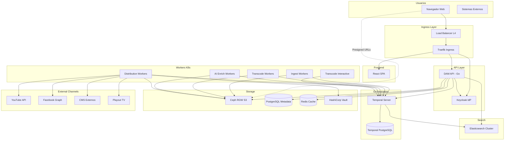
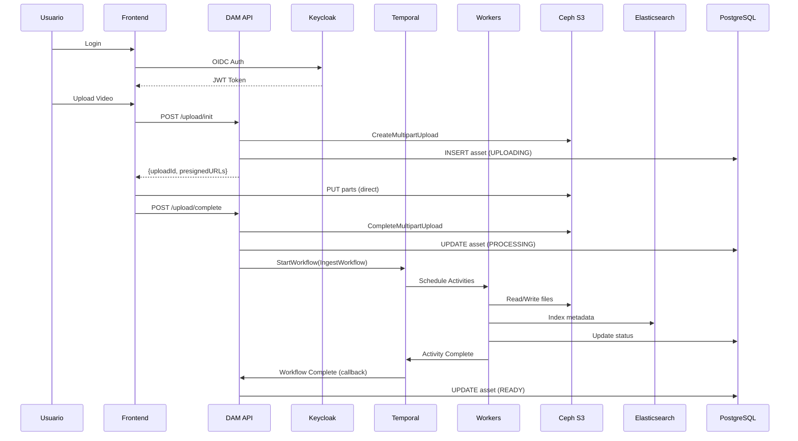
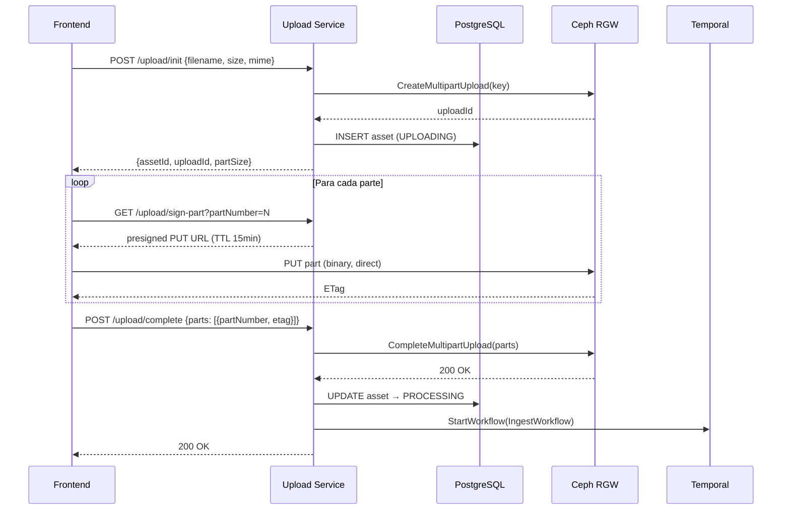
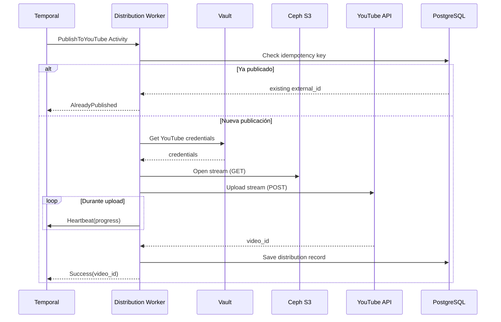

# Plataforma de Gestión de Activos Digitales (DAM) para Medios de Comunicación


**72.40 Ingeniería de Software**

---

**Alumnos:**
- Roman Berruti - 63533
- Tomás Pinausig - 63167
- Agostina Squillari - 64047

**Docentes:**
- Sotuyo Dodero, Juan Martin
- Mogni, Guido Matias

**Fecha:** Diciembre 2024

---

## Índice

1. [Introducción](#1-introducción)
2. [Funcionalidad Requerida](#2-funcionalidad-requerida)
   - 2.1 Requerimientos Funcionales
   - 2.2 Requerimientos No Funcionales
3. [Atributos de Calidad](#3-atributos-de-calidad)
   - 3.1 Disponibilidad
   - 3.2 Escalabilidad
   - 3.3 Performance
   - 3.4 Confiabilidad
   - 3.5 Tolerancia a Fallos
   - 3.6 Seguridad
   - 3.7 Interoperabilidad
4. [Arquitectura del Sistema](#4-arquitectura-del-sistema)
   - 4.1 Vista General de la Arquitectura
   - 4.2 Estrategia de Deployment (Kubernetes sobre IaaS)
   - 4.3 Overview de Servicios y Comunicación
   - 4.4 Implementación de Componentes
5. [Resolución de Puntos Críticos](#5-resolución-de-puntos-críticos)
   - 5.1 Ingesta Masiva de Archivos Grandes
   - 5.2 Búsqueda Rápida sobre Millones de Activos
   - 5.3 Procesamiento Asíncrono y Tolerancia a Fallos
   - 5.4 Distribución Multicanal Confiable
6. [Vista Física del Sistema](#6-vista-física-del-sistema)
   - 6.1 Diagrama de Deployment
   - 6.2 Topología de Red
   - 6.3 Especificación de Servidores y Recursos
7. [Supuestos, Riesgos, No Riesgos y Trade-offs](#7-supuestos-riesgos-no-riesgos-y-trade-offs)
   - 7.1 Supuestos
   - 7.2 Riesgos
   - 7.3 No Riesgos
   - 7.4 Trade-offs
8. [Referencias](#8-referencias)

---

## 1. Introducción

Este trabajo define una arquitectura candidata para una Plataforma de Gestión de Activos Digitales (DAM) destinada a un grupo de medios de comunicación que administra millones de archivos de video, audio e imágenes. El objetivo del sistema es permitir:

- **Almacenamiento a largo plazo** de activos originales (masters) con garantías de durabilidad.
- **Generación y gestión de versiones derivadas** (renditions) para distintos canales y casos de uso.
- **Indexación inteligente** mediante metadatos técnicos, editoriales y análisis de contenido con IA (transcripción, OCR, detección de objetos).
- **Búsqueda rápida** que permita a los editores localizar material relevante en segundos.
- **Distribución automatizada multicanal** hacia plataformas web, televisión y redes sociales.
- **Recuperación eficiente de archivos grandes** y escalabilidad ante el crecimiento continuo del volumen de datos.

La solución propuesta se diseña siguiendo el modelo de vistas arquitectónicas 4+1 (Kruchten), priorizando decisiones justificadas por atributos de calidad y respetando la restricción de evitar vendor lock-in mediante el uso exclusivo de servicios de infraestructura (IaaS).

---

## 2. Funcionalidad Requerida

### 2.1 Requerimientos Funcionales

El sistema debe cumplir con los siguientes requerimientos funcionales, ordenados por importancia:

1. **RF-01: Almacenamiento de activos digitales** — Permitir el almacenamiento de archivos digitales de gran tamaño, incluyendo videos, audios e imágenes, garantizando su conservación a largo plazo y la integridad de los datos.

2. **RF-02: Recuperación y descarga de activos** — Permitir la recuperación y descarga eficiente de activos digitales, incluyendo archivos de gran tamaño, facilitando su acceso para el uso editorial.

3. **RF-03: Búsqueda rápida y eficiente** — Permitir a los usuarios realizar búsquedas rápidas sobre el conjunto de activos digitales, utilizando tanto metadatos como información derivada del análisis de contenido.

4. **RF-04: Indexación y enriquecimiento con metadatos** — Asociar metadatos descriptivos a cada activo digital y complementar dicha información mediante análisis automático del contenido utilizando técnicas de inteligencia artificial.

5. **RF-05: Distribución automatizada multicanal** — Automatizar la distribución de los activos digitales a múltiples canales de salida, tales como plataformas web, televisión y redes sociales.

### 2.2 Requerimientos No Funcionales

1. **RNF-01: Escalabilidad** — El sistema debe soportar millones de activos y un crecimiento continuo del volumen de datos, sin degradación significativa del servicio.

2. **RNF-02: Performance en búsqueda** — Las búsquedas deben retornar resultados en menos de 2 segundos para el 95% de las consultas.

3. **RNF-03: Eficiencia en recuperación** — La recuperación de archivos grandes debe realizarse de manera eficiente, con throughput sostenido de al menos 100 MB/s por transferencia.

4. **RNF-04: Durabilidad** — La plataforma debe garantizar la conservación a largo plazo de los activos, con una durabilidad mínima de 99.999999999% (11 nueves).

5. **RNF-05: Alta disponibilidad** — El sistema debe asegurar una disponibilidad del 99.9% para los usuarios internos.

6. **RNF-06: Seguridad** — Control de accesos basado en roles, protección de datos en tránsito y reposo, y trazabilidad de acciones relevantes.

7. **RNF-07: No vendor lock-in** — La solución debe limitarse a infraestructura (IaaS), evitando dependencias de servicios gestionados o propietarios.

---

## 3. Atributos de Calidad

Los atributos de calidad se presentan ordenados por prioridad según el impacto en el negocio del grupo de medios.

### 3.1 Disponibilidad

**Prioridad: Alta**

La disponibilidad constituye el atributo de calidad más crítico. La indisponibilidad del sistema impacta directamente en la capacidad de producir, editar y publicar contenidos, afectando los tiempos de respuesta del negocio. La plataforma DAM es utilizada de forma intensiva por editores, productores y sistemas automatizados de publicación que dependen del acceso continuo a los activos digitales.

**Justificación de negocio:** Una hora de indisponibilidad durante un evento de alta relevancia informativa (breaking news) puede significar la pérdida de cobertura periodística y el consecuente impacto reputacional y económico.

**Estrategia arquitectónica:**
- Despliegue en múltiples zonas de disponibilidad.
- Replicación de datos críticos.
- Balanceo de carga en todos los niveles.
- Diseño para degradación graceful ante fallas parciales.

### 3.2 Escalabilidad

**Prioridad: Alta**

El sistema debe manejar un crecimiento continuo tanto en el volumen de datos almacenados como en la cantidad de usuarios y procesos concurrentes. En el contexto de un DAM para medios, los archivos no se eliminan, sino que se conservan como parte del patrimonio digital.

**Justificación de negocio:** El volumen de contenido multimedia crece exponencialmente año a año. Un sistema que no escale se convierte en un pasivo tecnológico a mediano plazo.

**Estrategia arquitectónica:**
- Almacenamiento definido por software (Ceph) con escalado horizontal.
- Procesamiento basado en workers stateless con auto-scaling por demanda.
- Motor de búsqueda distribuido (Elasticsearch).
- Arquitectura de microservicios desplegados en Kubernetes.

### 3.3 Performance

**Prioridad: Alta**

El rendimiento es un atributo central dado que condiciona directamente la operación editorial. Se exige búsqueda rápida y velocidad de recuperación de archivos grandes.

**Justificación de negocio:** Un editor que debe esperar más de unos segundos para localizar material o previsualizar contenido pierde productividad. El flujo de trabajo editorial es time-sensitive.

**Estrategia arquitectónica:**
- Tiering de almacenamiento (SSD para hot data, HDD para archive).
- Índices optimizados en Elasticsearch con sharding.
- CDN interna para streaming de proxies.
- Presigned URLs para transferencias directas (zero-copy).

### 3.4 Confiabilidad

**Prioridad: Alta**

La plataforma debe operar de manera consistente y predecible, minimizando fallas y errores. La confiabilidad se manifiesta especialmente en la correcta ejecución de flujos críticos como la ingesta, transcodificación, análisis con IA e indexación.

**Justificación de negocio:** Una falla que corrompa un master original o que pierda el estado de un proceso de transcodificación genera retrabajo costoso y pérdida de confianza en la plataforma.

**Estrategia arquitectónica:**
- Orquestación durable con Temporal (estado persistido, reintentos automáticos).
- Idempotencia en todas las operaciones de modificación.
- Checksums y validación de integridad.
- Erasure coding para durabilidad de datos.

### 3.5 Tolerancia a Fallos

**Prioridad: Media-Alta**

La arquitectura debe permitir que el servicio continúe operando, aunque sea de manera degradada, ante fallas parciales de infraestructura o software.

**Justificación de negocio:** En un sistema distribuido complejo, las fallas son inevitables. La capacidad de aislarlas y recuperarse automáticamente reduce el impacto operativo.

**Estrategia arquitectónica:**
- Patrón Circuit Breaker para servicios externos.
- Heartbeating en procesos de larga duración.
- Colas durables con reintento automático.
- Segregación de workers por tipo de tarea.

### 3.6 Seguridad

**Prioridad: Media**

El sistema administra activos que representan propiedad intelectual de alto valor, incluyendo material inédito o sensible previo a su publicación.

**Justificación de negocio:** Una fuga de material exclusivo previo a su publicación oficial puede tener consecuencias legales y económicas significativas.

**Estrategia arquitectónica:**
- Autenticación centralizada con Keycloak (OIDC).
- Autorización basada en roles (RBAC).
- URLs firmadas con TTL para transferencias.
- Cifrado en tránsito (TLS) y en reposo (Ceph encryption).
- Gestión de secretos con HashiCorp Vault.

### 3.7 Interoperabilidad

**Prioridad: Media**

El DAM debe poder comunicarse con plataformas externas como sistemas de gestión de contenidos web, sistemas de emisión televisiva y servicios de publicación en redes sociales.

**Justificación de negocio:** La distribución multicanal es un requerimiento funcional core. La incapacidad de integrarse con nuevos canales limita el alcance del negocio.

**Estrategia arquitectónica:**
- APIs RESTful con OpenAPI.
- Conectores modulares para canales de distribución.
- Formatos estándar de intercambio (JSON, XML donde corresponda).

---

## 4. Arquitectura del Sistema

### 4.1 Vista General de la Arquitectura

La arquitectura propuesta sigue un estilo de **microservicios orquestados** desplegados sobre Kubernetes en infraestructura IaaS. El sistema se organiza en las siguientes capas:

```
┌─────────────────────────────────────────────────────────────────────────────┐
│                           CAPA DE PRESENTACIÓN                               │
│  ┌─────────────────────────────────────────────────────────────────────┐    │
│  │                    Frontend SPA (React + TypeScript)                 │    │
│  │         • Búsqueda facetada  • Upload masivo  • Previsualización    │    │
│  └─────────────────────────────────────────────────────────────────────┘    │
└─────────────────────────────────────────────────────────────────────────────┘
                                      │
                                      ▼
┌─────────────────────────────────────────────────────────────────────────────┐
│                           CAPA DE GATEWAY                                    │
│  ┌─────────────────────────────────────────────────────────────────────┐    │
│  │              Traefik Ingress Controller (TLS + Routing)              │    │
│  └─────────────────────────────────────────────────────────────────────┘    │
└─────────────────────────────────────────────────────────────────────────────┘
                                      │
                                      ▼
┌─────────────────────────────────────────────────────────────────────────────┐
│                           CAPA DE SERVICIOS                                  │
│  ┌──────────────┐  ┌──────────────┐  ┌──────────────┐  ┌──────────────┐     │
│  │   DAM API    │  │   Keycloak   │  │   Temporal   │  │ Elasticsearch│     │
│  │   (Go/BFF)   │  │    (IdP)     │  │   (Orch)     │  │   (Search)   │     │
│  └──────────────┘  └──────────────┘  └──────────────┘  └──────────────┘     │
└─────────────────────────────────────────────────────────────────────────────┘
                                      │
                                      ▼
┌─────────────────────────────────────────────────────────────────────────────┐
│                           CAPA DE WORKERS                                    │
│  ┌──────────────┐  ┌──────────────┐  ┌──────────────┐  ┌──────────────┐     │
│  │    Ingest    │  │  Transcode   │  │  AI Enrich   │  │ Distribution │     │
│  │   Workers    │  │   Workers    │  │   Workers    │  │   Workers    │     │
│  │  (q-ingest)  │  │ (q-transcode)│  │(q-ai-enrich) │  │(q-distribution)│   │
│  └──────────────┘  └──────────────┘  └──────────────┘  └──────────────┘     │
└─────────────────────────────────────────────────────────────────────────────┘
                                      │
                                      ▼
┌─────────────────────────────────────────────────────────────────────────────┐
│                           CAPA DE DATOS                                      │
│  ┌──────────────────────────────────────────────────────────────────────┐   │
│  │                    Ceph Cluster (Object Storage S3)                   │   │
│  │   dam-archive (masters)  │  dam-proxies (renditions)  │  dam-delivery│   │
│  └──────────────────────────────────────────────────────────────────────┘   │
│  ┌──────────────────────┐  ┌──────────────────────────────────────────────┐ │
│  │   PostgreSQL (Meta)  │  │              Redis (Cache/Sessions)          │ │
│  └──────────────────────┘  └──────────────────────────────────────────────┘ │
└─────────────────────────────────────────────────────────────────────────────┘
```

**Diagrama de Componentes (Mermaid):**



### 4.2 Estrategia de Deployment (Kubernetes sobre IaaS)

#### 4.2.1 Plataforma de Orquestación

Se utiliza **Kubernetes** como plataforma de orquestación de contenedores, desplegado sobre infraestructura IaaS. La elección se justifica por:

- **Estándar de facto** para orquestación de contenedores.
- **Ecosistema maduro** de herramientas (KEDA, Prometheus, etc.).
- **Primitivas declarativas** para deployment, scaling y recovery.
- **Portabilidad** entre proveedores de IaaS.

**Distribución de Kubernetes:** Se utiliza una distribución vanilla de Kubernetes (kubeadm) o equivalente empresarial open-source (RKE2, k3s para ambientes más pequeños). No se utilizan servicios gestionados de Kubernetes del proveedor cloud (EKS, GKE, AKS) para evitar vendor lock-in.

#### 4.2.2 Topología del Cluster

```yaml
# cluster-topology.yaml
kubernetes:
  version: "1.29.x"
  distribution: "kubeadm"
  
  control_plane:
    replicas: 3
    node_type: "general-purpose"
    resources:
      cpu: 4
      memory: 16GB
      storage: 100GB SSD
    
  node_pools:
    - name: "general"
      purpose: "API, Frontend, Temporal, Elasticsearch coordinating"
      replicas: 3-10 (autoscaling)
      resources:
        cpu: 8
        memory: 32GB
        storage: 200GB SSD
      taints: []
      
    - name: "transcode"
      purpose: "Transcode Workers (CPU intensive)"
      replicas: 2-50 (KEDA)
      resources:
        cpu: 16
        memory: 32GB
        storage: 500GB NVMe (scratch)
      taints:
        - key: "workload"
          value: "transcode"
          effect: "NoSchedule"
          
    - name: "ai-gpu"
      purpose: "AI Enrichment Workers"
      replicas: 1-10 (KEDA)
      resources:
        cpu: 8
        memory: 64GB
        gpu: 1x NVIDIA T4/A10
      taints:
        - key: "nvidia.com/gpu"
          effect: "NoSchedule"
          
    - name: "elasticsearch"
      purpose: "Elasticsearch data nodes"
      replicas: 3-9
      resources:
        cpu: 8
        memory: 64GB
        storage: 2TB NVMe
      taints:
        - key: "workload"
          value: "elasticsearch"
          effect: "NoSchedule"
```

#### 4.2.3 Namespaces y Organización

```yaml
namespaces:
  - name: dam
    description: "Aplicación principal (API, Workers)"
  - name: temporal
    description: "Temporal Server y dependencias"
  - name: elasticsearch
    description: "Cluster Elasticsearch"
  - name: ceph-rgw
    description: "Ceph RADOS Gateway (S3 endpoint)"
  - name: keycloak
    description: "Identity Provider"
  - name: vault
    description: "HashiCorp Vault"
  - name: monitoring
    description: "Prometheus, Grafana, Loki"
  - name: ingress
    description: "Traefik Ingress Controller"
```

#### 4.2.4 Auto-Scaling con KEDA

Se implementa **KEDA (Kubernetes Event-driven Autoscaling)** con el **Temporal Scaler** para escalar workers basándose en el backlog de Task Queues, no en métricas de CPU/RAM.

```yaml
# keda-scaledobjects.yaml
apiVersion: keda.sh/v1alpha1
kind: ScaledObject
metadata:
  name: transcode-workers-scaler
  namespace: dam
spec:
  scaleTargetRef:
    name: transcode-worker-deployment
  pollingInterval: 5
  cooldownPeriod: 60
  minReplicaCount: 1
  maxReplicaCount: 50
  triggers:
    - type: temporal
      metadata:
        endpoint: temporal-frontend.temporal.svc.cluster.local:7233
        namespace: dam
        taskQueue: q-transcode
        queueTypes: activity
        targetQueueSize: "2"
---
apiVersion: keda.sh/v1alpha1
kind: ScaledObject
metadata:
  name: ai-workers-scaler
  namespace: dam
spec:
  scaleTargetRef:
    name: ai-worker-deployment
  pollingInterval: 10
  cooldownPeriod: 120
  minReplicaCount: 1
  maxReplicaCount: 10
  triggers:
    - type: temporal
      metadata:
        endpoint: temporal-frontend.temporal.svc.cluster.local:7233
        namespace: dam
        taskQueue: q-ai-enrich
        queueTypes: activity
        targetQueueSize: "1"
---
apiVersion: keda.sh/v1alpha1
kind: ScaledObject
metadata:
  name: distribution-workers-scaler
  namespace: dam
spec:
  scaleTargetRef:
    name: distribution-worker-deployment
  pollingInterval: 5
  cooldownPeriod: 60
  minReplicaCount: 1
  maxReplicaCount: 30
  triggers:
    - type: temporal
      metadata:
        endpoint: temporal-frontend.temporal.svc.cluster.local:7233
        namespace: dam
        taskQueue: q-distribution
        queueTypes: activity
        targetQueueSize: "10"
```

### 4.3 Overview de Servicios y Comunicación

#### 4.3.1 Matriz de Servicios

| Servicio | Lenguaje | Protocolo | Responsabilidad |
|----------|----------|-----------|-----------------|
| DAM API | Go | REST/HTTP | BFF, presigned URLs, disparo de workflows |
| Keycloak | Java | OIDC/OAuth2 | Autenticación y autorización |
| Temporal Server | Go | gRPC | Orquestación de workflows |
| Elasticsearch | Java | REST/HTTP | Indexación y búsqueda |
| Ingest Worker | Go | gRPC (Temporal) | Validación, checksums, metadata técnica |
| Transcode Worker | Go + FFmpeg | gRPC (Temporal) | Transcodificación de medios |
| AI Enrich Worker | Python | gRPC (Temporal) | Inferencia de modelos IA |
| Distribution Worker | Go | gRPC (Temporal) | Publicación a canales externos |

#### 4.3.2 Diagrama de Comunicación



#### 4.3.3 Modelo de Comunicación de Workers (Pull/Long-Polling)

Todos los workers operan bajo el patrón **Pull Model** con conexión gRPC persistente hacia Temporal:

1. **Iniciativa del Worker:** Los servicios no exponen puertos HTTP ni aceptan peticiones entrantes. Establecen una conexión gRPC saliente (Long-Polling) hacia el Temporal Frontend Service.

2. **Segregación por Task Queues:** Cada tipo de worker escucha exclusivamente una Task Queue específica, permitiendo escalar recursos de hardware independientemente.

3. **Control de Flujo (Backpressure):** Al utilizar un modelo de Pull, el sistema es naturalmente resistente a picos de carga. Si un worker está al 100% de capacidad, simplemente demora en solicitar la siguiente tarea.

### 4.4 Implementación de Componentes

#### 4.4.1 Frontend (Single Page Application)

**Stack Tecnológico:**
- **Framework:** React 18 + TypeScript
- **Estado servidor:** TanStack Query (React Query)
- **Upload:** Uppy con plugin `@uppy/aws-s3` (multipart, reintentos)
- **Reproducción video:** Video.js con HLS.js
- **Reproducción audio:** Wavesurfer.js
- **UI Components:** Material UI (MUI)

**Responsabilidades:**
- Autenticación OIDC con Keycloak (PKCE flow).
- Uploads masivos con chunking, paralelismo (3-6 partes) y reintentos.
- Exploración y búsqueda facetada.
- Previsualización de proxies (HLS/DASH) y miniaturas.
- Gestión de estado de jobs asíncronos.

**Deployment:**

```yaml
apiVersion: apps/v1
kind: Deployment
metadata:
  name: frontend
  namespace: dam
spec:
  replicas: 2
  selector:
    matchLabels:
      app: frontend
  template:
    metadata:
      labels:
        app: frontend
    spec:
      containers:
      - name: nginx
        image: dam/frontend:latest
        ports:
        - containerPort: 80
        resources:
          requests:
            cpu: "100m"
            memory: "128Mi"
          limits:
            cpu: "500m"
            memory: "256Mi"
```

#### 4.4.2 DAM API (Backend for Frontend)

**Stack Tecnológico:**
- **Lenguaje:** Go 1.22
- **Framework HTTP:** Chi router
- **Cliente S3:** AWS SDK for Go v2
- **Cliente Temporal:** Temporal Go SDK
- **ORM:** sqlc (type-safe SQL)

**Responsabilidades:**
- Exposición de API REST para el frontend.
- Emisión de Presigned URLs para transferencias S3.
- Disparo y consulta de workflows en Temporal.
- Autorización a nivel dominio (RBAC).
- Composición de respuestas de búsqueda.

**Endpoints Principales:**

| Endpoint | Método | Descripción |
|----------|--------|-------------|
| `/api/v1/assets/upload/init` | POST | Iniciar upload multipart |
| `/api/v1/assets/upload/sign-part` | GET | Obtener URL firmada para parte |
| `/api/v1/assets/upload/complete` | POST | Completar upload |
| `/api/v1/search/assets` | GET | Búsqueda de activos |
| `/api/v1/assets/{id}` | GET | Detalle de activo |
| `/api/v1/assets/{id}/downloads` | POST | Obtener URL de descarga |
| `/api/v1/assets/{id}/ondemand` | POST | Solicitar rendition on-demand |
| `/api/v1/jobs/{id}` | GET | Estado de job |

**Deployment:**

```yaml
apiVersion: apps/v1
kind: Deployment
metadata:
  name: dam-api
  namespace: dam
spec:
  replicas: 3
  selector:
    matchLabels:
      app: dam-api
  template:
    metadata:
      labels:
        app: dam-api
    spec:
      containers:
      - name: api
        image: dam/api:latest
        ports:
        - containerPort: 8080
        env:
        - name: POSTGRES_HOST
          value: "postgres.dam.svc.cluster.local"
        - name: S3_ENDPOINT
          value: "http://ceph-rgw.ceph-rgw.svc.cluster.local"
        - name: TEMPORAL_HOST
          value: "temporal-frontend.temporal.svc.cluster.local:7233"
        - name: ELASTICSEARCH_URL
          value: "http://elasticsearch.elasticsearch.svc.cluster.local:9200"
        resources:
          requests:
            cpu: "500m"
            memory: "512Mi"
          limits:
            cpu: "2000m"
            memory: "2Gi"
```

#### 4.4.3 Orquestador de Trabajos (Temporal)

**Justificación de Temporal.io:**

A diferencia de las arquitecturas basadas en coreografía (eventos disparados entre microservicios sin control central), Temporal implementa una arquitectura de orquestación basada en el patrón **"Fault-Oblivious Stateful Workflow"**:

1. **Code-as-Infrastructure:** Los pipelines se definen en código (Go/Java) y no en archivos JSON/XML propietarios. Esto permite testeo unitario, versionado en Git y uso de estructuras de control nativas del lenguaje.

2. **Durabilidad Garantizada:** Temporal persiste el historial de eventos en su base de datos. Si un worker colapsa en medio de una transcodificación de 2 horas, al recuperarse el sistema retoma el proceso exactamente en el punto de fallo.

3. **Abstracción Workflow vs. Activity:**
   - **Workflow:** Define la lógica de negocio (el DAG). Es determinístico y liviano.
   - **Activity:** Realiza el trabajo pesado. Puede fallar y reintentarse.

**Componentes de Temporal:**

| Componente | Replicas | Función |
|------------|----------|---------|
| Frontend Service | 3 | API gRPC, rate limiting |
| History Service | 3 | Persistencia de estado de workflows |
| Matching Service | 3 | Distribución de tareas a workers |
| Worker Service | 3 | Tareas internas de Temporal |

**Persistencia:**
- **Default Store:** PostgreSQL (estado de workflows)
- **Visibility Store:** Elasticsearch (búsqueda avanzada de workflows)

**Deployment:**

```yaml
# temporal-server.yaml
apiVersion: apps/v1
kind: Deployment
metadata:
  name: temporal-frontend
  namespace: temporal
spec:
  replicas: 3
  selector:
    matchLabels:
      app: temporal-frontend
  template:
    spec:
      containers:
      - name: temporal
        image: temporalio/server:1.24.2
        args: ["start", "--service=frontend"]
        ports:
        - containerPort: 7233
        env:
        - name: DB
          value: "postgresql"
        - name: DB_PORT
          value: "5432"
        - name: POSTGRES_SEEDS
          value: "temporal-postgres.temporal.svc.cluster.local"
        - name: ENABLE_ES
          value: "true"
        - name: ES_SEEDS
          value: "elasticsearch.elasticsearch.svc.cluster.local"
```

#### 4.4.4 Almacenamiento de Objetos (Ceph)

**Decisión:** Ceph como solución unificada de almacenamiento definido por software (SDS) con Ceph Object Gateway (RGW) exponiendo interfaz S3-compatible.

**Diseño de Pools y Tiering:**

| Pool | Medio | Protección | Propósito |
|------|-------|------------|-----------|
| `dam.rgw.buckets.index` | NVMe | Replicación x3 | Índices RGW para baja latencia |
| `dam.masters.data` | HDD | Erasure Coding 4+2 | Masters/originales largo plazo |
| `dam.renditions.data` | SSD | Replicación x3 | Hot tier para proxies y delivery |

**Placement Targets:**
- **STANDARD:** → `dam.masters.data` (HDD + EC)
- **HOT-STORAGE:** → `dam.renditions.data` (SSD + réplica)

**Estructura de Buckets:**

| Bucket | Propósito | Placement | Lifecycle |
|--------|-----------|-----------|-----------|
| `dam-archive` | Masters (source of truth) | STANDARD | Versioning enabled, MPU abort 7d |
| `dam-proxies` | Renditions editoriales | HOT-STORAGE | proxies/ 90d, thumbs/ 180d, ondemand/ 2d |
| `dam-delivery` | CDN origin | HOT-STORAGE | web/ 60d, social/ 90d, tv/ 365d |

**Convención de Keys (inmutable y auditable):**

```
masters/{assetId}/{sha256}/source.{ext}
proxies/{assetId}/{sha256}/{profile}/...
delivery/{channel}/{assetId}/{sha256}/{profile}/...
```

#### 4.4.5 Motor de Búsqueda (Elasticsearch)

**Decisión:** Elasticsearch self-hosted como motor unificado de búsqueda e indexación, sirviendo tanto para la búsqueda de activos como para el Visibility Store de Temporal.

**Justificación:**
1. **Unificación de infraestructura:** Un único cluster para DAM y Temporal Visibility.
2. **Advanced Visibility en Temporal:** Queries complejos sobre millones de workflows.
3. **Búsqueda full-text:** Soporte nativo para español con analizadores apropiados.
4. **Compatibilidad con IaaS:** Self-hosted, sin vendor lock-in.

**Topología del Cluster:**

| Rol | Replicas | Recursos | Función |
|-----|----------|----------|---------|
| Master | 3 | 4 CPU, 8GB | Gestión del cluster, quorum |
| Data | 6+ | 8 CPU, 64GB, 2TB NVMe | Almacenamiento y queries |
| Coordinating | 2 | 4 CPU, 16GB | Balanceo de carga |

**Estructura de Índices:**

```yaml
indices:
  dam-assets-video-v1:
    description: "1 documento por video"
    fields: [assetId, title, description, tags, transcript_summary, entities, duration, resolution]
    
  dam-assets-audio-v1:
    description: "1 documento por audio"
    fields: [assetId, title, description, tags, transcript_summary, entities, duration]
    
  dam-assets-image-v1:
    description: "1 documento por imagen"
    fields: [assetId, title, description, tags, ocr_text, detected_objects, caption]
    
  dam-transcript-segments-v1:
    description: "1 documento por segmento de transcripción"
    fields: [assetId, start_ms, end_ms, text, speaker_id, confidence]
    
  temporal_visibility_v1:
    description: "Gestionado por Temporal Server"
    fields: [WorkflowId, RunId, WorkflowType, StartTime, ExecutionStatus, CustomSearchAttributes]

aliases:
  dam-assets: [dam-assets-video-v1, dam-assets-audio-v1, dam-assets-image-v1]
  dam-transcript-segments: [dam-transcript-segments-v1]
```

#### 4.4.6 Base de Datos Relacional (PostgreSQL)

**Propósito:** Fuente canónica (transaccional) para el ciclo de vida del activo, control de estados, auditoría y metadatos técnicos.

**Configuración:**

```yaml
postgresql:
  version: "16"
  deployment: "StatefulSet"
  replicas: 3  # 1 primary + 2 replicas
  high_availability: "Patroni"
  storage: 500GB SSD
  resources:
    cpu: 8
    memory: 32GB
```

**Esquema Principal:**

```sql
-- Tabla principal de activos
CREATE TABLE assets (
    id UUID PRIMARY KEY DEFAULT gen_random_uuid(),
    filename VARCHAR(500) NOT NULL,
    mime_type VARCHAR(100) NOT NULL,
    size_bytes BIGINT NOT NULL,
    sha256 VARCHAR(64),
    status VARCHAR(20) NOT NULL DEFAULT 'UPLOADING',
    s3_key VARCHAR(1000),
    created_by UUID REFERENCES users(id),
    created_at TIMESTAMP DEFAULT NOW(),
    updated_at TIMESTAMP DEFAULT NOW()
);

CREATE INDEX idx_assets_status ON assets(status);
CREATE INDEX idx_assets_created_at ON assets(created_at);

-- Tabla de renditions
CREATE TABLE renditions (
    id UUID PRIMARY KEY DEFAULT gen_random_uuid(),
    asset_id UUID NOT NULL REFERENCES assets(id),
    profile VARCHAR(100) NOT NULL,
    s3_key VARCHAR(1000) NOT NULL,
    status VARCHAR(20) NOT NULL DEFAULT 'PENDING',
    created_at TIMESTAMP DEFAULT NOW(),
    UNIQUE(asset_id, profile)
);

-- Tabla de distribuciones
CREATE TABLE asset_distributions (
    id UUID PRIMARY KEY DEFAULT gen_random_uuid(),
    asset_id UUID NOT NULL REFERENCES assets(id),
    channel_type VARCHAR(50) NOT NULL,
    channel_id VARCHAR(100) NOT NULL,
    rendition_key VARCHAR(500) NOT NULL,
    external_id VARCHAR(500),
    status VARCHAR(20) NOT NULL,
    error_message TEXT,
    started_at TIMESTAMP NOT NULL,
    completed_at TIMESTAMP,
    created_by UUID REFERENCES users(id),
    idempotency_key VARCHAR(500) UNIQUE NOT NULL
);
```

#### 4.4.7 Workers de Procesamiento

##### A. Ingest Worker

| Aspecto | Valor |
|---------|-------|
| **Task Queue** | `q-ingest` |
| **Lenguaje** | Go |
| **Perfil de carga** | I/O Bound + CPU Light |
| **Responsabilidad** | Validación técnica, checksums SHA-256, extracción de metadatos (ffprobe, exiftool) |
| **Recursos** | 0.5 CPU / 512MB RAM |
| **Concurrencia** | Alta (20-50 tareas) |

##### B. Transcode Worker

| Aspecto | Valor |
|---------|-------|
| **Task Queue** | `q-transcode` (batch), `q-transcode-interactive` (on-demand) |
| **Lenguaje** | Go (wrapper) + FFmpeg + libvips |
| **Perfil de carga** | CPU Bound |
| **Responsabilidad** | Generación de renditions (proxies, thumbnails, HLS) |
| **Recursos** | 4 CPU / 8GB RAM |
| **Concurrencia** | Baja (1 tarea por pod) |

**Matriz de Renditions:**

| Tipo | Perfil | Especificaciones | Propósito |
|------|--------|------------------|-----------|
| Video | Preview/Proxy | MP4/H.264 High @ 1080p, 5Mbps | Edición offline |
| Video | Web Low-Res | MP4/H.264 Main @ 720p, 1.5Mbps | Conexiones lentas |
| Video | HLS Master | HLS con múltiples bitrates | Streaming adaptativo |
| Video | Poster Frame | JPG @ 1920x1080 | Portada |
| Audio | Web Preview | MP3 @ 128kbps | Preescucha |
| Audio | Broadcast | WAV PCM 24-bit 48kHz | Edición profesional |
| Imagen | Thumbnails | WebP @ 300px, 800px, 1200px | Miniaturas responsivas |
| Imagen | Display | JPG optimizado (MozJPEG) | Pantalla completa |

##### C. AI Enrichment Worker

| Aspecto | Valor |
|---------|-------|
| **Task Queue** | `q-ai-enrich` |
| **Lenguaje** | Python |
| **Perfil de carga** | GPU Bound |
| **Responsabilidad** | Inferencia de modelos (Whisper STT, YOLO, OCR) |
| **Recursos** | 4 CPU / 16GB RAM + GPU |
| **Concurrencia** | Baja (1 tarea por GPU) |

**Herramientas de IA (self-hosted):**
- **Speech-to-Text:** faster-whisper (optimización CTranslate2)
- **OCR:** PaddleOCR
- **Detección de objetos:** YOLO/Ultralytics
- **NLP:** spaCy (español)

##### D. Distribution Worker

| Aspecto | Valor |
|---------|-------|
| **Task Queue** | `q-distribution` |
| **Lenguaje** | Go |
| **Perfil de carga** | Network Bound |
| **Responsabilidad** | Publicación a canales externos |
| **Recursos** | 0.2 CPU / 256MB RAM |
| **Concurrencia** | Muy alta (100+ tareas) |

**Conectores implementados:**
- `YouTubeConnector` — YouTube Data API v3
- `FacebookConnector` — Graph API
- `CMSConnector` — REST genérico
- `TVConnector` — MOS/SFTP

#### 4.4.8 Autenticación (Keycloak)

**Decisión:** Keycloak self-hosted como Identity Provider (IdP).

**Configuración:**
- **Protocolo:** OIDC (Authorization Code + PKCE para SPA)
- **Tokens:** JWT con TTL 15 minutos, Refresh Token con rotación
- **Realms:** `dam-production`
- **Roles:** `editor`, `archivista`, `admin`, `system`

**Deployment:**

```yaml
apiVersion: apps/v1
kind: Deployment
metadata:
  name: keycloak
  namespace: keycloak
spec:
  replicas: 2
  template:
    spec:
      containers:
      - name: keycloak
        image: quay.io/keycloak/keycloak:24.0
        args: ["start"]
        env:
        - name: KC_DB
          value: "postgres"
        - name: KC_DB_URL
          value: "jdbc:postgresql://keycloak-postgres:5432/keycloak"
        - name: KC_HOSTNAME
          value: "auth.dam.example.com"
```

#### 4.4.9 Gestión de Secretos (HashiCorp Vault)

**Decisión:** HashiCorp Vault self-hosted para gestión centralizada de secretos.

**Justificación:**
- Self-hosted (no vendor lock-in)
- Integración nativa con Kubernetes (Service Accounts, CSI Driver)
- Rotación automática de credenciales
- Auditoría de accesos

**Estructura de Secretos:**

```
secret/
  dam/
    postgres/
      username: dam_app
      password: <rotated>
    s3/
      access_key: <key>
      secret_key: <secret>
  channels/
    youtube/
      channel-1/
        api_key: <key>
        access_token: <token>
    facebook/
      page-1/
        access_token: <token>
```

---

## 5. Resolución de Puntos Críticos

### 5.1 Ingesta Masiva de Archivos Grandes

**Problema:** Archivos de video pueden superar los 100GB. Un upload monolítico es inviable por timeouts, consumo de memoria y falta de recuperación ante fallos.

**Solución: S3 Multipart Upload + Presigned URLs**

**Diseño:**
1. El archivo se sube **directamente a la key final** en `dam-archive`, sin staging intermedio.
2. El frontend divide el archivo en partes (part size: 100MB).
3. Cada parte se sube en paralelo (3-6 partes concurrentes) con reintentos independientes.
4. El objeto **no es visible** hasta `CompleteMultipartUpload`.
5. La "promoción" se controla por estado en DB (`UPLOADING` → `PROCESSING` → `READY`).

**Diagrama de Secuencia:**



**Beneficios:**
- Zero-copy: el archivo nunca pasa por la API.
- Recuperación granular: si falla una parte, solo se reintenta esa parte.
- Throughput: paralelismo controlado satura el ancho de banda disponible.

### 5.2 Búsqueda Rápida sobre Millones de Activos

**Problema:** Búsqueda full-text y facetada sobre millones de activos con latencia <2 segundos.

**Solución: Elasticsearch como Read Model Optimizado**

**Diseño:**
1. PostgreSQL es la fuente canónica (transaccional).
2. Elasticsearch es la **vista derivada** optimizada para lectura.
3. Los workers de enriquecimiento indexan metadatos en Elasticsearch tras cada procesamiento.
4. La API de búsqueda consulta Elasticsearch, nunca PostgreSQL para búsquedas complejas.

**Estrategia de Indexación:**

```json
{
  "settings": {
    "analysis": {
      "analyzer": {
        "spanish_analyzer": {
          "type": "custom",
          "tokenizer": "standard",
          "filter": ["lowercase", "spanish_stop", "spanish_stemmer"]
        }
      }
    }
  },
  "mappings": {
    "properties": {
      "title": { "type": "text", "analyzer": "spanish_analyzer" },
      "description": { "type": "text", "analyzer": "spanish_analyzer" },
      "transcript": { "type": "text", "analyzer": "spanish_analyzer" },
      "tags": { "type": "keyword" },
      "asset_type": { "type": "keyword" },
      "created_at": { "type": "date" },
      "duration_seconds": { "type": "integer" },
      "file_size_bytes": { "type": "long" }
    }
  }
}
```

**Búsqueda dentro del video (timestamps):**

Para permitir "buscar dentro del video" y devolver el timestamp exacto, se indexan segmentos de transcripción en un índice separado:

```json
{
  "index": "dam-transcript-segments-v1",
  "document": {
    "asset_id": "uuid-123",
    "start_ms": 125000,
    "end_ms": 130000,
    "text": "el ministro anunció nuevas medidas",
    "speaker_id": "speaker_0",
    "confidence": 0.95
  }
}
```

### 5.3 Procesamiento Asíncrono y Tolerancia a Fallos

**Problema:** Procesos de transcodificación pueden durar horas. Fallas de infraestructura no deben perder el estado.

**Solución: Temporal con Heartbeating y Reintentos**

**Diseño del Workflow de Ingesta:**

```go
func IngestWorkflow(ctx workflow.Context, assetID string) error {
    // Activity 1: Validación y checksum
    var checksum string
    err := workflow.ExecuteActivity(ctx, ValidateActivity, assetID).Get(ctx, &checksum)
    if err != nil {
        return err
    }

    // Activity 2: Extracción de metadatos técnicos
    var metadata TechnicalMetadata
    err = workflow.ExecuteActivity(ctx, ExtractMetadataActivity, assetID).Get(ctx, &metadata)
    if err != nil {
        return err
    }

    // Actividades en paralelo: Transcoding + AI Enrichment
    var proxyResult ProxyResult
    var aiResult AIEnrichmentResult
    
    proxyFuture := workflow.ExecuteActivity(ctx, TranscodeProxyActivity, assetID)
    aiFuture := workflow.ExecuteActivity(ctx, AIEnrichActivity, assetID)
    
    // Esperar ambos
    err = proxyFuture.Get(ctx, &proxyResult)
    if err != nil {
        return err
    }
    err = aiFuture.Get(ctx, &aiResult)
    if err != nil {
        return err
    }

    // Activity final: Indexación en Elasticsearch
    err = workflow.ExecuteActivity(ctx, IndexAssetActivity, assetID, aiResult).Get(ctx, nil)
    if err != nil {
        return err
    }

    return nil
}
```

**Heartbeating en Transcodificación:**

```go
func TranscodeProxyActivity(ctx context.Context, assetID string) error {
    // Configurar heartbeat cada 30 segundos
    activity.RecordHeartbeat(ctx, "starting")
    
    cmd := exec.Command("ffmpeg", args...)
    stdout, _ := cmd.StdoutPipe()
    cmd.Start()
    
    // Parsear progreso de FFmpeg y emitir heartbeats
    scanner := bufio.NewScanner(stdout)
    for scanner.Scan() {
        progress := parseFFmpegProgress(scanner.Text())
        activity.RecordHeartbeat(ctx, progress)
    }
    
    return cmd.Wait()
}
```

**Políticas de Reintento:**

```go
retryPolicy := &temporal.RetryPolicy{
    InitialInterval:    time.Second,
    BackoffCoefficient: 2.0,
    MaximumInterval:    5 * time.Minute,
    MaximumAttempts:    5,
    NonRetryableErrorTypes: []string{
        "ValidationError",      // Error permanente
        "CorruptedFileError",   // Error permanente
    },
}
```

### 5.4 Distribución Multicanal Confiable

**Problema:** APIs externas son inestables (rate limits, timeouts, caídas). La distribución debe ser confiable e idempotente.

**Solución: Distribución por Streaming + Idempotencia**

**Principio de diseño:**
1. El Distribution Worker **no descarga el archivo completo**.
2. Se realiza **streaming directo** desde S3 hacia el canal externo.
3. Cada distribución tiene una **idempotency key** estable.
4. Los secretos de canales se obtienen de **Vault**.

**Flujo de Distribución:**



**Implementación de Streaming (sin archivos temporales):**

```go
func (a *DistributionActivity) PublishToChannel(ctx context.Context, req PublishRequest) (*PublishResult, error) {
    // 1. Abrir stream desde S3
    s3Reader, err := a.s3Client.GetObject(ctx, &s3.GetObjectInput{
        Bucket: aws.String("dam-proxies"),
        Key:    aws.String(req.RenditionKey),
    })
    if err != nil {
        return nil, err
    }
    defer s3Reader.Body.Close()

    // 2. Obtener conector del canal
    connector := a.connectors.Get(req.Channel.Type)
    
    // 3. Obtener credenciales de Vault
    creds, err := a.vault.GetChannelCredentials(req.Channel.Type, req.Channel.ID)
    if err != nil {
        return nil, err
    }
    connector.Configure(creds)

    // 4. Streaming directo al canal (sin archivo temporal)
    externalID, err := connector.UploadStream(ctx, s3Reader.Body, req.Metadata)
    if err != nil {
        return nil, err
    }

    return &PublishResult{ExternalID: externalID}, nil
}
```

---

## 6. Vista Física del Sistema

### 6.1 Diagrama de Deployment

```
┌─────────────────────────────────────────────────────────────────────────────────────────┐
│                                      INTERNET                                            │
└─────────────────────────────────────────────────────────────────────────────────────────┘
                                           │
                                           ▼
┌─────────────────────────────────────────────────────────────────────────────────────────┐
│                              LOAD BALANCER (L4/L7)                                       │
│                          HAProxy / Cloud LB (IaaS)                                       │
│                              IP Pública: 203.0.113.10                                    │
└─────────────────────────────────────────────────────────────────────────────────────────┘
                                           │
                    ┌──────────────────────┼──────────────────────┐
                    │                      │                      │
                    ▼                      ▼                      ▼
┌─────────────────────────────────────────────────────────────────────────────────────────┐
│                              KUBERNETES CLUSTER                                          │
│  ┌─────────────────────────────────────────────────────────────────────────────────┐    │
│  │                         INGRESS NAMESPACE                                        │    │
│  │   ┌─────────────────────────────────────────────────────────────────────────┐   │    │
│  │   │                    Traefik Ingress Controller                            │   │    │
│  │   │                     (3 replicas, anti-affinity)                          │   │    │
│  │   └─────────────────────────────────────────────────────────────────────────┘   │    │
│  └─────────────────────────────────────────────────────────────────────────────────┘    │
│                                                                                          │
│  ┌─────────────────────────────────────────────────────────────────────────────────┐    │
│  │                            DAM NAMESPACE                                         │    │
│  │   ┌───────────────┐  ┌───────────────┐  ┌───────────────┐  ┌───────────────┐   │    │
│  │   │   Frontend    │  │    DAM API    │  │    Ingest     │  │   Transcode   │   │    │
│  │   │   (NGINX)     │  │     (Go)      │  │   Workers     │  │    Workers    │   │    │
│  │   │   2 pods      │  │   3 pods      │  │   2-20 pods   │  │   2-50 pods   │   │    │
│  │   └───────────────┘  └───────────────┘  └───────────────┘  └───────────────┘   │    │
│  │   ┌───────────────┐  ┌───────────────┐  ┌───────────────┐                      │    │
│  │   │  AI Enrich    │  │ Distribution  │  │   Transcode   │                      │    │
│  │   │   Workers     │  │   Workers     │  │  Interactive  │                      │    │
│  │   │  1-10 pods    │  │  1-30 pods    │  │   1-10 pods   │                      │    │
│  │   │    (GPU)      │  │               │  │               │                      │    │
│  │   └───────────────┘  └───────────────┘  └───────────────┘                      │    │
│  └─────────────────────────────────────────────────────────────────────────────────┘    │
│                                                                                          │
│  ┌─────────────────────────────────────────────────────────────────────────────────┐    │
│  │                          TEMPORAL NAMESPACE                                      │    │
│  │   ┌───────────────┐  ┌───────────────┐  ┌───────────────┐  ┌───────────────┐   │    │
│  │   │   Frontend    │  │   History     │  │   Matching    │  │    Worker     │   │    │
│  │   │   Service     │  │   Service     │  │   Service     │  │   Service     │   │    │
│  │   │   3 pods      │  │   3 pods      │  │   3 pods      │  │   3 pods      │   │    │
│  │   └───────────────┘  └───────────────┘  └───────────────┘  └───────────────┘   │    │
│  │   ┌─────────────────────────────────────────────────────────────────────────┐   │    │
│  │   │                      PostgreSQL (Patroni HA)                             │   │    │
│  │   │                        1 Primary + 2 Replicas                            │   │    │
│  │   └─────────────────────────────────────────────────────────────────────────┘   │    │
│  └─────────────────────────────────────────────────────────────────────────────────┘    │
│                                                                                          │
│  ┌─────────────────────────────────────────────────────────────────────────────────┐    │
│  │                       ELASTICSEARCH NAMESPACE                                    │    │
│  │   ┌───────────────┐  ┌───────────────────────────────────┐  ┌───────────────┐   │    │
│  │   │    Master     │  │           Data Nodes              │  │ Coordinating  │   │    │
│  │   │    Nodes      │  │          6+ pods                  │  │    Nodes      │   │    │
│  │   │   3 pods      │  │     64GB RAM, 2TB NVMe each       │  │   2 pods      │   │    │
│  │   └───────────────┘  └───────────────────────────────────┘  └───────────────┘   │    │
│  └─────────────────────────────────────────────────────────────────────────────────┘    │
│                                                                                          │
│  ┌─────────────────────────────────────────────────────────────────────────────────┐    │
│  │                         KEYCLOAK NAMESPACE                                       │    │
│  │   ┌───────────────────────┐  ┌───────────────────────────────────────────────┐  │    │
│  │   │    Keycloak           │  │              PostgreSQL                        │  │    │
│  │   │    2 pods             │  │            (dedicated)                         │  │    │
│  │   └───────────────────────┘  └───────────────────────────────────────────────┘  │    │
│  └─────────────────────────────────────────────────────────────────────────────────┘    │
│                                                                                          │
│  ┌─────────────────────────────────────────────────────────────────────────────────┐    │
│  │                           VAULT NAMESPACE                                        │    │
│  │   ┌─────────────────────────────────────────────────────────────────────────┐   │    │
│  │   │                    HashiCorp Vault (HA mode)                             │   │    │
│  │   │                      3 pods + Consul backend                             │   │    │
│  │   └─────────────────────────────────────────────────────────────────────────┘   │    │
│  └─────────────────────────────────────────────────────────────────────────────────┘    │
│                                                                                          │
│  ┌─────────────────────────────────────────────────────────────────────────────────┐    │
│  │                         MONITORING NAMESPACE                                     │    │
│  │   ┌───────────────┐  ┌───────────────┐  ┌───────────────┐  ┌───────────────┐   │    │
│  │   │  Prometheus   │  │    Grafana    │  │     Loki      │  │   Alertmanager│   │    │
│  │   └───────────────┘  └───────────────┘  └───────────────┘  └───────────────┘   │    │
│  └─────────────────────────────────────────────────────────────────────────────────┘    │
└─────────────────────────────────────────────────────────────────────────────────────────┘
                                           │
                                           ▼
┌─────────────────────────────────────────────────────────────────────────────────────────┐
│                              CEPH STORAGE CLUSTER                                        │
│                              (Separado del cluster K8s)                                  │
│  ┌─────────────────────────────────────────────────────────────────────────────────┐    │
│  │                           CEPH MONITORS (MON)                                    │    │
│  │                              3 nodos (quorum)                                    │    │
│  └─────────────────────────────────────────────────────────────────────────────────┘    │
│                                                                                          │
│  ┌─────────────────────────────────────────────────────────────────────────────────┐    │
│  │                         CEPH RADOS GATEWAY (RGW)                                 │    │
│  │                           3 instancias (S3 API)                                  │    │
│  │                      Endpoint: rgw.dam.internal:7480                             │    │
│  └─────────────────────────────────────────────────────────────────────────────────┘    │
│                                                                                          │
│  ┌───────────────────────────────┐  ┌───────────────────────────────────────────────┐   │
│  │     OSD Nodes (NVMe/SSD)      │  │            OSD Nodes (HDD)                    │   │
│  │      Hot Tier (renditions)    │  │         Cold Tier (masters)                   │   │
│  │         6+ nodos              │  │            12+ nodos                          │   │
│  │    24 OSDs × 2TB NVMe         │  │       48 OSDs × 8TB HDD                       │   │
│  │    = ~48TB usable             │  │       = ~200TB usable (EC 4+2)                │   │
│  └───────────────────────────────┘  └───────────────────────────────────────────────┘   │
└─────────────────────────────────────────────────────────────────────────────────────────┘
```

### 6.2 Topología de Red

```yaml
network_topology:
  external:
    load_balancer:
      type: "L4/L7"
      public_ip: "203.0.113.10"
      ports:
        - 443/tcp  # HTTPS
        - 7480/tcp # S3 (para presigned URLs)
      
  internal:
    kubernetes_network:
      cni: "Calico"
      pod_cidr: "10.244.0.0/16"
      service_cidr: "10.96.0.0/12"
      
    storage_network:
      type: "Dedicated VLAN"
      cidr: "10.10.0.0/24"
      mtu: 9000  # Jumbo frames
      
    services:
      dam_api: "dam-api.dam.svc.cluster.local:8080"
      temporal: "temporal-frontend.temporal.svc.cluster.local:7233"
      elasticsearch: "elasticsearch.elasticsearch.svc.cluster.local:9200"
      postgresql: "postgres.dam.svc.cluster.local:5432"
      keycloak: "keycloak.keycloak.svc.cluster.local:8080"
      vault: "vault.vault.svc.cluster.local:8200"
      ceph_rgw: "rgw.ceph-rgw.svc.cluster.local:7480"
```

### 6.3 Especificación de Servidores y Recursos

**Nodos Kubernetes (Control Plane):**

| Cantidad | CPU | RAM | Storage | Propósito |
|----------|-----|-----|---------|-----------|
| 3 | 4 cores | 16GB | 100GB SSD | Control plane (etcd, API server) |

**Nodos Kubernetes (Worker Pools):**

| Pool | Cantidad | CPU | RAM | Storage | GPU | Propósito |
|------|----------|-----|-----|---------|-----|-----------|
| general | 3-10 | 8 cores | 32GB | 200GB SSD | - | API, Frontend, Temporal |
| transcode | 2-50 | 16 cores | 32GB | 500GB NVMe | - | Workers de transcoding |
| ai-gpu | 1-10 | 8 cores | 64GB | 200GB SSD | 1× T4/A10 | Workers IA |
| elasticsearch | 3-9 | 8 cores | 64GB | 2TB NVMe | - | Data nodes ES |

**Cluster Ceph:**

| Rol | Cantidad | CPU | RAM | Storage | Propósito |
|-----|----------|-----|-----|---------|-----------|
| MON | 3 | 4 cores | 8GB | 100GB SSD | Monitors (quorum) |
| RGW | 3 | 4 cores | 16GB | - | S3 Gateway |
| OSD (Hot) | 6+ | 8 cores | 32GB | 4× 2TB NVMe | Tier caliente (SSD) |
| OSD (Cold) | 12+ | 4 cores | 16GB | 4× 8TB HDD | Tier frío (archivo) |

**Resumen de Capacidad:**

| Recurso | Capacidad |
|---------|-----------|
| Almacenamiento Hot (SSD) | ~48TB usable |
| Almacenamiento Cold (HDD) | ~200TB usable |
| Capacidad de transcoding | 50 jobs paralelos (pico) |
| Capacidad de inferencia IA | 10 jobs paralelos (pico) |
| Throughput de ingesta | >10 Gbps interno |

---

## 7. Supuestos, Riesgos, No Riesgos y Trade-offs

### 7.1 Supuestos

| ID | Supuesto | Impacto si es falso |
|----|----------|---------------------|
| S1 | El grupo de medios cuenta con un equipo de operaciones capaz de administrar infraestructura Kubernetes y Ceph. | Requeriría contratar expertise o simplificar la arquitectura. |
| S2 | La red interna del datacenter provee al menos 10Gbps de throughput entre nodos. | Degradación de performance en ingesta y transcodificación. |
| S3 | Los canales de distribución (YouTube, Facebook) mantienen APIs estables y documentadas. | Requiere desarrollo adicional de conectores. |
| S4 | El volumen inicial es de aproximadamente 500TB, con crecimiento anual del 30-50%. | Replantear sizing inicial y estrategia de escalado. |
| S5 | Los usuarios internos (editores) tienen conexiones de al menos 100Mbps para previsualización fluida. | Requiere optimización adicional de proxies o CDN interna. |
| S6 | El idioma principal del contenido es español, con porcentaje menor de portugués e inglés. | Ajustar configuración de modelos de IA y analizadores de Elasticsearch. |

### 7.2 Riesgos

| ID | Riesgo | Probabilidad | Impacto | Mitigación |
|----|--------|--------------|---------|------------|
| R1 | **Complejidad operativa de Ceph:** La operación de un cluster Ceph requiere expertise especializado. Errores de configuración pueden resultar en pérdida de datos. | Media | Alto | Capacitación del equipo, documentación detallada de runbooks, monitoreo proactivo con alertas, ambiente de staging para pruebas. |
| R2 | **Latencia de modelos de IA:** Los modelos de transcripción (Whisper) y detección pueden ser más lentos de lo esperado en hardware disponible. | Media | Medio | Benchmark temprano con datos reales, ajuste de modelos (distilled versions), escalado horizontal de workers GPU. |
| R3 | **Rate limits de APIs externas:** YouTube/Facebook pueden throttlear uploads durante picos. | Alta | Medio | Políticas de reintento exponencial, distribución temporal de publicaciones, monitoreo de quotas. |
| R4 | **Falla de zona de disponibilidad:** Si el sistema se despliega en una sola zona, una falla regional causa indisponibilidad total. | Baja | Alto | Despliegue multi-zona con réplicas de datos, DR plan documentado. |
| R5 | **Crecimiento más rápido del esperado:** El volumen de datos supera las proyecciones. | Media | Medio | Arquitectura diseñada para escalado horizontal, monitoreo de capacidad, proceso de capacity planning trimestral. |

### 7.3 No Riesgos

| ID | No Riesgo | Justificación |
|----|-----------|---------------|
| NR1 | **Vendor lock-in en almacenamiento:** No hay riesgo porque Ceph es open-source y desplegado on-premises sobre IaaS. | Migración posible a cualquier infraestructura que soporte Linux. |
| NR2 | **Obsolescencia de Temporal:** No hay riesgo significativo porque Temporal es ampliamente adoptado (Uber, Netflix, Stripe, Snap). | Comunidad activa, desarrollo sostenido, alternativas open-source disponibles. |
| NR3 | **Pérdida de datos por bug de aplicación:** No hay riesgo crítico porque los masters se almacenan con versioning y EC, y nunca se modifican. | Modelo append-only para archivos originales. |
| NR4 | **Incompatibilidad de formatos de video:** No hay riesgo porque FFmpeg soporta prácticamente todos los formatos de la industria. | FFmpeg es el estándar de facto en la industria de medios. |

### 7.4 Trade-offs

| Trade-off | Decisión tomada | Alternativa descartada | Justificación |
|-----------|-----------------|------------------------|---------------|
| **Consistencia vs. Disponibilidad en búsqueda** | Consistencia eventual (ES como read model) | Queries directos a PostgreSQL (consistencia fuerte) | La latencia de búsqueda es más crítica que ver un asset 1-2 segundos después de indexarse. El modelo de uso editorial no requiere consistencia instantánea. |
| **Complejidad vs. Escalabilidad** | Arquitectura de microservicios con Temporal | Monolito con colas simples (RabbitMQ) | El volumen de datos y la complejidad de los workflows (transcodificación + IA + distribución) justifican la inversión en una arquitectura más sofisticada. |
| **Costo de GPU vs. Calidad de transcripción** | faster-whisper (CPU/GPU optimizado) | Whisper original (más lento) o servicios cloud (vendor lock-in) | Balance entre calidad (Whisper es state-of-the-art), costo (self-hosted) y performance (optimización CTranslate2). |
| **Replicación vs. Erasure Coding (masters)** | EC 4+2 para masters | Replicación x3 | Masters son archivos grandes de acceso infrecuente. EC reduce costo de almacenamiento ~50% vs replicación x3, con durabilidad equivalente. |
| **Replicación vs. Erasure Coding (hot tier)** | Replicación x3 para renditions | EC para todo | Renditions requieren baja latencia de acceso. Replicación tiene menor overhead de CPU en lecturas y mejor performance bajo concurrencia. |
| **Streaming directo vs. Descarga local (distribución)** | Streaming directo desde S3 | Descarga a disco local del worker | Evita I/O doble y archivos temporales en pods efímeros. Más eficiente y resiliente a fallos. |
| **Cola separada para transcode interactivo vs. Cola única** | Colas separadas (`q-transcode`, `q-transcode-interactive`) | Cola única con prioridades | Permite políticas de escalado, límites y SLOs distintos sin scheduler propio. El interactivo tiene SLO de latencia, el batch tiene SLO de throughput. |
| **Elasticsearch self-hosted vs. Servicio gestionado** | Self-hosted | OpenSearch Service (AWS) o Elastic Cloud | Requisito de evitar vendor lock-in. Costo operativo aceptable dado el equipo disponible. |

---

## 8. Referencias

### Documentación Oficial

- **Temporal.io:** https://docs.temporal.io/
- **Elasticsearch:** https://www.elastic.co/guide/en/elasticsearch/reference/current/index.html
- **Ceph:** https://docs.ceph.com/en/latest/
- **Kubernetes:** https://kubernetes.io/docs/
- **KEDA:** https://keda.sh/docs/
- **Keycloak:** https://www.keycloak.org/documentation
- **HashiCorp Vault:** https://www.vaultproject.io/docs
- **FFmpeg:** https://ffmpeg.org/documentation.html
- **faster-whisper:** https://github.com/SYSTRAN/faster-whisper

### APIs de Distribución

- **YouTube Data API v3:** https://developers.google.com/youtube/v3/docs
- **Facebook Graph API:** https://developers.facebook.com/docs/graph-api
- **AWS S3 API (compatible con Ceph RGW):** https://docs.aws.amazon.com/AmazonS3/latest/API/

### Librerías y Frameworks

- **React:** https://react.dev/
- **TanStack Query:** https://tanstack.com/query/latest
- **Uppy:** https://uppy.io/docs/
- **Video.js:** https://videojs.com/guides/
- **Chi Router (Go):** https://go-chi.io/
- **sqlc:** https://sqlc.dev/

### Artículos y Patrones

- Kruchten, P. (1995). "The 4+1 View Model of Architecture"
- Temporal.io Blog: "Designing Durable Workflows"
- KEDA Temporal Scaler: https://keda.sh/docs/2.18/scalers/temporal/

---

*Documento generado para el Trabajo Práctico Especial de Ingeniería de Software (72.40) - FIUBA*
