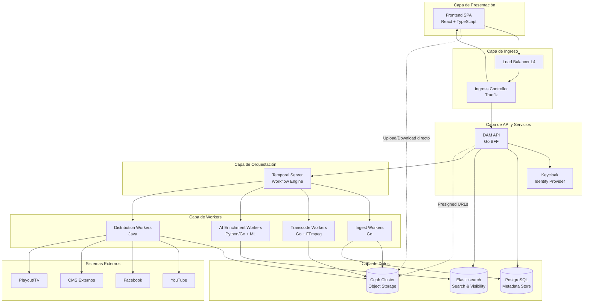
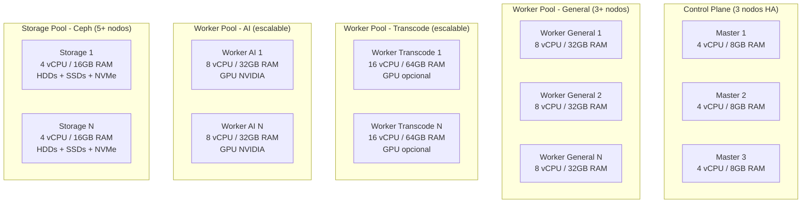
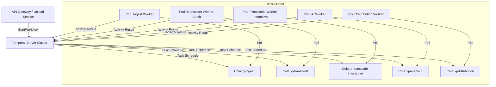
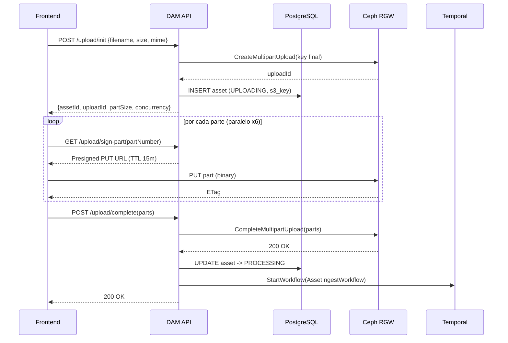
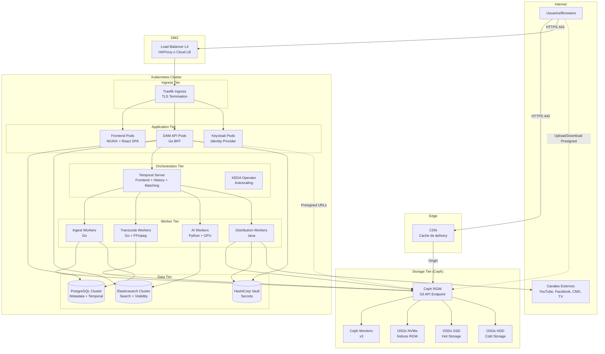

# Plataforma de Gestión de Activos Digitales (DAM) para Medios de Comunicación

---

**72.40 Ingeniería de Software**

**Alumnos:**

- Roman Berruti - 63533
- Tomás Pinausig - 63167
- Agostina Squillari - 64047

**Docentes:**

- Sotuyo Dodero, Juan Martin
- Mogni, Guido Matias

**Diciembre 2024**

---

# Índice

1. [Introducción](#1-introducción)
2. [Funcionalidad Requerida](#2-funcionalidad-requerida)
   - 2.1 [Requerimientos Funcionales](#21-requerimientos-funcionales)
   - 2.2 [Requerimientos No Funcionales](#22-requerimientos-no-funcionales)
3. [Atributos de Calidad](#3-atributos-de-calidad)
   - 3.1 [Disponibilidad](#31-disponibilidad)
   - 3.2 [Escalabilidad](#32-escalabilidad)
   - 3.3 [Performance](#33-performance)
   - 3.4 [Confiabilidad](#34-confiabilidad)
   - 3.5 [Tolerancia a Fallos](#35-tolerancia-a-fallos)
   - 3.6 [Seguridad](#36-seguridad)
   - 3.7 [Interoperabilidad](#37-interoperabilidad)
4. [Arquitectura del Sistema](#4-arquitectura-del-sistema)
   - 4.1 [Vista General de la Arquitectura](#41-vista-general-de-la-arquitectura)
   - 4.2 [Estrategia de Deployment](#42-estrategia-de-deployment)
   - 4.3 [Componentes del Sistema](#43-componentes-del-sistema)
5. [Resolución de Puntos Críticos](#5-resolución-de-puntos-críticos)
6. [Vista Física del Sistema](#6-vista-física-del-sistema)
7. [Supuestos, Riesgos, No-Riesgos y Trade-offs](#7-supuestos-riesgos-no-riesgos-y-trade-offs)
8. [Referencias](#8-referencias)

---

# 1. Introducción

Este trabajo define la arquitectura candidata para una Plataforma de Gestión de Activos Digitales (DAM) destinada a un grupo de medios de comunicación que administra millones de archivos de video, audio e imágenes. El objetivo del sistema es permitir el almacenamiento a largo plazo de activos originales (masters), la generación y gestión de versiones derivadas (renditions) para distintos canales, la indexación inteligente mediante metadatos y análisis de contenido con inteligencia artificial, y una búsqueda rápida y eficiente.

La plataforma automatiza la distribución multicanal hacia destinos como plataformas web, televisión y redes sociales, garantizando recuperación eficiente de archivos grandes y escalabilidad ante el crecimiento continuo del volumen de datos.

La solución propuesta se diseña siguiendo la metodología de documentación de arquitecturas 4+1, priorizando decisiones justificadas por atributos de calidad y cumpliendo estrictamente con la restricción de evitar vendor lock-in mediante el uso exclusivo de servicios de infraestructura (IaaS).

Dadas estas características, el sistema presenta desafíos arquitectónicos significativos en términos de escalabilidad, performance, durabilidad y desacoplamiento, que motivan la definición de una arquitectura orientada a componentes distribuidos y procesamiento asíncrono.

---

# 2. Funcionalidad Requerida

## 2.1 Requerimientos Funcionales

El sistema debe cumplir con los siguientes requerimientos funcionales, enumerados en orden de importancia:

1. **Almacenamiento de activos digitales:** Permitir el almacenamiento de archivos digitales de gran tamaño, incluyendo videos, audios e imágenes, garantizando su conservación a largo plazo con protección contra pérdida y corrupción de datos.
2. **Recuperación y descarga de activos:** Permitir la recuperación y descarga de activos digitales, incluyendo archivos de gran tamaño, facilitando su acceso eficiente para el uso editorial con tiempos de respuesta adecuados.
3. **Indexación inteligente con IA:** Asociar metadatos descriptivos a cada activo digital y complementar dicha información mediante análisis automático del contenido utilizando técnicas de inteligencia artificial (transcripción de audio, reconocimiento de objetos, OCR).
4. **Búsqueda rápida y eficiente:** Permitir a los usuarios realizar búsquedas rápidas sobre el conjunto de activos digitales, utilizando tanto metadatos editoriales como información derivada del análisis de contenido (transcripciones, etiquetas generadas por IA).
5. **Distribución automatizada multicanal:** Automatizar la distribución de los activos digitales a múltiples canales de salida, tales como plataformas web, televisión, YouTube, Facebook y otros sistemas de gestión de contenidos externos.

## 2.2 Requerimientos No Funcionales

El sistema deberá cumplir con los siguientes requerimientos no funcionales:

1. **Escalabilidad masiva:** El sistema debe soportar millones de activos y un crecimiento continuo del volumen de datos, sin degradación significativa del servicio.
2. **Performance adecuada:** La plataforma debe ofrecer tiempos de respuesta adecuados para uso editorial, tanto en búsquedas como en accesos de activos.
3. **Recuperación eficiente de archivos grandes:** La recuperación de archivos grandes debe realizarse de manera eficiente y confiable, evitando esperas excesivas en los flujos de trabajo de los editores.
4. **Escalabilidad horizontal:** El sistema debe ser escalable horizontalmente, permitiendo aumentar la capacidad de almacenamiento y procesamiento sin afectar la operación normal.
5. **Durabilidad de datos:** La plataforma debe garantizar la conservación a largo plazo de los activos, evitando pérdida o corrupción de información mediante esquemas de protección apropiados.
6. **Alta disponibilidad:** El sistema debe asegurar una alta disponibilidad del servicio para los usuarios internos, minimizando interrupciones y manteniendo continuidad operativa ante fallas.
7. **Seguridad corporativa:** Debe contar con mecanismos de seguridad acordes a un entorno corporativo: control de accesos basado en roles, protección de datos y trazabilidad de acciones relevantes.
8. **No vendor lock-in (IaaS only):** En caso de utilizar nube pública, la solución debe limitarse a infraestructura (IaaS), evitando dependencias de servicios gestionados o propietarios que generen vendor lock-in.

---

# 3. Atributos de Calidad

Los atributos de calidad se presentan ordenados por prioridad según su impacto en el negocio del grupo de medios.

## 3.1 Disponibilidad

**Prioridad: Crítica**

Para la plataforma DAM, la disponibilidad constituye el atributo de calidad más crítico. La indisponibilidad del sistema impacta de manera directa en la capacidad de producir, editar y publicar contenidos, afectando los tiempos de respuesta del negocio.

La plataforma es utilizada de forma intensiva por editores, productores y sistemas automatizados de publicación que dependen del acceso continuo a los activos digitales. Dado que el contenido puede ser requerido en distintos momentos del día y para múltiples canales, no existen períodos prolongados de inactividad en los que una caída del sistema resulte aceptable.

El sistema cumple un rol clave como origen del contenido distribuido automáticamente a plataformas web, televisión y redes sociales. Una indisponibilidad del DAM no solo afecta a los usuarios internos, sino que también interrumpe los flujos de distribución, dejando a los canales sin actualizaciones de contenido.

**Cómo la arquitectura resuelve este atributo:**

- Despliegue de todos los componentes sobre Kubernetes con múltiples réplicas y health checks automáticos.
- Almacenamiento con Ceph, que provee self-healing y tolerancia a fallos de hardware mediante replicación y erasure coding.
- Motor de workflows Temporal con persistencia durable que permite retomar tareas tras fallos sin pérdida de estado.
- Elasticsearch desplegado en cluster con nodos master redundantes (3) y réplicas de shards distribuidas.

## 3.2 Escalabilidad

**Prioridad: Crítica**

La escalabilidad es prioritaria porque el sistema debe ser capaz de manejar un crecimiento continuo tanto en el volumen de datos almacenados como en la cantidad de usuarios y procesos concurrentes, sin requerir un rediseño de su arquitectura.

Se debe administrar millones de archivos y acompañar un incremento constante a lo largo del tiempo. En el contexto de un DAM para medios, los archivos no se eliminan sino que se conservan como parte del patrimonio digital, lo que exige que la arquitectura pueda crecer de manera sostenida, especialmente en términos de almacenamiento y procesamiento asociado al análisis de contenido y transcodificación.

El sistema debe responder adecuadamente a picos de demanda generados por eventos de alta relevancia informativa, donde se incrementan de forma abrupta tanto las cargas de material como los accesos y descargas.

**Cómo la arquitectura resuelve este atributo:**

- Arquitectura de workers desacoplados con colas de tareas especializadas (Temporal Task Queues) que escalan independientemente.
- KEDA (Kubernetes Event-driven Autoscaling) con Temporal Scaler para escalar workers basado en profundidad de cola, no en métricas tardías como CPU/RAM.
- Ceph SDS que permite agregar capacidad de almacenamiento añadiendo nodos sin downtime.
- Elasticsearch con sharding horizontal para búsquedas sobre millones de documentos.

## 3.3 Performance

**Prioridad: Alta**

El rendimiento es un atributo central dado que condiciona directamente la operación editorial. Se exige una búsqueda rápida y una velocidad de recuperación de archivos grandes esencial, lo cual implica que el sistema debe responder en tiempos adecuados no solo en escenarios ideales, sino también bajo carga real y con millones de activos indexados.

Para el editor, el valor del sistema está en poder localizar material relevante y obtener una previsualización. Si la búsqueda tarda varios segundos o la recuperación de un video/imagen/audio se vuelve impredecible, el flujo de trabajo se interrumpe y el DAM deja de ser una herramienta habilitante para convertirse en un cuello de botella.

El sistema debe sostener un alto throughput en operaciones pesadas como la ingesta, el procesamiento de contenido (transcodificación y análisis con IA) y la distribución multicanal, ya que son procesos que pueden ocurrir en paralelo para muchos activos y compiten por recursos de cómputo, red y almacenamiento.

**Cómo la arquitectura resuelve este atributo:**

- Tiering de almacenamiento: SSDs para proxies y entregas (hot storage), HDDs con erasure coding para masters (cold storage), NVMe para índices de RGW.
- Uploads directos a S3 mediante Presigned URLs (zero-copy), evitando que el API streamee archivos grandes.
- Elasticsearch para búsquedas full-text con latencia sub-segundo sobre millones de documentos.
- Proxies pre-generados en formatos de streaming (HLS/DASH) para previsualización inmediata.

## 3.4 Confiabilidad

**Prioridad: Alta**

La confiabilidad es necesaria porque la plataforma debe operar de manera consistente y predecible, minimizando fallas y errores a lo largo del tiempo. En un DAM, la confiabilidad se manifiesta especialmente en la correcta ejecución de flujos críticos como la ingesta de archivos, la generación de renditions, el análisis con IA, la indexación y la distribución multicanal.

Dado que muchos de estos procesos son asíncronos y de larga duración, el sistema debe garantizar que los trabajos no se pierdan, que puedan reintentarse de forma segura (idempotencia) y que los resultados sean consistentes. Una baja confiabilidad genera fallas intermitentes difíciles de diagnosticar, retrabajo manual y pérdida de confianza de los editores en la plataforma.

**Cómo la arquitectura resuelve este atributo:**

- Temporal persiste el historial de eventos en PostgreSQL, garantizando durabilidad del estado de workflows.
- Heartbeating en tareas de larga duración (transcodificación) para detectar fallos y reprogramar automáticamente.
- Idempotencia en distribución mediante claves únicas (asset+canal+rendition) que evitan publicaciones duplicadas.
- Reintentos con backoff exponencial configurables por tipo de error (transitorio vs. permanente).

## 3.5 Tolerancia a Fallos

**Prioridad: Alta**

Dada la complejidad del sistema y la cantidad de componentes involucrados, resulta fundamental que la falla de un componente individual no implique la caída total del sistema. La arquitectura debe permitir que el servicio continúe operando, aunque sea de manera degradada, ante fallas parciales de infraestructura o de software, preservando el acceso a las funcionalidades más críticas para los usuarios.

Este enfoque permite garantizar la continuidad del servicio y reducir el impacto operativo de incidentes inevitables, como la indisponibilidad temporal de nodos de procesamiento, servicios de análisis de contenido o recursos de almacenamiento.

**Cómo la arquitectura resuelve este atributo:**

- Desacoplamiento mediante colas de mensajes: si un worker falla, las tareas permanecen en Temporal hasta que otro worker las procese.
- Circuit breaker pattern en workflows: si un servicio externo está caído, el workflow puede pausarse o ejecutar compensaciones (Saga Pattern).
- Ceph con self-healing automático: ante fallo de un OSD, el cluster redistribuye datos automáticamente.
- Múltiples réplicas de cada servicio crítico con load balancing.

## 3.6 Seguridad

**Prioridad: Alta**

La seguridad es fundamental en una plataforma DAM destinada a un entorno corporativo de medios de comunicación, ya que el sistema administra activos que representan propiedad intelectual de alto valor, incluyendo material inédito o sensible previo a su publicación. Resulta crítico controlar de manera estricta quién puede acceder, descargar, modificar o distribuir cada activo, de modo de prevenir accesos no autorizados y fugas de información que puedan generar impactos económicos, legales o reputacionales.

**Cómo la arquitectura resuelve este atributo:**

- Autenticación centralizada con Keycloak (OIDC/OAuth2) y tokens JWT con TTL corto.
- Autorización RBAC/ABAC por roles (editor, archivista, admin) y pertenencia a proyecto/carpeta.
- Presigned URLs con tiempo de expiración para transferencias directas a S3.
- HashiCorp Vault para gestión de secretos (credenciales de canales externos) con políticas de acceso granulares.
- Comunicación TLS entre todos los componentes.

## 3.7 Interoperabilidad

**Prioridad: Media**

La interoperabilidad es clave ya que la función principal del sistema es integrarse con distintos sistemas del ecosistema del grupo de medios. El DAM debe poder comunicarse con plataformas externas como sistemas de gestión de contenidos web, sistemas de emisión televisiva y servicios de publicación en redes sociales.

Dado que la distribución de contenido es un proceso automatizado, resulta fundamental que el sistema exponga interfaces y servicios basados en estándares ampliamente utilizados, que permitan el intercambio de información y activos de manera fluida.

**Cómo la arquitectura resuelve este atributo:**

- API REST estándar para todas las operaciones del frontend y integraciones.
- Conectores especializados por canal (YouTube API, Facebook Graph API, FTP/SFTP para broadcast).
- Almacenamiento con API S3-compatible (Ceph RGW) que permite migración futura sin cambios en la aplicación.
- Formatos de salida estándar (HLS, DASH, MP4, ProRes) compatibles con la industria.

---

# 4. Arquitectura del Sistema

## 4.1 Vista General de la Arquitectura

La arquitectura del sistema DAM se basa en un diseño de microservicios orquestados, con procesamiento asíncrono mediante workers especializados y almacenamiento distribuido. El siguiente diagrama presenta una vista de alto nivel de los componentes principales y sus interacciones:



### Principios Arquitectónicos

1. **Separación de planos (Control vs. Data):** El API maneja la lógica de control y metadatos, mientras que las transferencias de archivos grandes van directamente a/desde el storage mediante Presigned URLs, evitando que el API se convierta en cuello de botella.
2. **Procesamiento asíncrono mediante workflows:** Todas las operaciones de larga duración (transcodificación, enriquecimiento con IA, distribución) se modelan como workflows durables en Temporal, garantizando recuperación ante fallos.
3. **Workers especializados por tipo de carga:** Cada tipo de tarea tiene workers dedicados con recursos optimizados para su perfil (CPU-bound, GPU-bound, I/O-bound, Network-bound).
4. **Tiering de almacenamiento:** Datos fríos (masters) en HDD con erasure coding para optimizar costos; datos calientes (proxies, entregas) en SSD con replicación para optimizar latencia.
5. **Búsqueda como vista materializada:** Elasticsearch actúa como read model optimizado para búsqueda, mientras PostgreSQL mantiene la fuente canónica transaccional.

## 4.2 Estrategia de Deployment

### 4.2.1 Selección de Infraestructura IaaS

Para cumplir con el requerimiento de evitar vendor lock-in, el sistema se despliega íntegramente sobre infraestructura como servicio (IaaS). Se selecciona un modelo híbrido utilizando servidores bare-metal o máquinas virtuales de cualquier proveedor IaaS. Optamos por AWS EC2. Otras alternativas podrian ser Google Compute Engine, Azure VMs, DigitalOcean, entre otros.

**Decisión de IaaS:** Se utiliza un conjunto de máquinas virtuales Linux (Ubuntu Server 22.04 LTS) sobre el proveedor IaaS seleccionado. La arquitectura es agnóstica al proveedor específico, requiriendo únicamente:

- Instancias de cómputo con soporte para contenedores
- Almacenamiento en bloque (para Ceph OSDs)
- Networking con IPs privadas y públicas
- Load Balancer L4 (puede ser HAProxy self-hosted si el proveedor no lo ofrece)

### 4.2.2 Kubernetes como Plataforma de Orquestación

Se despliega un clúster de Kubernetes self-managed sobre las máquinas virtuales IaaS. La decisión de usar Kubernetes se fundamenta en:

1. **Estándar de facto:** Es la plataforma de orquestación de contenedores más adoptada, con ecosistema maduro de herramientas y operadores.
2. **Primitivas necesarias:** Provee las APIs requeridas para que KEDA funcione (HPA, métricas externas).
3. **Portabilidad:** Un clúster Kubernetes puede moverse entre proveedores IaaS sin cambios en la aplicación.
4. **Operación declarativa:** Manifiestos YAML versionables en Git para infraestructura como código.

**Alternativa descartada:** Docker Swarm carece del ecosistema maduro de autoscalers y operadores necesarios para este nivel de complejidad. !VER CHEQUEAR

### 4.2.3 Topología del Clúster Kubernetes



**Distribución de nodos:**

| Pool             | Cantidad Mínima  | Especificaciones                   | Propósito                                         |
| ---------------- | ----------------- | ---------------------------------- | -------------------------------------------------- |
| Control Plane    | 3                 | 4 vCPU, 8GB RAM, 100GB SSD         | API Server, etcd, Controller Manager               |
| Worker General   | 3                 | 8 vCPU, 32GB RAM, 200GB SSD        | API, Frontend, Temporal, Elasticsearch, PostgreSQL |
| Worker Transcode | 2-100 (elástico) | 16 vCPU, 64GB RAM, NVMe local      | Workers FFmpeg/libvips                             |
| Worker AI        | 1-20 (elástico)  | 8 vCPU, 32GB RAM, GPU NVIDIA       | Workers Whisper/YOLO/OCR                           |
| Storage Ceph     | 5+                | 4 vCPU, 16GB RAM, discos dedicados | OSDs de Ceph                                       |

### 4.2.4 Componentes de Infraestructura Desplegados

!VER service mesh? monitoreo y logs?

| Componente                    | Tecnología                       | Deployment                   |
| ----------------------------- | --------------------------------- | ---------------------------- |
| Orquestación de contenedores | Kubernetes (kubeadm o RKE2)       | Self-hosted                  |
| Ingress Controller            | Traefik                           | Kubernetes DaemonSet         |
| Autoscaling                   | KEDA + Temporal Scaler            | Kubernetes Operator          |
| Service Mesh (opcional)       | Istio o Linkerd                   | Kubernetes                   |
| Almacenamiento                | Ceph (Rook Operator)              | Kubernetes + nodos dedicados |
| Base de datos                 | PostgreSQL (CrunchyData Operator) | Kubernetes StatefulSet       |
| Motor de búsqueda            | Elasticsearch (ECK Operator)      | Kubernetes StatefulSet       |
| Workflow Engine               | Temporal Server                   | Kubernetes Deployment        |
| Identity Provider             | Keycloak                          | Kubernetes Deployment        |
| Gestión de secretos          | HashiCorp Vault                   | Kubernetes StatefulSet       |
| Monitoreo                     | Prometheus + Grafana              | Kubernetes                   |
| Logs                          | Loki o EFK Stack                  | Kubernetes                   |

## 4.3 Componentes del Sistema

### 4.3.1 Frontend (Single Page Application)

#### Responsabilidad

El frontend es la interfaz de usuario principal del sistema DAM, proporcionando una experiencia rica e interactiva para editores y productores. Permite la exploración de activos mediante búsqueda facetada, la edición de metadatos, la carga masiva de archivos, la previsualización de contenido multimedia y la gestión de distribuciones.

#### Stack Tecnológico

- **Framework:** React 18 con TypeScript
- **Gestión de estado asíncrono:** TanStack Query (`@tanstack/react-query`) para cache de server-state, revalidación automática y manejo de estados de carga.
- **Upload resiliente:** Uppy con plugin `@uppy/aws-s3` para uploads multipart con reintentos automáticos por parte, paralelismo controlado y reporte de progreso.
- **Reproducción de video:** Video.js con soporte HLS (vía VHS - Video HTTP Streaming).
- **Reproducción de audio:** Wavesurfer.js para visualización de waveforms y navegación temporal.
- **Componentes UI:** Material UI (MUI) por su madurez, densidad de componentes y soporte de temas.

#### Responsabilidades Específicas

1. **Autenticación OIDC:** Implementa el flujo Authorization Code con PKCE para autenticación segura contra Keycloak, gestionando tokens de acceso y refresh. !VER investigar
2. **Uploads masivos:** El frontend divide archivos grandes en chunks (partes de 5-100MB), sube hasta 6 partes en paralelo con reintentos individuales, y reporta progreso granular al usuario.
3. **Exploración y búsqueda:** Interfaz de búsqueda con filtros facetados (tipo de activo, fecha, tags, estados), paginación y cache local con revalidación optimista.
4. **Previsualización:** Reproduce proxies HLS/DASH directamente en el navegador sin descargar masters, utilizando URLs firmadas temporales.

#### Deployment

El frontend se compila como un build estático (HTML/JS/CSS) y se sirve mediante NGINX en un contenedor Docker. NGINX se configura para:

- Servir archivos estáticos con headers de cache agresivos
- Reescribir rutas SPA al index.html
- Comprimir con gzip/brotli

```yaml
# Fragmento de deployment Kubernetes
apiVersion: apps/v1
kind: Deployment
metadata:
  name: dam-frontend
spec:
  replicas: 2
  template:
    spec:
      containers:
      - name: frontend
        image: dam/frontend:latest
        ports:
        - containerPort: 80
        resources:
          requests:
            cpu: "100m"
            memory: "128Mi"
          limits:
            cpu: "500m"
            memory: "256Mi"
```

---

### 4.3.2 API Gateway e Ingress (Traefik)

#### Responsabilidad

Traefik actúa como punto de entrada único al clúster Kubernetes, manejando el ruteo de tráfico HTTP/HTTPS hacia los servicios internos, la terminación TLS y políticas de seguridad a nivel de red.

#### Funciones

1. **Terminación TLS:** Todos los certificados SSL se gestionan en Traefik mediante Let's Encrypt (ACME) o certificados provistos, descargando esta responsabilidad de los servicios internos.
2. **Routing por path:**

   - `/` → Frontend SPA
   - `/api/*` → DAM API (BFF)
   - `/auth/*` → Keycloak
3. **Límites de tamaño:** Para requests JSON al API se limita el body size (ej. 10MB). Los uploads grandes van directamente a S3 mediante Presigned URLs, sin pasar por el gateway.
4. **Observabilidad:** Exposición de métricas Prometheus y logs estructurados para cada request.

#### Justificación de Traefik

Se selecciona Traefik sobre alternativas como NGINX Ingress o HAProxy por:

- **Integración nativa con Kubernetes:** Descubre servicios automáticamente mediante anotaciones.
- **Configuración declarativa:** Middlewares y rutas definidas como Custom Resources.
- **Dashboard integrado:** Visualización del estado de rutas y servicios.
- **Let's Encrypt automático:** Renovación de certificados sin intervención manual.

---

### 4.3.3 DAM API (Backend for Frontend)

#### Responsabilidad

El DAM API es un servicio Go que actúa como Backend for Frontend (BFF), exponiendo un contrato estable a la SPA y encapsulando la complejidad de interactuar con múltiples servicios backend. Implementa la lógica de dominio, autorización y composición de respuestas.

#### Stack Tecnológico

!VER DECIDIR TODO ESO

- **Lenguaje:** Go 1.21+
- **Framework HTTP:** Chi router o Gin (ligeros y de alto rendimiento)
- **Validación:** go-playground/validator
- **Cliente PostgreSQL:** pgx
- **Cliente Elasticsearch:** elastic/go-elasticsearch
- **Cliente Temporal:** temporalio/sdk-go
- **Cliente S3:** aws-sdk-go-v2 (compatible con Ceph RGW)

#### Funciones Principales

1. **Composición de respuestas:** Agrega datos de múltiples fuentes (PostgreSQL para metadatos, Elasticsearch para búsqueda, Temporal para estados de jobs) en respuestas unificadas.
2. **Autorización a nivel dominio:** Valida permisos del usuario sobre recursos específicos (assets, proyectos, carpetas) según roles RBAC y políticas ABAC. !VER que es eso
3. **Generación de Presigned URLs:** Emite URLs firmadas para uploads (PUT) y downloads (GET) directos a Ceph RGW, con tiempos de expiración configurables.
4. **Disparo de workflows:** Inicia workflows Temporal para operaciones asíncronas (ingesta, transcodificación on-demand, distribución).
5. **Consulta de estados:** Expone endpoints para consultar el progreso y resultado de jobs en ejecución.

#### Endpoints Principales

| Endpoint                            | Método | Descripción                     |
| ----------------------------------- | ------- | -------------------------------- |
| `/api/v1/assets`                  | GET     | Listar assets con filtros        |
| `/api/v1/assets/{id}`             | GET     | Obtener asset por ID             |
| `/api/v1/assets/upload/init`      | POST    | Iniciar upload multipart         |
| `/api/v1/assets/upload/sign-part` | GET     | Obtener Presigned URL para parte |
| `/api/v1/assets/upload/complete`  | POST    | Completar upload multipart       |
| `/api/v1/search/assets`           | GET     | Búsqueda full-text con facetas  |
| `/api/v1/assets/{id}/downloads`   | POST    | Obtener URL de descarga          |
| `/api/v1/assets/{id}/ondemand`    | POST    | Solicitar rendition on-demand    |
| `/api/v1/jobs/{id}`               | GET     | Consultar estado de job          |

#### Justificación de Go

Se selecciona Go para el BFF por:

- **Consistencia:** Mismo lenguaje que los workers de ingesta y transcodificación.
- **Rendimiento:** Compilado, con bajo footprint de memoria y alta concurrencia mediante goroutines.
- **Ecosistema:** SDKs oficiales de Temporal, AWS S3, PostgreSQL y Elasticsearch.
- **Simplicidad de deployment:** Binario estático sin dependencias de runtime.

---

### 4.3.4 Servicio de Autenticación (Keycloak)

#### Responsabilidad

Keycloak actúa como Identity Provider (IdP) centralizado, gestionando la autenticación de usuarios, emisión de tokens y federación con sistemas de identidad externos si fuera necesario.

#### Funciones

1. **Autenticación OIDC:** Implementa el estándar OpenID Connect con soporte para Authorization Code Flow + PKCE (requerido para SPAs).
2. **Gestión de usuarios:** Interfaz administrativa para crear, modificar y desactivar usuarios del sistema.
3. **Roles y grupos:** Definición de roles (editor, archivista, admin) y grupos (proyectos, departamentos) para autorización.
4. **Tokens JWT:** Emite access tokens JWT con claims personalizados (roles, grupos, permisos) con TTL corto (5-15 minutos) y refresh tokens para renovación.
5. **Federación (opcional):** Capacidad de integrarse con LDAP/Active Directory corporativo o proveedores externos (Google, Microsoft).

#### Deployment

Keycloak se despliega en modo cluster con PostgreSQL como backend de persistencia, garantizando alta disponibilidad de la autenticación.

```yaml
# Fragmento de deployment
apiVersion: apps/v1
kind: Deployment
metadata:
  name: keycloak
spec:
  replicas: 2
  template:
    spec:
      containers:
      - name: keycloak
        image: quay.io/keycloak/keycloak:23.0
        args: ["start", "--optimized"]
        env:
        - name: KC_DB
          value: postgres
        - name: KC_DB_URL
          value: jdbc:postgresql://postgres:5432/keycloak
```

#### Justificación

Se selecciona Keycloak sobre alternativas como Auth0 o Okta por:

- **Self-hosted:** Cumple con el requerimiento de no vendor lock-in.
- **Estándar OIDC:** Implementación completa y certificada del protocolo.
- **Madurez:** Proyecto respaldado por Red Hat con amplia adopción.
- **Extensibilidad:** SPIs para personalización de flujos de autenticación.

---

### 4.3.5 Base de Datos Relacional (PostgreSQL)

#### Responsabilidad

PostgreSQL actúa como la fuente canónica (source of truth) para los metadatos del sistema, el ciclo de vida de los activos, auditoría y configuración. Almacena datos transaccionales que requieren consistencia ACID.

#### Datos Almacenados

1. **Assets:** Metadatos del activo (id, nombre, tipo, estado, fechas, propietario, proyecto).
2. **Renditions:** Referencias a las versiones derivadas de cada asset (profile, s3_key, status).
3. **Metadatos técnicos:** Información extraída por ffprobe/exiftool (duración, resolución, codec, bitrate).
4. **Distribuciones:** Registro de publicaciones a canales externos (asset_id, channel, external_id, status).
5. **Usuarios y permisos:** Tablas auxiliares para RBAC si no se delega completamente a Keycloak. !VER RBAC?

#### Modelo de Datos Principal

```sql
-- Assets (fuente canónica)
CREATE TABLE assets (
    id UUID PRIMARY KEY DEFAULT gen_random_uuid(),
    name VARCHAR(500) NOT NULL,
    type VARCHAR(50) NOT NULL, -- video, audio, image
    status VARCHAR(50) NOT NULL, -- uploading, processing, ready, error
    s3_key_master VARCHAR(1000),
    file_size_bytes BIGINT,
    mime_type VARCHAR(100),
    sha256_hash VARCHAR(64),
    created_at TIMESTAMP DEFAULT NOW(),
    updated_at TIMESTAMP DEFAULT NOW(),
    created_by UUID REFERENCES users(id),
    project_id UUID REFERENCES projects(id)
);

-- Renditions (versiones derivadas)
CREATE TABLE renditions (
    id UUID PRIMARY KEY DEFAULT gen_random_uuid(),
    asset_id UUID REFERENCES assets(id),
    profile VARCHAR(100) NOT NULL, -- proxy, thumbnail, web-720p, etc.
    s3_key VARCHAR(1000) NOT NULL,
    status VARCHAR(50) NOT NULL,
    created_at TIMESTAMP DEFAULT NOW()
);

-- Distribuciones (auditoría de publicaciones)
CREATE TABLE asset_distributions (
    id UUID PRIMARY KEY DEFAULT gen_random_uuid(),
    asset_id UUID NOT NULL REFERENCES assets(id),
    channel_type VARCHAR(50) NOT NULL,
    channel_id VARCHAR(100) NOT NULL,
    rendition_key VARCHAR(500) NOT NULL,
    external_id VARCHAR(500),
    status VARCHAR(20) NOT NULL,
    error_message TEXT,
    started_at TIMESTAMP NOT NULL,
    completed_at TIMESTAMP,
    idempotency_key VARCHAR(500) UNIQUE NOT NULL
);

CREATE INDEX idx_assets_status ON assets(status);
CREATE INDEX idx_assets_type ON assets(type);
CREATE INDEX idx_assets_project ON assets(project_id);
CREATE INDEX idx_renditions_asset ON renditions(asset_id);
CREATE INDEX idx_distributions_asset ON asset_distributions(asset_id);
```

#### Deployment

!VER INGESTIGAR

PostgreSQL se despliega mediante el operador CrunchyData (PGO) que gestiona:

- Cluster con réplicas de streaming replication
- Backups automáticos a object storage
- Failover automático
- Connection pooling con PgBouncer

---

### 4.3.6 Motor de Búsqueda (Elasticsearch)

#### Responsabilidad

Elasticsearch actúa como motor de indexación y búsqueda de metadatos enriquecidos, sirviendo como vista derivada optimizada para lectura (read model). Esta separación evita sobrecargar la base de datos relacional con consultas complejas y permite que la experiencia editorial escale horizontalmente.

Además, Elasticsearch sirve como Visibility Store para Temporal, habilitando Advanced Visibility con queries complejos sobre workflows. (Temporal configurado en dual-visibility)

#### Justificación de Unificación

Un único cluster de Elasticsearch sirve para:

1. **Búsqueda de activos DAM:** Índices `dam-assets-*`, `dam-transcript-segments-*`
2. **Visibility Store de Temporal:** Índice `temporal_visibility_v1`

Esta unificación reduce la complejidad operativa al mantener un único motor de búsqueda. La alternativa de usar PostgreSQL para Visibility de Temporal (Standard Visibility) fue descartada porque:

- Solo soporta filtros básicos (=, !=, IN, rangos)
- Se degrada con millones de workflows
- No permite búsqueda full-text ni ORDER BY sobre atributos custom

#### Estructura de Índices

Se implementa una estrategia de índices versionados con aliases para permitir evolución de mappings sin downtime:

| Índice                        | Contenido                                  | Campos Clave                                                       |
| ------------------------------ | ------------------------------------------ | ------------------------------------------------------------------ |
| `dam-assets-video-v1`        | 1 documento por video                      | assetId, title, description, tags_ai, entities, transcript_summary |
| `dam-assets-audio-v1`        | 1 documento por audio                      | assetId, title, transcript, keywords, topics                       |
| `dam-assets-image-v1`        | 1 documento por imagen                     | assetId, title, objects, scenes, ocr_text, caption                 |
| `dam-transcript-segments-v1` | 1 documento por segmento de transcripción | assetId, start_ms, end_ms, text, speaker_id                        |
| `temporal_visibility_v1`     | Workflows de Temporal                      | WorkflowId, AssetId, WorkflowType, ExecutionStatus                 |

**Alias unificado:** `dam-assets` apunta a los tres índices de activos para búsquedas transversales.

#### Deployment del Cluster

El cluster se despliega en Kubernetes mediante ECK (Elastic Cloud on Kubernetes) con la siguiente topología:

| Tipo de Nodo | Cantidad      | Función                                           |
| ------------ | ------------- | -------------------------------------------------- |
| Master       | 3             | Gestión del cluster, quorum HA                    |
| Data         | N (escalable) | Almacenamiento de índices y ejecución de queries |
| Coordinating | 2+            | Balanceo de carga y agregación de resultados      |

**Configuración de alta disponibilidad:**

- Cada índice con al menos 1 réplica
- Shards primarios y réplicas en nodos diferentes
- Snapshots periódicos a Ceph S3 para disaster recovery

---

### 4.3.7 Almacenamiento de Objetos (Ceph)

#### Responsabilidad

Ceph es la solución de almacenamiento definido por software (SDS) que gestiona todo el almacenamiento de archivos del sistema DAM, exponiendo una interfaz S3-compatible mediante Ceph Object Gateway (RGW). La arquitectura implementa tiering interno para balancear costo y rendimiento.

#### Justificación de Ceph

Se selecciona Ceph sobre alternativas como MinIO o almacenamiento directo del proveedor cloud por:

- **Tiering nativo:** Permite diferentes estrategias de protección por tipo de dato sin mover archivos.
- **Self-healing:** Recuperación automática ante fallos de discos o nodos.
- **Escalabilidad:** Permite agregar capacidad añadiendo nodos sin downtime.
- **API S3 completa:** Soporta multipart upload, lifecycle policies, versioning.
- **No vendor lock-in:** Software libre desplegable sobre cualquier IaaS.

#### Diseño de Pools y Tiering

Se definen pools separados por clase de dispositivo y estrategia de protección:

| Pool                      | Medio | Protección          | Propósito                                              |
| ------------------------- | ----- | -------------------- | ------------------------------------------------------- |
| `dam.rgw.buckets.index` | NVMe  | Replicación x3      | Índices RGW para operaciones S3 de baja latencia       |
| `dam.masters.data`      | HDD   | Erasure Coding (4+2) | Masters/originales - archivo histórico costo-eficiente |
| `dam.renditions.data`   | SSD   | Replicación x3      | Proxies, thumbnails, delivery - baja latencia           |

**Placement Targets RGW:**

- `STANDARD` → Pool `dam.masters.data` (para preservación)
- `HOT-STORAGE` → Pool `dam.renditions.data` (para entrega)

#### Estructura de Buckets

| Bucket           | Propósito                | Placement   | Lifecycle                                                     |
| ---------------- | ------------------------- | ----------- | ------------------------------------------------------------- |
| `dam-archive`  | Masters (source of truth) | STANDARD    | Abort MPU 7d, Versioning enabled                              |
| `dam-proxies`  | Renditions editoriales    | HOT-STORAGE | Abort MPU 7d, Expire proxies/ 90d, thumbs/ 180d, ondemand/ 2d |
| `dam-delivery` | CDN Origin                | HOT-STORAGE | Abort MPU 7d, Expire web/ 60d, social/ 90d, tv/ 365d          |

#### A. Bucket: dam-archive (Source of Truth)

* Propósito: almacenamiento de masters/originales y preservación a largo plazo.
* Placement Target:STANDARD (HDD + Erasure Coding).
* Versioning:Enabled (protección ante sobrescrituras accidentales y soporte a auditoría/rollback).
* Políticas de ciclo de vida:
  1. AbortIncompleteMultipartUpload (7 días):
     Justificación: al utilizar S3 Multipart Upload (MPU) para archivos grandes, esta regla elimina cargas incompletas y fragmentos huérfanos, evitando consumo de almacenamiento por subidas fallidas.

Aclaración de diseño (staging lógico): la “promoción” de un master se controla por el estado en la base de datos (UPLOADING → READY/PROCESSING), no por un “move” físico del objeto. Idealmente, el MPU se completa directamente en la key final del master (p. ej. masters/{assetId}/{sha256}/...) para evitar copias de objetos grandes; uploads/ se reserva para casos donde se requiera staging explícito.

#### B. Bucket: dam-proxies (Trabajo Editorial)

* Propósito: renditions internas (proxies de baja resolución, thumbnails) para edición y previsualización.
* Placement Target:HOT-STORAGE (SSD).
* Políticas de ciclo de vida:
  1. AbortIncompleteMultipartUpload (7 días):
     Justificación: higiene de cargas parciales en un bucket de alta rotación.
  2. Expiration – Prefix proxies/ (90 días):
     Justificación: los proxies son regenerables a partir del master. Mantenerlos indefinidamente en SSD incrementa costos sin aportar valor proporcional.
  3. Expiration – Prefix thumbs/ (180 días):
     Justificación: miniaturas de bajo peso relativo, útiles para exploración visual y UX; se retienen más tiempo para minimizar regeneración.
  4. Expiration – Prefix ondemand/ (2 días):
     Justificación: elimina rendiciones generadas on-demand.

#### C. Bucket: dam-delivery (CDN Origin)

* Propósito: salida para distribución (web, TV, redes) y origen para CDN.
* Placement Target:HOT-STORAGE (SSD).
* Políticas de ciclo de vida:

1. AbortIncompleteMultipartUpload (7 días):
   Justificación: evita acumulación de cargas incompletas en el bucket de entrega.
2. Expiration – Prefix web/ (60 días):
   Justificación: contenido de actualidad con caída rápida de demanda; puede regenerarse bajo demanda si fuera necesario.
3. Expiration – Prefix social/ (90 días):
   Justificación: los destinos (plataformas sociales) almacenan copia; el bucket funciona como buffer de entrega temporal.
4. Expiration – Prefix tv/ (365 días):
   Justificación: ventanas de disponibilidad más amplias por necesidades de broadcast/partners y potenciales acuerdos de sindicación.

#### Convención de Keys

Se utiliza una convención de keys inmutables versionadas para maximizar eficiencia de cache en CDN:

```
masters/{assetId}/{sha256}/source.{ext}
proxies/{assetId}/{sha256}/{profile}/output.{ext}
delivery/{channel}/{assetId}/{sha256}/{profile}/manifest.m3u8
```

**Justificación:** Las keys incluyen `sha256` y versión de perfil, lo que garantiza que ante cualquier cambio se escriba una nueva key. Esto permite headers `Cache-Control: immutable` con alto hit ratio en CDN sin invalidaciones.

---

### 4.3.8 Orquestador de Workflows (Temporal)

#### Responsabilidad

Temporal.io es el motor de orquestación que coordina todos los flujos de trabajo asíncronos del sistema: ingesta, transcodificación, enriquecimiento con IA y distribución. Implementa el patrón "Fault-Oblivious Stateful Workflow", garantizando que los procesos de larga duración se completen correctamente incluso ante fallos de infraestructura.

#### Justificación de Temporal

Se selecciona Temporal sobre alternativas como colas simples (RabbitMQ, Kafka) o Airflow por:

1. **Code-as-Infrastructure:** Los pipelines se definen en código (Go/Java) y no en archivos de configuración propietarios. Esto permite testeo unitario, versionado en Git y uso de estructuras de control nativas.
2. **Durabilidad garantizada:** Temporal persiste el historial de eventos en PostgreSQL. Si un worker colapsa en medio de una transcodificación de 2 horas, al recuperarse retoma exactamente en el punto de fallo.
3. **Abstracción Workflow/Activity:**
   - **Workflow:** Define la lógica de negocio (DAG). Es determinístico y liviano.
   - **Activity:** Realiza el trabajo pesado (FFmpeg, llamadas a APIs). Puede fallar y reintentarse.
4. **Visibilidad avanzada:** Con Elasticsearch como Visibility Store, permite queries complejos sobre millones de workflows para debugging y auditoría.
   **¿Por qué no colas simples?** Las colas no guardan estado del flujo. Implementar lógica como "Ejecutar A, luego B y C en paralelo, esperar a ambos, y si alguno falla ejecutar D" requeriría construir un motor de orquestación casero, lo cual es complejidad adicional que Temporal resuelve nativamente.

#### Task Queues y Segregación

Se definen Task Queues específicas para cada tipo de trabajo, permitiendo escalado independiente:

| Task Queue                  | Workers     | Perfil de Carga               | Propósito                                       |
| --------------------------- | ----------- | ----------------------------- | ------------------------------------------------ |
| `q-ingest`                | Go          | I/O Bound                     | Validación, checksums, extracción de metadatos |
| `q-transcode`             | Go + FFmpeg | CPU/GPU Bound                 | Transcodificación batch (ingesta masiva)        |
| `q-transcode-interactive` | Go + FFmpeg | CPU/GPU Bound (cupo limitado) | Renditions on-demand (prioridad UX)              |
| `q-ai-enrich`             | Python/Go   | GPU Bound                     | Inferencia de modelos (Whisper, YOLO, OCR)       |
| `q-distribution`          | Java        | Network Bound                 | Publicación a canales externos                  |

#### Diagrama de Orquestación

!VER MAL



#### Custom Search Attributes

Se definen atributos personalizados para búsquedas relevantes al dominio:

| Atributo          | Tipo    | Uso                                  |
| ----------------- | ------- | ------------------------------------ |
| `AssetId`       | Keyword | Filtrar workflows por asset          |
| `AssetType`     | Keyword | Filtrar por tipo (video/audio/image) |
| `FileName`      | Text    | Búsqueda full-text en nombre        |
| `FileSizeBytes` | Long    | Filtrar por tamaño                  |
| `UserId`        | Keyword | Auditoría por usuario               |
| `Channel`       | Keyword | Filtrar distribuciones por canal     |
| `ErrorType`     | Keyword | Clasificar fallos                    |

---

### 4.3.9 Ingest Workers

#### Responsabilidad

Los Ingest Workers ejecutan la primera etapa del pipeline de procesamiento: validación técnica de archivos, cálculo de checksums, extracción de metadatos técnicos y generación de identificadores únicos.

#### Stack Tecnológico

- **Lenguaje:** Go
- **Herramientas:** ffprobe (metadatos video/audio), exiftool (metadatos imagen)
- **Task Queue:** `q-ingest`

#### Perfil de Carga

- **I/O Bound + CPU Light:** Requiere alto ancho de banda de lectura contra Ceph pero bajo consumo de CPU.
- **Concurrencia típica:** 20-50 tareas por pod.

#### Flujo de Ejecución

1. Recibe notificación de nuevo asset (assetId, s3Key).
2. Lee el archivo desde Ceph para calcular SHA-256.
3. Ejecuta ffprobe/exiftool para extraer metadatos técnicos.
4. Actualiza PostgreSQL con metadatos extraídos.
5. Dispara siguiente etapa del workflow (transcoding).

---

### 4.3.10 Transcode Workers

#### Responsabilidad

Los Transcode Workers son el motor de cómputo intensivo de la plataforma. Su función es ejecutar la normalización de activos y la generación de derivados (renditions) de video, audio e imagen según los perfiles definidos por negocio.

#### Stack Tecnológico

- **Wrapper/Controlador:** Go (gestión de subprocesos, heartbeating, cancelación)
- **Motor de Video/Audio:** FFmpeg
- **Motor de Imágenes:** libvips (preferido sobre ImageMagick por procesamiento en streaming que reduce consumo de RAM)
- **Task Queues:** `q-transcode` (batch), `q-transcode-interactive` (on-demand)

#### Arquitectura y Flujo de Ejecución

Opera bajo un modelo de "polling" sobre la Task Queue de Temporal:

!VER de donde saca el voluem efimero de alta velocidad

1. **Aprovisionamiento de datos:** El worker descarga el archivo fuente desde Ceph a un volumen efímero de alta velocidad (EmptyDir/SSD) para acceso random rápido (seekable) necesario para análisis y codificación multipasada.
2. **Ejecución controlada:** El código Go construye el comando FFmpeg/libvips con los parámetros del perfil.

   - **Heartbeating:** Durante la ejecución (que puede durar horas para largometrajes), el wrapper lee la salida de FFmpeg, calcula el porcentaje completado y envía heartbeats a Temporal. Si el pod muere, Temporal detecta la falla y reprograma la tarea.
   - **Cancelación:** El worker escucha el contexto de cancelación de Temporal. Si el usuario cancela desde la UI, el wrapper mata el proceso FFmpeg.
3. **Persistencia y limpieza:** El archivo resultante se sube a Ceph mediante Multipart Upload. Al finalizar, se eliminan los archivos temporales.

#### Matriz de Renditions

| Tipo de Asset | Perfil        | Especificaciones               | Propósito                  |
| ------------- | ------------- | ------------------------------ | --------------------------- |
| Video         | Preview/Proxy | MP4/H.264 High @ 1080p, 5Mbps  | Edición offline, revisión |
| Video         | Web Low-Res   | MP4/H.264 Main @ 720p, 1.5Mbps | Visualización rápida      |
| Video         | Poster Frame  | JPG @ 1920x1080                | Imagen de portada           |
| Video         | HLS Streaming | HLS multi-bitrate              | Streaming adaptativo        |
| Audio         | Web Preview   | MP3 @ 128kbps CBR              | Preescucha en navegador     |
| Audio         | Broadcast     | WAV/PCM 24-bit 48kHz           | Edición profesional        |
| Imagen        | Thumbnails    | WebP @ 300px, 800px, 1200px    | Miniaturas responsivas      |
| Imagen        | Display       | JPG optimizado (MozJPEG)       | Visualización completa     |

#### Separación Batch vs. Interactivo

La cola `q-transcode` está optimizada para throughput (ingesta continua, escalado agresivo). La cola `q-transcode-interactive` está optimizada para latencia baja en requests de usuarios (exports on-demand).

**Políticas diferenciadas:**

| Aspecto         | q-transcode (batch) | q-transcode-interactive |
| --------------- | ------------------- | ----------------------- |
| Objetivo        | Throughput          | Latencia baja           |
| maxReplicaCount | 100                 | 10                      |
| targetQueueSize | 2-3                 | 1                       |
| Prioridad       | Normal              | Alta                    |

#### Configuración Kubernetes

```yaml
resources:
  requests:
    cpu: "2000m"
    memory: "4Gi"
  limits:
    cpu: "4000m"
    memory: "8Gi"
```

Los workers se despliegan en un NodePool dedicado con taints/tolerations para evitar que saturen nodos donde corren la API o base de datos.

---

### 4.3.11 AI Enrichment Workers

#### Responsabilidad

Los AI Enrichment Workers ejecutan inferencia de modelos de inteligencia artificial para generar metadatos semánticos que mejoren la exploración editorial: transcripciones, etiquetas, entidades reconocidas y texto OCR.

#### Stack Tecnológico

- **Lenguaje:** Python o Go (según modelo)
- **Speech-to-Text:** Whisper (faster-whisper optimizado sobre CTranslate2)
- **OCR:** Tesseract
- **Visión:** YOLO/Ultralytics para detección de objetos
- **Task Queue:** `q-ai-enrich`

#### Perfil de Carga

- **GPU Bound:** Principal consumidor de recursos GPU.
- **Concurrencia típica:** 1 tarea por GPU.

#### Flujo de Ejecución

1. Recibe referencia al asset y tipo de enriquecimiento requerido.
2. Descarga el archivo (o extrae audio de video) a almacenamiento local.
3. Ejecuta el modelo correspondiente.
4. Indexa los resultados en Elasticsearch.
5. Actualiza el estado del asset en PostgreSQL.

#### Modelos Self-Hosted

Para cumplir con el requerimiento de no vendor lock-in, todos los modelos se ejecutan en nodos de cómputo propios con GPUs NVIDIA:

| Modelo              | Uso                        | Requisitos |
| ------------------- | -------------------------- | ---------- |
| faster-whisper      | Transcripción audio/video | 8GB VRAM   |
| Tesseract/PaddleOCR | OCR de imágenes y frames  | CPU o GPU  |
| YOLOv8              | Detección de objetos      | 4GB VRAM   |
|                     |                            |            |

#### Configuración Kubernetes

```yaml
resources:
  requests:
    cpu: "4000m"
    memory: "16Gi"
    nvidia.com/gpu: 1
  limits:
    cpu: "8000m"
    memory: "32Gi"
    nvidia.com/gpu: 1
```

---

### 4.3.12 Distribution Workers

#### Responsabilidad

Los Distribution Workers publican activos hacia canales externos (YouTube, Facebook, CMS, sistemas de TV) de manera confiable, escalable y trazable. Implementan streaming directo desde S3 sin archivos temporales locales.

#### Stack Tecnológico

- **Lenguaje:** Java 17+
- **SDK Temporal:** temporalio/sdk-java
- **Cliente S3:** AWS SDK v2 (compatible con Ceph RGW)
- **Cliente Vault:** BetterCloud Vault Java Driver
- **HTTP Client:** OkHttp
- **Task Queue:** `q-distribution`

#### Diseño: Núcleo + Conectores

El worker implementa un núcleo de publicación y conectores por canal:

**Core (Java):**

- Validación de requerimientos por canal
- Selección de rendition
- Orquestación de publicación
- Normalización de errores
- Auditoría y métricas
- Políticas de reintento/idempotencia

**Conectores:**

- `YouTubeConnector` (YouTube Data API v3)
- `FacebookConnector` (Graph API)
- `CMSConnector` (REST genérico)
- `TVConnector` (MOS/FTP/SFTP)

#### Streaming Directo desde S3

**Problema:** Los pods de Kubernetes son efímeros; cualquier archivo escrito localmente se pierde si el pod muere.

**Solución:** El worker abre un stream de lectura desde S3 y lo conecta directamente al stream de escritura del canal externo, transfiriendo bytes en chunks de 8KB sin persistirlos localmente.

```java
// Ejemplo conceptual de streaming directo
S3Object s3Object = s3Client.getObject(
    GetObjectRequest.builder()
        .bucket("dam-proxies")
        .key(renditionKey)
        .build()
);

try (InputStream sourceStream = s3Object) {
    String externalId = connector.uploadStream(
        sourceStream,
        assetId,
        channel.getMetadata()
    );
}
```

**Ventajas:**

- Sin archivos temporales (todo en memoria con buffers pequeños)
- Resiliente (si el pod muere, Temporal reintenta)
- Eficiente (no hay I/O doble)
- Escalable (múltiples pods sin competir por disco)

#### Gestión de Secretos con HashiCorp Vault

Las credenciales de canales externos se almacenan en HashiCorp Vault:

```
secret/
  channels/
    youtube/
      channel-1/
        api_key: <key>
        access_token: <token>
    facebook/
      page-1/
        access_token: <token>
```

El worker obtiene credenciales dinámicamente con políticas de mínimo privilegio:

```hcl
# Política Vault para Distribution Worker
path "secret/data/channels/*" {
  capabilities = ["read"]
}
```

#### Idempotencia

Para evitar publicaciones duplicadas ante reintentos:

1. Se genera una `idempotency_key` estable por (asset, canal, rendition).
2. Antes de publicar, se verifica si ya existe un registro exitoso.
3. Si existe, se retorna el `external_id` previo sin re-publicar.
4. Al finalizar, se registra el resultado para futuras verificaciones.

#### Configuración Kubernetes

```yaml
resources:
  requests:
    cpu: "200m"
    memory: "512Mi"
  limits:
    cpu: "1000m"
    memory: "2Gi"
```

---

### 4.3.13 Escalabilidad Automática (KEDA + Temporal Scaler)

#### Responsabilidad

KEDA (Kubernetes Event-driven Autoscaling) gestiona el escalado horizontal de workers basándose en el backlog real de cada Task Queue de Temporal, en lugar de métricas tardías como CPU/RAM.

#### Principio de Escalado

El Temporal Scaler (disponible desde KEDA v2.17+) consulta periódicamente el Temporal Frontend y obtiene el tamaño de cola pendiente. La regla de decisión es:

```
desiredReplicas ≈ ceil(backlog / targetQueueSize)
```

Acotado por `minReplicaCount` y `maxReplicaCount`.

#### Parámetros por Task Queue

| Task Queue              | targetQueueSize | minReplicas | maxReplicas | Justificación               |
| ----------------------- | --------------- | ----------- | ----------- | ---------------------------- |
| q-ingest                | 5               | 1           | 50          | Tareas rápidas, I/O bound   |
| q-transcode             | 2               | 1           | 100         | Tareas pesadas CPU-bound     |
| q-transcode-interactive | 1               | 1           | 10          | Prioridad UX, cupo limitado  |
| q-ai-enrich             | 1               | 1           | 20          | GPU-bound, recursos costosos |
| q-distribution          | 10              | 1           | 50          | Tareas cortas, I/O network   |

#### Ejemplo de ScaledObject

```yaml
apiVersion: keda.sh/v1alpha1
kind: ScaledObject
metadata:
  name: transcode-workers-scaler
spec:
  scaleTargetRef:
    name: transcode-worker-deployment
  pollingInterval: 5
  cooldownPeriod: 60
  minReplicaCount: 1
  maxReplicaCount: 100
  advanced:
    horizontalPodAutoscalerConfig:
      behavior:
        scaleDown:
          stabilizationWindowSeconds: 120
  triggers:
    - type: temporal
      metadata:
        endpoint: temporal-frontend.temporal.svc.cluster.local:7233
        namespace: dam
        taskQueue: q-transcode
        queueTypes: activity
        targetQueueSize: "2"
        activationTargetQueueSize: "0"
```

#### Beneficios del Enfoque

1. **Reacción rápida a picos:** Si llegan 50 videos simultáneos, KEDA incrementa réplicas en segundos.
2. **Optimización de costos:** Al vaciarse la cola, reduce la flota.
3. **Escalado independiente:** Cada tipo de worker escala según su propia demanda.
4. **No vendor lock-in:** KEDA + Temporal son open-source.

---

### 4.3.14 Gestor de Secretos (HashiCorp Vault)

#### Responsabilidad

HashiCorp Vault gestiona de forma centralizada y segura todas las credenciales sensibles del sistema: tokens de APIs de canales externos, certificados, credenciales de bases de datos y claves de cifrado. Vault se despliega en modo HA con backend de almacenamiento en Consul o PostgreSQL. Los workers obtienen credenciales mediante Service Account tokens que Vault valida contra la API de Kubernetes (Kubernetes Auth Method).

Se selecciona Vault sobre Kubernetes Secrets nativos por:

- **Auditoría:** Registra todos los accesos a secretos.
- **Rotación automática:** Permite rotar credenciales sin downtime.
- **Múltiples backends:** Soporta secretos estáticos, dinámicos y certificados.
- **Políticas granulares:** Control de acceso fino por path y operación.
- **Self-hosted:** Cumple con requerimiento de no vendor lock-in.

# 5. Resolución de Puntos Críticos

## 5.1 Ingesta Masiva de Archivos Grandes

Los archivos de video pueden pesar decenas de gigabytes. Subir archivos de este tamaño a través del API tradicional (body de HTTP request) sería inviable por:

- Timeouts de conexión
- Saturación del API
- Falta de resiliencia ante cortes de red

### Solución: S3 Multipart Upload con Presigned URLs

El archivo se sube directamente a Ceph RGW (S3) mediante Multipart Upload, sin pasar por el API para el payload de datos.

**Flujo implementado:**



**Decisiones técnicas:**

- **Subida directa a key final:** El objeto se sube directamente a `masters/{assetId}/{sha256}/source.{ext}`, sin staging intermedio. El objeto no es visible hasta `CompleteMultipartUpload`.
- **Tamaño de parte:** 5-100MB configurable según red del cliente.
- **Paralelismo:** Hasta 6 partes simultáneas para maximizar throughput.
- **Reintentos por parte:** Si una parte falla, solo se reintenta esa parte.

## 5.2 Transcodificación de Larga Duración

Procesar un largometraje 4K puede tardar horas. Durante ese tiempo:

- El nodo de Kubernetes puede morir (Spot Instance reclamation, fallo de hardware)
- El usuario puede cancelar la operación
- Se necesita reportar progreso

### Solución: Heartbeating con Temporal

El worker de transcodificación implementa heartbeating para mantener a Temporal informado del progreso:

1. **Heartbeat periódico (cada 30s):** El wrapper Go parsea la salida de FFmpeg, calcula el porcentaje completado y envía heartbeat a Temporal.
2. **Detección de fallos:** Si el heartbeat se detiene (pod muere), Temporal detecta el timeout y reprograma la tarea en otro worker.
3. **Cancelación:** El worker escucha `ctx.Done()` y mata el proceso FFmpeg si el usuario cancela.

## 5.3 Distribución a Canales Externos Inestables

Las APIs de canales externos (YouTube, Facebook) son inestables:

- Rate limits
- Timeouts
- Caídas temporales
- Errores transitorios
  Además, no se pueden generar archivos temporales locales porque los pods son efímeros.

### Solución: Reintentos Inteligentes + Streaming Directo

**Reintentos con clasificación de errores:**

```java
RetryOptions retryOptions = RetryOptions.newBuilder()
    .setInitialInterval(Duration.ofSeconds(1))
    .setBackoffCoefficient(2.0)
    .setMaximumInterval(Duration.ofMinutes(5))
    .setMaximumAttempts(5)
    .setDoNotRetry(IllegalArgumentException.class) // errores permanentes
    .build();
```

- **Errores transitorios (5xx, timeout, rate limit):** Reintentar con backoff exponencial.
- **Errores permanentes (credenciales inválidas, formato no soportado):** Fallar inmediatamente.
  **Streaming directo desde S3:**
  El worker abre un stream desde S3 y lo conecta directamente al stream de upload del canal, sin escribir a disco local. Si el pod muere, Temporal reintenta y el nuevo worker reinicia el stream desde S3.

## 5.4 Búsqueda sobre Millones de Assets

Con millones de activos, las búsquedas sobre PostgreSQL degradan significativamente el rendimiento.

### Solución: Elasticsearch como Read Model

Se mantiene PostgreSQL como fuente canónica para transacciones, pero se replica a Elasticsearch como vista materializada optimizada para lectura:

- **Índices por tipo de asset:** Mappings optimizados para video, audio e imagen.
- **Índice de segmentos:** Para búsqueda dentro de transcripciones con timestamp exacto.
- **Alias unificado:** Permite búsquedas transversales (una query, todos los tipos).
- **Versionado de índices:** Permite evolucionar mappings sin downtime mediante reindex.

## 5.5 Gestión de Secretos de Canales Externos

Los Distribution Workers necesitan credenciales de múltiples canales externos, que deben:

- Estar protegidas
- Ser rotables sin downtime
- Auditarse

### Solución: HashiCorp Vault

Los secretos se almacenan en Vault con estructura jerárquica:

```
secret/channels/{channel_type}/{channel_id}/
  api_key
  access_token
  refresh_token
```

Los workers obtienen credenciales en runtime con políticas de mínimo privilegio. Vault registra cada acceso para auditoría.

---

# 6. Vista Física del Sistema

## 6.1 Diagrama de Deployment



## 6.2 Protocolos y Puertos

| Componente Origen    | Componente Destino | Protocolo  | Puerto   | Descripción                           |
| -------------------- | ------------------ | ---------- | -------- | -------------------------------------- |
| Usuarios             | Load Balancer      | HTTPS      | 443      | Tráfico web                           |
| Usuarios             | Ceph RGW           | HTTPS      | 443      | Uploads/Downloads directos (Presigned) |
| CDN                  | Ceph RGW           | HTTPS      | 443      | Origin pull                            |
| Load Balancer        | Traefik            | HTTP       | 80       | Tráfico interno (TLS ya terminado)    |
| Traefik              | Frontend           | HTTP       | 80       | Contenido estático                    |
| Traefik              | DAM API            | HTTP       | 8080     | REST API                               |
| Traefik              | Keycloak           | HTTP       | 8080     | OIDC endpoints                         |
| DAM API              | PostgreSQL         | TCP        | 5432     | SQL                                    |
| DAM API              | Elasticsearch      | HTTP       | 9200     | Búsqueda                              |
| DAM API              | Temporal           | gRPC       | 7233     | Workflows                              |
| Workers              | Temporal           | gRPC       | 7233     | Long-polling                           |
| Workers              | Ceph RGW           | HTTPS      | 443      | Object Storage                         |
| Distribution Workers | Vault              | HTTP       | 8200     | Secretos                               |
| Distribution Workers | Canales Externos   | HTTPS/SFTP | Variable | Publicación                           |

## 6.3 Requisitos de Hardware

### Mínimo para Producción (Carga Media)

| Componente            | Cantidad | Especificaciones                | Almacenamiento                          |
| --------------------- | -------- | ------------------------------- | --------------------------------------- |
| K8s Masters           | 3        | 4 vCPU, 8GB RAM                 | 100GB SSD                               |
| K8s Workers General   | 3        | 8 vCPU, 32GB RAM                | 200GB SSD                               |
| K8s Workers Transcode | 3        | 16 vCPU, 64GB RAM               | 500GB NVMe                              |
| K8s Workers AI        | 2        | 8 vCPU, 32GB RAM, 1x GPU NVIDIA | 200GB SSD                               |
| Ceph Nodes            | 5        | 4 vCPU, 16GB RAM                | 1x 200GB NVMe, 2x 500GB SSD, 4x 4TB HDD |

### Escalado Esperado

- **Workers Transcode:** 3 → 100 pods según demanda
- **Workers AI:** 2 → 20 pods según demanda
- **Workers Distribution:** 1 → 50 pods según demanda
- **Ceph:** Agregar nodos para incrementar capacidad (lineal)

---

# 7. Supuestos, Riesgos, No-Riesgos y Trade-offs

## 7.1 Supuestos

1. **Conectividad de red estable:** Se asume que la red interna del datacenter/cloud tiene latencia baja (<5ms) y ancho de banda suficiente (10Gbps) para transferencias entre workers y storage.
2. **Disponibilidad de GPUs:** Para los workers de IA, se asume acceso a instancias con GPUs NVIDIA (CUDA) para inferencia eficiente de modelos.
3. **Volumen inicial conocido:** Se asume un volumen inicial de ~1 millón de activos con crecimiento de ~100,000 activos/mes, que guía el sizing inicial de infraestructura.
4. **Formatos de entrada estándar:** Los archivos ingresados son formatos multimedia estándar (MP4, MOV, WAV, MP3, JPEG, PNG, TIFF, ETC). Formatos propietarios o exóticos pueden requerir extensiones.
5. **Equipo de operaciones capacitado:** Se asume un equipo de operaciones con conocimientos de Kubernetes, Ceph y las tecnologías seleccionadas para operación y troubleshooting.


# 8. Referencias

## Documentación Oficial

- **Kubernetes:** https://kubernetes.io/docs/
- **Temporal.io:** https://docs.temporal.io/
- **Ceph:** https://docs.ceph.com/
- **Elasticsearch:** https://www.elastic.co/guide/
- **Keycloak:** https://www.keycloak.org/documentation
- **HashiCorp Vault:** https://www.vaultproject.io/docs
- **KEDA:** https://keda.sh/docs/
- **Traefik:** https://doc.traefik.io/traefik/

## Herramientas de Procesamiento

- **FFmpeg:** https://ffmpeg.org/documentation.html
- **libvips:** https://www.libvips.org/API/current/
- **Whisper (faster-whisper):** https://github.com/SYSTRAN/faster-whisper
- **YOLO/Ultralytics:** https://docs.ultralytics.com/

## Frontend

- **React:** https://react.dev/
- **TanStack Query:** https://tanstack.com/query/latest
- **Uppy:** https://uppy.io/docs/
- **Video.js:** https://videojs.com/guides/

## APIs de Canales

- **YouTube Data API v3:** https://developers.google.com/youtube/v3/docs
- **Facebook Graph API:** https://developers.facebook.com/docs/graph-api/

## Especificaciones S3

- **AWS S3 Multipart Upload:** https://docs.aws.amazon.com/AmazonS3/latest/userguide/mpuoverview.html
- **Ceph RGW S3 API:** https://docs.ceph.com/en/latest/radosgw/s3/

## Autoscaling

- **KEDA Temporal Scaler:** https://keda.sh/docs/2.18/scalers/temporal/

---

*Documento generado para la materia 72.40 Ingeniería de Software - FIUBA*
