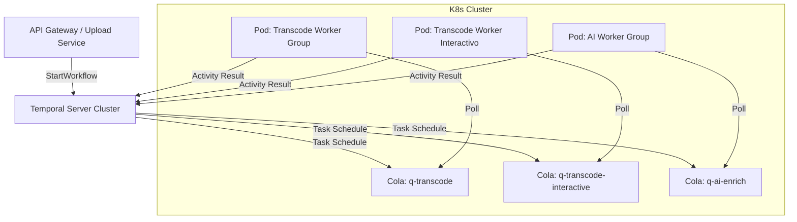

# 6. Orquestación de Flujos de Trabajo y Estrategia de Escalabilidad

Para coordinar la complejidad asíncrona del sistema (ingesta, validación, transcodificación, enriquecimiento con IA y distribución), se selecciona **Temporal.io** como motor de orquestación de flujos de trabajo (Workflow Engine), desplegado sobre un clúster de Kubernetes gestionado en infraestructura IaaS.

> **Nota:** Esta es una sección crítica del informe. Para un sistema DAM que maneja millones de archivos, la orquestación no puede ser un simple script o una cola de mensajes básica (como RabbitMQ "pelado"), porque se necesitan gestionar estados complejos (ej: "esperar a que terminen 3 renditions antes de notificar"), reintentos inteligentes y tiempos de ejecución largos (transcoding).

---

## 6.1. Justificación de la Tecnología: Temporal.io

A diferencia de las arquitecturas basadas en coreografía (eventos disparados entre microservicios sin control central), Temporal implementa una arquitectura de orquestación basada en el patrón **"Fault-Oblivious Stateful Workflow"**.

### Decisiones de Diseño

1. **Code-as-Infrastructure:** Los pipelines se definen en código (Go/Java) y no en archivos JSON/XML propietarios (como en AWS Step Functions o Airflow). Esto permite testeo unitario, versionado en Git y uso de estructuras de control nativas del lenguaje.
2. **Durabilidad Garantizada:** Temporal persiste el historial de eventos en su base de datos (PostgreSQL). Si un worker o el orquestador colapsan en medio de una transcodificación de 2 horas, al recuperarse el sistema retoma el proceso exactamente en el punto de fallo sin perder estado.
3. **Abstracción Workflow vs. Activity:**

   - **Workflow:** Define la lógica de negocio (el DAG: Directed Acyclic Graph). Es determinístico y liviano.
   - **Activity:** Realiza el trabajo pesado (FFmpeg, llamadas a API de IA). Puede fallar y reintentarse.

---

## 6.2. Implementación de Workers y Segregación de Tareas

Para garantizar la escalabilidad y evitar que tareas intensivas en CPU (transcoding) bloqueen tareas livianas (actualización de DB), se implementa el patrón **Worker-per-Task-Queue**.

Se definen contenedores Docker específicos para cada tipo de tarea, desplegados en Kubernetes como Deployments independientes. Cada grupo de workers escucha una Task Queue específica en Temporal.

| Tipo de Worker                 | Task Queue                  | Recursos Requeridos         | Responsabilidad                                                                                           |
| ------------------------------ | --------------------------- | --------------------------- | --------------------------------------------------------------------------------------------------------- |
| Ingest Worker                  | `q-ingest`                | High I/O, Low CPU           | Validación de archivos, cálculo de hash SHA-256, escaneo de virus                                       |
| Transcode Worker (Batch)       | `q-transcode`             | High CPU/GPU                | Ejecución de FFmpeg/libvips. Renderizado de proxies y thumbnails para pipelines de ingesta masiva        |
| Transcode Worker (Interactivo) | `q-transcode-interactive` | High CPU/GPU (cupo acotado) | Renditions**on-demand** solicitadas por usuarios (descarga/formato específico con prioridad de UX) |
| AI Worker                      | `q-ai-enrich`             | GPU / Tensor Cores          | Inferencia de modelos (Whisper, YOLO, OCR)                                                                |
| Dist Worker                    | `q-distribution`          | High Network, Low CPU       | Transferencia a CDN, llamadas a APIs sociales (I/O bound)                                                 |

### 6.2.1. Agregar cola de transcode interactivo (prioridad UX sin canibalizar batch)

La cola `q-transcode` (batch) está optimizada para throughput (ingesta continua, colas profundas y escalado agresivo). Sin embargo, el caso **on-demand** (por ejemplo “necesito ProRes para edición ya”) requiere un objetivo distinto: **latencia baja** para el usuario, sin esperar a que termine un backlog masivo.

Por este motivo se introduce una **Task Queue dedicada**:

- **Nueva Task Queue**: `q-transcode-interactive`.\n
- **Uso**: ejecutar Activities de transcodificación disparadas por interacciones del usuario (descargas con formato no existente, exports, etc.).\n
- **Política operativa**: **cupo acotado** y límites de concurrencia para garantizar que lo interactivo no consuma el 100% de CPU/GPU del clúster y afecte la ingesta.

#### Implementación concreta (routing + deployments)

1. **Routing a nivel Workflow/Activity (Temporal):** el workflow que atiende requests on-demand configura las Activities de transcode con `TaskQueue: "q-transcode-interactive"`. El workflow de ingesta mantiene `TaskQueue: "q-transcode"`.
2. **Deployments separados (Kubernetes):**

   - `transcode-worker-batch` (polling `q-transcode`): escalado amplio; orientado a throughput.
   - `transcode-worker-interactive` (polling `q-transcode-interactive`): escalado acotado; orientado a baja latencia y respuesta rápida.
3. **Límites de concurrencia en el proceso del worker (defensa en profundidad):**

   - En el worker interactivo se configura un máximo de Activities concurrentes (por ejemplo 1–2 por pod) para evitar saturación (FFmpeg suele ser CPU/GPU-bound).
   - En el worker batch se permite mayor concurrencia por pod (según hardware), priorizando utilización total de recursos.

> **Justificación:** separar por colas permite aplicar políticas de escalado, priorización y límites distintos sin inventar un scheduler propio. Temporal hace el encolado y KEDA traduce backlog en réplicas por cola.

### Diagrama Lógico de Orquestación



---

## 6.3. Estrategia de Escalabilidad Automática (Autoscaling con KEDA + Temporal Scaler)

El requerimiento de reaccionar a picos de carga (sin sobredimensionar infraestructura) se resuelve integrando Kubernetes con **KEDA** utilizando el **Temporal Scaler** nativo (`type: temporal`, disponible desde KEDA v2.17+). Este enfoque permite escalar cada grupo de workers en función del backlog real de su Task Queue en Temporal, en lugar de escalar por CPU/RAM (métrica tardía para sistemas de colas).

### 6.3.1. Principio de escalado: backlog por Task Queue (no por recursos)

KEDA consulta periódicamente el Temporal Frontend gRPC endpoint y obtiene una estimación del tamaño de cola (pendientes) para una taskQueue. En base a ese backlog, KEDA calcula el número deseado de réplicas para el Deployment de workers.

**Regla de decisión (conceptual):**

- `desiredReplicas ≈ ceil(backlog / targetQueueSize)`
- Acotado por `minReplicaCount` y `maxReplicaCount`

Esto se alinea con el patrón Worker-per-Task-Queue: cada cola (`q-transcode`, `q-ai-enrich`, etc.) escala de forma independiente según su propia demanda, evitando que un pico en transcoding "arrastre" al resto del sistema.

> **Nota de observabilidad:** Schedule-To-Start latency se utiliza como métrica de salud/SLO para detectar "workers quedándose atrás", pero el escalado automático se basa en backlog.

### 6.3.2. Componentes involucrados (flujo de control)

1. **KEDA Operator** corre en el clúster y observa objetos `ScaledObject`.
2. Por cada `ScaledObject`, KEDA crea/gestiona un HPA "interno" con métricas externas.
3. El **Temporal Scaler** consulta el endpoint gRPC de Temporal y evalúa backlog de la Task Queue configurada.
4. Kubernetes incrementa o reduce réplicas del Deployment correspondiente (Pods de workers).

### 6.3.3. Parametrización recomendada por cola

Para cada grupo de workers se define un `ScaledObject` con:

| Parámetro                               | Descripción                                                       |
| ---------------------------------------- | ------------------------------------------------------------------ |
| `endpoint`                             | `temporal-frontend.<ns>.svc.cluster.local:7233` (gRPC)           |
| `namespace`                            | Namespace Temporal (ej.`dam`)                                    |
| `taskQueue`                            | Cola a monitorear (ej.`q-transcode`)                             |
| `queueTypes`                           | `activity` para workers que ejecutan Activities                  |
| `targetQueueSize`                      | Backlog "deseable" por réplica (controla agresividad de escalado) |
| `activationTargetQueueSize`            | Umbral para activar el escalado (útil para scale-to-zero)         |
| `pollingInterval` / `cooldownPeriod` | Frecuencia de evaluación y tiempo de enfriamiento                 |

**Criterio práctico de sizing:**

- `q-transcode`: `targetQueueSize` bajo (ej. 1–3) porque cada Activity es pesada.
- `q-ai-enrich`: similar si usa GPU.
- `q-distribution`: `targetQueueSize` mayor (ej. 10–50), porque son tareas I/O bound y cortas.

### 6.3.4. Implementación (YAML) — Temporal Scaler por Deployment

Ejemplo concreto para Transcode Worker (`q-transcode`), escalando por backlog de Activities:

```yaml
apiVersion: keda.sh/v1alpha1
kind: ScaledObject
metadata:
  name: transcode-workers-scaler
spec:
  scaleTargetRef:
    name: transcode-worker-deployment
  pollingInterval: 5          # cada 5s consulta backlog
  cooldownPeriod: 60          # evita "thrashing" al bajar
  minReplicaCount: 1          # 1 worker siempre listo (reduce cold start)
  maxReplicaCount: 100        # límite presupuestario
  advanced:
    horizontalPodAutoscalerConfig:
      behavior:
        scaleDown:
          stabilizationWindowSeconds: 120
  triggers:
    - type: temporal
      metadata:
        endpoint: temporal-frontend.temporal.svc.cluster.local:7233
        namespace: dam
        taskQueue: q-transcode
        queueTypes: activity
        targetQueueSize: "2"
        activationTargetQueueSize: "0"
```

### 6.3.4.1. Implementación (YAML) — ScaledObject para `q-transcode-interactive` (cupo y latencia)

Para el transcode **interactivo**, el escalado se configura con objetivos más conservadores y límites estrictos:

- **`targetQueueSize` más bajo** (ej. 1): intenta mantener backlog ~0–1 por réplica.\n
- **`minReplicaCount`** típicamente 1: evita cold-start cuando un editor solicita un export.\n
- **`maxReplicaCount` acotado** (ej. 5–10): límite presupuestario y, principalmente, para no canibalizar batch.\n

Ejemplo:

```yaml
apiVersion: keda.sh/v1alpha1
kind: ScaledObject
metadata:
  name: transcode-interactive-workers-scaler
spec:
  scaleTargetRef:
    name: transcode-interactive-worker-deployment
  pollingInterval: 5
  cooldownPeriod: 60
  minReplicaCount: 1
  maxReplicaCount: 10
  advanced:
    horizontalPodAutoscalerConfig:
      behavior:
        scaleDown:
          stabilizationWindowSeconds: 120
  triggers:
    - type: temporal
      metadata:
        endpoint: temporal-frontend.temporal.svc.cluster.local:7233
        namespace: dam
        taskQueue: q-transcode-interactive
        queueTypes: activity
        targetQueueSize: "1"
        activationTargetQueueSize: "0"
```

#### Política operativa recomendada (evitar canibalización)

La separación de colas no basta si ambos deployments compiten por los mismos nodos. Para garantizar aislamiento se aplican, en conjunto:

1. **Cupo por escalado (KEDA):** `maxReplicaCount` del interactivo bajo.\n
2. **Cupo por pod (worker options):** baja concurrencia por pod en el interactivo.\n
3. **Aislamiento por scheduling (Kubernetes):** si hay GPU/CPU dedicadas, usar `nodeSelector`/`taints & tolerations` para reservar un pool pequeño a interacciones (o, alternativamente, asignar `PriorityClass` más alta al interactivo con límites de recursos para no expulsar batch indiscriminadamente).\n

> Resultado: el sistema puede responder rápido a solicitudes puntuales sin bloquear la ingesta masiva ni degradar la estabilidad del clúster.

### 6.3.5. Scale-to-zero: cuándo aplicarlo y cómo evitar comportamientos indeseados

KEDA permite `minReplicaCount: 0`, pero Temporal Scaler advierte que activar/desactivar solo por backlog puede ser no confiable al escalar a cero (no contempla tareas "in-flight" o workloads de baja tasa que nunca generan backlog suficiente). Por eso, si se habilita scale-to-zero, se deben ajustar `cooldownPeriod` y el comportamiento de scale-down del HPA.

**Política recomendada en este DAM:**

- **No scale-to-zero** para `q-transcode` (evita demoras por cold start y reduce riesgo de cortar procesamiento en picos intermitentes).
- **Scale-to-zero opcional** para colas esporádicas (p.ej. `q-distribution` si la carga es muy puntual), con `cooldownPeriod` alto y estabilización.

### 6.3.6. Seguridad de conexión (mTLS / secrets)

El Temporal Scaler soporta API key y mTLS; en despliegues self-hosted se prioriza mTLS dentro del cluster. KEDA consume credenciales vía `TriggerAuthentication` referenciando Secrets.

Este esquema mantiene el objetivo de **No Vendor Lock-in**: Temporal + KEDA + Kubernetes son componentes open-source desplegables sobre IaaS, y el escalado queda gobernado por métricas del propio sistema (Task Queues) en lugar de servicios gestionados del proveedor cloud.

---

## 6.4. Tolerancia a Fallos y Resiliencia

La implementación en Temporal resuelve los puntos críticos de fallo definidos en los atributos de calidad:

### 1. Heartbeating en Transcoding

Dado que procesar un video 4K puede tardar horas, los workers de `q-transcode` envían un "latido" (heartbeat) a Temporal cada 30 segundos. Si un nodo de Kubernetes muere (Spot Instance reclamation o fallo de hardware), el latido se detiene. Temporal detecta el timeout y re-agenda la tarea inmediatamente en otro worker disponible, sin intervención humana.

### 2. Idempotencia en Distribución

Las Activities de distribución (`q-distribution`) están configuradas con **Políticas de Reintento Exponencial** (Exponential Backoff). Si la API de YouTube devuelve un error 503, Temporal reintentará automáticamente (esperando 1s, luego 2s, 4s...) hasta un máximo definido o hasta que la API responda, garantizando entrega eventual.

### 3. Circuit Breaker

Si un servicio externo (ej. la base de datos o un servicio de IA) está caído, el Workflow puede pausarse o derivar a una rama de error (**Saga Pattern**) para ejecutar compensaciones (ej. marcar el asset como "Error de Procesamiento" y alertar a Ops), en lugar de saturar el sistema con reintentos infinitos.

---

## 6.5. Vista Física del Despliegue (IaaS)

Para evitar Vendor Lock-in, el clúster de Temporal es **"Self-Hosted"** sobre la infraestructura IaaS seleccionada.

| Componente                                            | Descripción                                                                                                           |
| ----------------------------------------------------- | ---------------------------------------------------------------------------------------------------------------------- |
| **Temporal Frontend/History/Matching Services** | Desplegados como Pods stateless en Kubernetes. Escalan horizontalmente.                                                |
| **Persistencia (Backend)**                      | Clúster de PostgreSQL (gestionado por nosotros en IaaS) para almacenar el historial de eventos y estado de workflows. |
| **Visibilidad (Advanced Visibility)**           | Elasticsearch, reutilizando el cluster ya definido para indexación del DAM.                                           |

### Beneficios de Elasticsearch para Visibility

La integración con Elasticsearch permite:

- **Queries complejos sobre workflows:** búsqueda full-text, filtros LIKE/BETWEEN, ORDER BY sobre Custom Search Attributes.
- **Debugging operativo:** "¿Qué workflows fallaron para el asset X?"
- **Auditoría:** "¿Qué workflows ejecutó el usuario Y entre fecha A y B?"
- **Monitoreo y reportes:** aggregations sobre estado, duración, tipo de workflow.

> **Justificación:** La elección de Elasticsearch sobre PostgreSQL para Visibility se justifica por la escala del sistema: cada asset genera múltiples workflows (ingesta, transcoding, enriquecimiento IA, distribución), resultando en millones de workflows que requieren capacidad de búsqueda avanzada imposible con Standard Visibility (PostgreSQL).

### 6.5.1. Configuración de Temporal con Elasticsearch

El Temporal Server se configura para usar Elasticsearch como Visibility Store:

```yaml
# temporal-config.yaml (fragmento relevante)
persistence:
  defaultStore: postgres-default
  visibilityStore: es-visibility
  datastores:
    postgres-default:
      sql:
        pluginName: "postgres"
        databaseName: "temporal"
        connectAddr: "postgres.dam.svc.cluster.local:5432"
    es-visibility:
      elasticsearch:
        version: "v7"
        url:
          scheme: "http"
          host: "elasticsearch.dam.svc.cluster.local:9200"
        indices:
          visibility: temporal_visibility_v1
```

### 6.5.2. Custom Search Attributes para el DAM

Se definen Custom Search Attributes específicos para habilitar búsquedas relevantes al dominio:

| Atributo          | Tipo    | Uso                                      |
| ----------------- | ------- | ---------------------------------------- |
| `AssetId`       | Keyword | Filtrar workflows por asset específico  |
| `AssetType`     | Keyword | Filtrar por tipo (video/audio/image)     |
| `FileName`      | Text    | Búsqueda full-text en nombre de archivo |
| `FileSizeBytes` | Long    | Filtrar por tamaño de archivo           |
| `UserId`        | Keyword | Auditoría por usuario                   |
| `Channel`       | Keyword | Filtrar distribuciones por canal destino |
| `ErrorType`     | Keyword | Clasificar fallos para análisis         |

Estos atributos se registran en Temporal y se propagan desde los workflows, permitiendo queries como:

```sql
WorkflowType = 'TranscodeWorkflow' 
  AND AssetType = 'video' 
  AND ExecutionStatus = 'Failed'
  AND StartTime > '2024-12-01'
  ORDER BY StartTime DESC
```

---

## 6.6. Notas para el Informe (Justificaciones Clave)

### ¿Por qué contenedores separados?

Para aislar dependencias y tamaños. El contenedor de Transcode pesa GBs (librerías de video, drivers de GPU) y consume mucha CPU. El contenedor de Distribution pesa MBs y consume casi nada. Escalarlos juntos sería un desperdicio de recursos (ineficiencia de costos).

### ¿Por qué Kubernetes?

Porque es el estándar de facto para orquestar contenedores y provee las primitivas de API necesarias para que KEDA funcione. Docker Swarm carece del ecosistema maduro de autoscalers como KEDA.

### ¿Por qué no colas simples (RabbitMQ/Kafka)?

Las colas no guardan estado del flujo. Si se necesita la lógica: *"Ejecutar A, luego B y C en paralelo, esperar a ambos, y si alguno falla ejecutar D"*, hacerlo con colas implica escribir un "Motor de orquestación casero" dentro de los workers, lo cual es un antipatrón (complejidad accidental). Temporal resuelve esto "out-of-the-box".

---

## 6.7. Restricciones de Usar Temporal en Kubernetes

### Apatridia (Statelessness) y Efimeridad del Sistema de Archivos

**La Limitación:** En Kubernetes, los Pods pueden ser destruidos, reiniciados o movidos de nodo en cualquier momento (por escalado o fallos). El sistema de archivos del contenedor es volátil; cualquier archivo escrito localmente se pierde si el Pod muere.

**Implicancias en el Código:**

| ❌ Prohibido                                                                                                                                                   | ✅ Adaptación en el DAM                                                                                                                                             |
| -------------------------------------------------------------------------------------------------------------------------------------------------------------- | -------------------------------------------------------------------------------------------------------------------------------------------------------------------- |
| Guardar archivos de sesión, logs o archivos temporales de procesamiento (ej. chunks de video) en el disco local esperando que persistan entre requests.       | Los workers de transcodificación deben escribir en un**Volumen Persistente compartido (PVC)** o subir directamente el stream a **Object Storage (S3)**. |
| Guardar estado en variables globales o memoria RAM (ej.`user_sessions = []`) porque el tráfico siguiente puede caer en una réplica diferente del servicio. | Todo estado debe externalizarse a la**Base de Datos** o **Caché (Redis)**.                                                                              |
