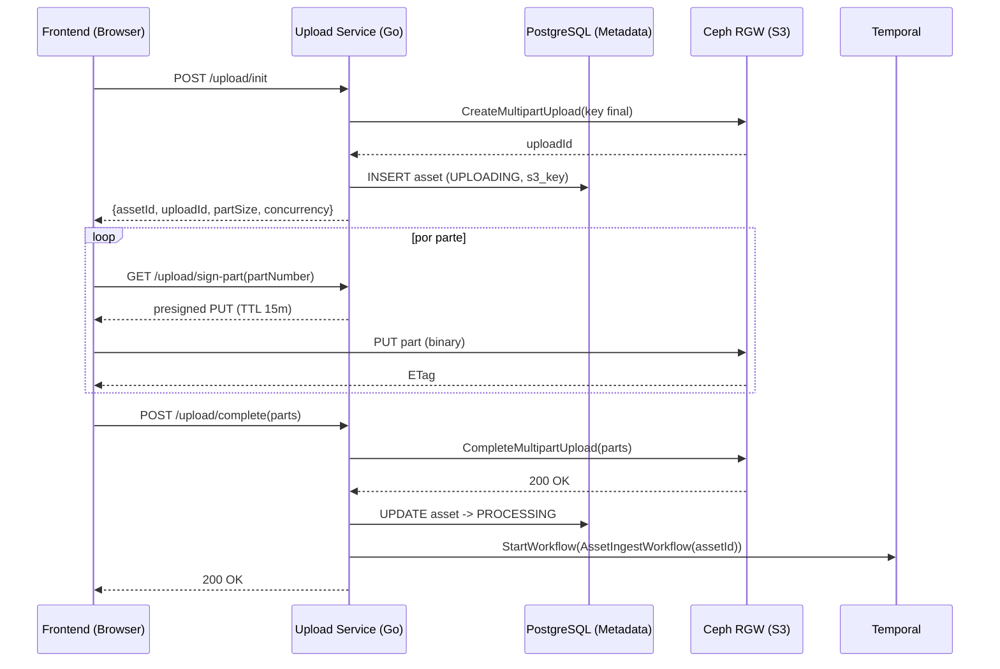
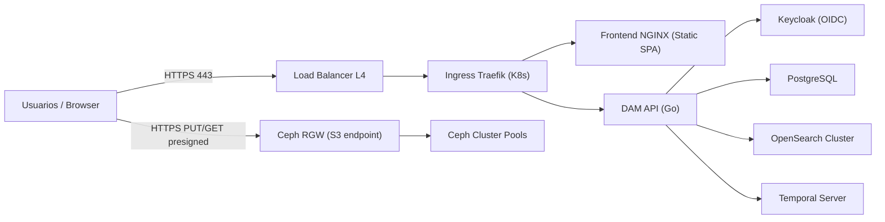

# 7. Arquitectura de Frontend y API (DAM)

> Alcance: esta sección especifica de forma **concreta** la arquitectura de **Frontend (SPA)**, **API/BFF**, y los **flujos críticos de usuario** (upload, búsqueda, previsualización, descarga segura y transcodificación on-demand), alineada con las restricciones de la cátedra: **software autogestionado** sobre infraestructura **IaaS** (sin servicios gestionados del proveedor cloud).

## 7.1. Objetivos y drivers

- **Escalabilidad**: soportar millones de activos y concurrencia editorial sin que el plano de control (API) se convierta en cuello de botella.
- **Performance**: minimizar latencia en exploración/búsqueda y maximizar throughput en subida/descarga de archivos grandes.
- **Seguridad**: control de acceso por roles, trazabilidad y URLs de transferencia temporales (least privilege).
- **Resiliencia**: operaciones largas asíncronas (transcoding/enriquecimiento) con reintentos, heartbeats y recuperación automática.
- **No vendor lock‑in**: todos los componentes se despliegan sobre VMs (IaaS) y Kubernetes; el object storage expone **API S3 compatible** (Ceph RGW).

## 7.2. Arquitectura de Frontend

### 7.2.1. Estilo

- **SPA (Single Page Application)**: interacción rica (búsqueda facetada, edición de metadatos, uploads masivos, reproducción HLS/DASH).
- **Entrega**: build estático servido por NGINX (contenedor) detrás del Ingress.

### 7.2.2. Stack concreto

- **Framework**: React + TypeScript.
- **Estado asíncrono / cache de server-state**: TanStack Query (`@tanstack/react-query`).
- **Upload resiliente**: Uppy con plugin `@uppy/aws-s3` (soporta multipart según tamaño y reintentos).
- **Reproducción**:
  - **Video**: Video.js (HLS vía VHS; DASH vía plugin si se requiere).
  - **Audio**: Wavesurfer.js (waveform y navegación por tiempo, opcional).
- **UI**: componente de tablas/facetas (ej. MUI / Chakra / AntD). (La elección no afecta arquitectura; se recomienda MUI por madurez y densidad de UI).

### 7.2.3. Responsabilidades del Frontend

- **Autenticación OIDC**: redirección a IdP (Keycloak) y manejo de tokens.
- **Uploads**: slicing en chunks, paralelismo controlado (3–6 partes), reintentos por parte, y reporte de progreso.
- **Exploración**: búsquedas por texto + filtros; paginación; cache local y revalidación.
- **Previsualización**: reproducción de proxies (HLS/DASH) y miniaturas; nunca descarga masters por defecto.

## 7.3. Arquitectura de API (Gateway + BFF + servicios)

### 7.3.1. API Gateway / Ingress

- **Tecnología**: Traefik (Ingress Controller) sobre Kubernetes.
- **Funciones**:
  - **Terminación TLS**.
  - **Routing** por path (`/api/*`, `/auth/*`, `/` para frontend).
  - **Rate limiting** y límites de tamaño en requests JSON (no aplica a uploads directos a S3).
  - **Observabilidad**: métricas y logs HTTP.

### 7.3.2. BFF (Backend for Frontend)

Se implementa un **BFF lógico** (DAM API) que expone un contrato estable a la SPA y encapsula:

- composición de respuestas (ej. resultados de búsqueda + estados del asset),
- autorización a nivel dominio (roles, proyectos, permisos),
- emisión de **Presigned URLs** para transferencia (PUT/GET),
- disparo y consulta de jobs (Temporal).

**Lenguaje**: Go (consistencia con workers y ecosistema de I/O/concurrencia).

### 7.3.3. Servicios backend (responsabilidades mínimas)

- **Auth/IdP**: Keycloak (self‑hosted) vía OIDC/OAuth2.
- **Metadata Service** (Go + PostgreSQL): fuente canónica del ciclo de vida y metadatos.
- **Upload Service** (Go): orquesta multipart S3 (init/part/complete/abort) y dispara workflows.
- **Search Service** (Go): traduce filtros a OpenSearch Query DSL y devuelve “read model”.
- **Jobs API** (Go): consulta estado de workflows/jobs y entrega enlaces de descarga cuando corresponde.

> Nota: pueden convivir en un único “DAM API” modular para reducir overhead operativo, manteniendo boundaries claros (paquetes internos y rutas). Arquitectónicamente se documentan como componentes separados.

## 7.4. Autenticación y autorización

- **IdP**: Keycloak.
- **Protocolo**: OIDC (Authorization Code + PKCE para SPA).
- **Tokens**:
  - Access Token JWT (TTL corto, p.ej. 5–15 min).
  - Refresh Token (almacenado de forma segura; recomendado: cookie httpOnly si se implementa BFF con sesión, o almacenamiento protegido si se mantiene 100% SPA).
- **Validación**:
  - En el gateway se valida firma/issuer/audience y se propaga identidad.
  - Los servicios aplican **RBAC/ABAC**: roles (editor, archivista, admin) + pertenencia a proyecto/carpeta.

## 7.5. Flujos críticos (implementación)

### 7.5.1. Ingesta masiva (Upload) – S3 Multipart + Presigned URLs (zero‑copy)

**Decisión**: el archivo se sube **directamente a la key final** en `dam-archive` (masters), sin staging `uploads/` que requiera `CopyObject`.

**Justificación técnica**:
- Minimiza I/O y evita reescrituras de objetos enormes.
- El objeto **no es visible** hasta `CompleteMultipartUpload`.
- La “promoción” se controla por estado en DB (UPLOADING→PROCESSING→READY).

**Convención de keys (inmutable y auditable)**:
- Master: `masters/{assetId}/{sha256}/source.{ext}`
- Proxies/thumbnails: `proxies/{assetId}/{sha256}/{profile}/...`
- Delivery (CDN origin): `delivery/{channel}/{assetId}/{sha256}/{profile}/...`

**API (contrato concreto)**:
- `POST /api/v1/assets/upload/init`
  - body: `{ filename, size_bytes, mime_type }`
  - resp: `{ assetId, uploadId, s3Key, partSizeBytes, maxConcurrency }`
- `GET /api/v1/assets/upload/sign-part?assetId=...&uploadId=...&partNumber=N`
  - resp: `{ url, headers? }`
- `POST /api/v1/assets/upload/complete`
  - body: `{ assetId, uploadId, parts: [{ partNumber, etag }] }`
- `POST /api/v1/assets/upload/abort`
  - body: `{ assetId, uploadId }`

**Secuencia (control + data plane)**:

**CORS**: se configura en RGW para permitir `PUT` desde el dominio del frontend hacia el endpoint S3.

### 7.5.2. Búsqueda y exploración (OpenSearch detrás del API)

- La SPA **no consulta OpenSearch directo**.
- El Search Service expone:
  - `GET /api/v1/search/assets?q=...&filters=...&page=...`
  - devuelve: `{ items: [...], facets: {...}, total }`

**Aclaración**: el sistema **no usa embeddings**; se indexa texto (editorial + STT/OCR + tags), con analizadores adecuados en español.

### 7.5.3. Previsualización (proxies) y miniaturas

- El frontend obtiene URLs de streaming/preview como **Presigned GET** (TTL 30–60 min) o, si hay CDN interna, mediante URL firmada/cookie firmada.
- Proxies residen en `dam-proxies` (HOT‑STORAGE en SSD), en HLS/DASH.

### 7.5.4. Descarga segura (masters y renditions)

**Decisión**: descargas se realizan con **Presigned GET** desde Ceph RGW (evita que la API streamee gigabytes).

- `POST /api/v1/assets/{assetId}/downloads`
  - body: `{ kind: "master" | "rendition", renditionProfile? }`
  - resp (si existe): `{ url, expiresAt }`

**Headers en la firma**:
- `Response-Content-Disposition: attachment; filename="..."`
- `Response-Content-Type` (si corresponde)

### 7.5.5. Renditions on-demand (Async Request‑Reply)

**Caso**: usuario pide un formato no existente (ej. ProRes).

- `POST /api/v1/assets/{assetId}/ondemand`
  - body: `{ profile: "prores-422-hq" }`
  - resp: `202 Accepted { jobId }`
- `GET /api/v1/jobs/{jobId}`
  - resp: `{ status: PENDING|RUNNING|READY|FAILED, progress?, downloadUrl? }`

**Orquestación**:
- Temporal workflow `OnDemandRenditionWorkflow(assetId, profile)`.
- Task Queue dedicada: **`q-transcode-interactive`** (prioriza interacciones sobre batch).

**Retención**:
- output se guarda en `dam-proxies` bajo `ondemand/{assetId}/{sha256}/{profile}/...`.
- lifecycle: expiración **48h** (limpieza automática).

## 7.6. Vista física (frontend + API)

**Notas de red**:
- Endpoint RGW accesible desde usuarios (o vía edge) para PUT/GET presignados.
- Tráfico pesado **no** ingresa al API.
- Para streaming, se habilitan **Range Requests** y CORS donde aplique.

## 7.7. Observabilidad y operación (mínimo indispensable)

- **Logs**: stdout + agregación (ej. Loki/EFK autogestionado).
- **Métricas**: Prometheus + Grafana.
- **Trazas**: OpenTelemetry (opcional, recomendado).
- **SLOs clave**:
  - latencia p95 de búsqueda,
  - tiempo p95 de emisión de presigned URLs,
  - backlog de colas Temporal (`q-transcode`, `q-transcode-interactive`),
  - errores 4xx/5xx en gateway,
  - tasa de abort de MPUs.

## 7.8. Referencias (documentación oficial)

- Ceph RGW S3 Object Ops / Multipart Upload: `https://docs.ceph.com/en/latest/radosgw/s3/objectops/`
- AWS S3 CompleteMultipartUpload (especificación API): `https://docs.aws.amazon.com/AmazonS3/latest/API/API_CompleteMultipartUpload.html`
- Temporal Retry Policies / Heartbeats: `https://docs.temporal.io/encyclopedia/retry-policies` y `https://docs.temporal.io/encyclopedia/detecting-activity-failures`
- KEDA Temporal scaler: `https://keda.sh/docs/2.18/scalers/temporal/`
- OpenSearch Aliases API: `https://docs.opensearch.org/latest/api-reference/alias/aliases-api/`
- Uppy AWS S3 plugin: `https://uppy.io/docs/aws-s3/`
- TanStack Query (React Query): `https://tanstack.com/query/latest`
- Video.js (guías/FAQ): `https://videojs.com/guides/faqs/`
