# 4. Arquitectura

## 4.1 Estilo Arquitectónico

La arquitectura propuesta para la plataforma DAM se basa en un estilo híbrido que combina **microservicios moderados**, **arquitectura orientada a eventos** (Event-Driven Architecture) y **CQRS parcial** (Command Query Responsibility Segregation). Esta combinación responde a las características específicas del dominio:

- **Operaciones interactivas** que requieren baja latencia (búsqueda, consulta de metadatos, navegación).
- **Procesos pesados y de larga duración** que deben ejecutarse de forma asíncrona (ingesta, transcodificación, análisis con IA, distribución).
- **Volumen masivo de datos** que crece continuamente y requiere escalabilidad horizontal.
- **Múltiples consumidores** de eventos que reaccionan a cambios en los activos.

### 4.1.1 Justificación del Estilo Elegido

La decisión de adoptar este estilo arquitectónico se fundamenta en los siguientes aspectos:

**Microservicios moderados**: A diferencia de una arquitectura de microservicios pura con alta granularidad, se opta por servicios de tamaño moderado que agrupan funcionalidades cohesivas. Esto reduce la complejidad operacional sin sacrificar los beneficios de desacoplamiento y escalabilidad independiente. Por ejemplo, el Asset Service agrupa operaciones CRUD de activos, gestión de estados y coordinación con almacenamiento, evitando la fragmentación excesiva.

**Event-Driven Architecture**: El patrón de eventos permite desacoplar temporalmente a los productores de los consumidores. Cuando un editor sube un archivo, el Asset Service no necesita esperar a que finalicen la transcodificación, el análisis de IA y la indexación. En cambio, emite un evento `AssetCreated` que es consumido de forma independiente por cada subsistema interesado. Este desacoplamiento es fundamental para:
- Mantener tiempos de respuesta predecibles en las operaciones interactivas.
- Permitir que los procesos pesados escalen independientemente.
- Facilitar la incorporación de nuevos consumidores sin modificar los productores.

**CQRS parcial**: Se aplica CQRS en el subsistema de búsqueda, separando el modelo de escritura (base de datos transaccional PostgreSQL) del modelo de lectura optimizado para consultas (índice OpenSearch). Esta separación permite:
- Optimizar el esquema de indexación para los patrones de búsqueda editorial.
- Escalar lecturas y escrituras de forma independiente.
- Utilizar tecnologías especializadas para cada caso de uso.

### 4.1.2 Patrones Arquitectónicos Complementarios

La arquitectura incorpora los siguientes patrones para garantizar los atributos de calidad requeridos:

| Patrón | Propósito | Aplicación en el DAM |
|--------|-----------|---------------------|
| API Gateway | Punto de entrada único, autenticación, rate limiting | Centraliza acceso desde UI y sistemas externos |
| Saga / Orquestación | Coordinación de transacciones distribuidas | Workflows de procesamiento (ingesta, distribución) |
| Outbox Pattern | Garantía de entrega de eventos | Publicación confiable de eventos desde servicios |
| Circuit Breaker | Tolerancia a fallos en integraciones | Conectores de distribución a canales externos |
| Retry con Backoff | Manejo de fallos transitorios | Workers de procesamiento, conectores |
| Dead Letter Queue | Manejo de mensajes fallidos | Cola para jobs que exceden reintentos |

## 4.2 Vista Lógica: Componentes del Sistema

La siguiente figura presenta la descomposición del sistema en sus componentes principales:

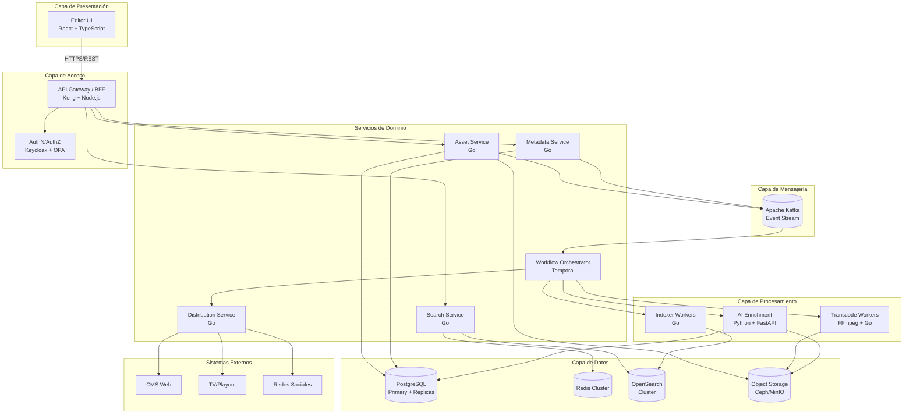

### 4.2.1 Detalle de Componentes

A continuación se describe cada componente, incluyendo la implementación elegida, justificación, opciones analizadas y debilidades identificadas.

---

#### 4.2.1.1 API Gateway / BFF

**Responsabilidad**: Punto de entrada único para todas las solicitudes externas. Gestiona autenticación, autorización preliminar, rate limiting, enrutamiento y agregación de respuestas para la UI.

**Implementación elegida**: Kong Gateway (open source) + Backend for Frontend (BFF) en Node.js/Express.

**Justificación**:
- Kong provee capacidades enterprise de API management sin vendor lock-in.
- El BFF permite optimizar las respuestas para las necesidades específicas de la UI editorial, reduciendo round-trips.
- Node.js es eficiente para operaciones I/O-bound como agregación de llamadas a servicios.

**Opciones analizadas**:

| Opción | Ventajas | Desventajas | Decisión |
|--------|----------|-------------|----------|
| Kong Gateway | Open source, plugins extensos, alta performance | Requiere configuración inicial | ✓ Elegido |
| Nginx + Lua | Muy ligero, alto rendimiento | Menos funcionalidades out-of-the-box | Descartado |
| Traefik | Integración nativa con containers | Menos maduro para enterprise | Descartado |
| AWS API Gateway | Managed, fácil setup | Vendor lock-in (IaaS restriction) | Descartado |

**Debilidades**:
- Kong requiere una base de datos PostgreSQL adicional para su configuración (modo tradicional) o sincronización entre nodos (modo DB-less).
- El BFF introduce un punto adicional de mantenimiento.

**Mitigación**: Se despliega Kong en modo DB-less con configuración declarativa en Git, simplificando operaciones.

---

#### 4.2.1.2 Servicio de Autenticación y Autorización

**Responsabilidad**: Gestionar identidades de usuarios, autenticación (AuthN), autorización (AuthZ) basada en roles y atributos, y auditoría de accesos.

**Implementación elegida**: Keycloak (Identity Provider) + Open Policy Agent (OPA) para políticas de autorización.

**Justificación**:
- Keycloak es el estándar de facto open source para Identity and Access Management (IAM).
- Soporta OIDC/OAuth2, SAML, federación con directorios corporativos (LDAP, Active Directory).
- OPA permite definir políticas de autorización complejas (ABAC) de forma declarativa, evaluando permisos por asset, carpeta o proyecto.

**Modelo de permisos propuesto**:

```
Usuario → Roles → Permisos sobre Recursos

Roles ejemplo:
- editor: lectura/escritura de assets en proyectos asignados
- producer: editor + publicación a canales
- admin: gestión completa + configuración de sistema
- viewer: solo lectura de assets publicados

Recursos:
- Asset (individual)
- Carpeta/Colección
- Proyecto
- Canal de distribución
```

**Opciones analizadas**:

| Opción | Ventajas | Desventajas | Decisión |
|--------|----------|-------------|----------|
| Keycloak + OPA | Open source, flexible, estándar | Complejidad de setup inicial | ✓ Elegido |
| Auth0 | SaaS, fácil integración | Vendor lock-in, costos variables | Descartado |
| Keycloak solo | Más simple | AuthZ limitado para ABAC complejo | Descartado |

**Debilidades**:
- Keycloak requiere recursos significativos (JVM-based).
- OPA agrega latencia en cada decisión de autorización.

**Mitigación**: 
- Caching de tokens JWT y decisiones de OPA en Redis.
- Despliegue de OPA como sidecar para minimizar latencia de red.

---

#### 4.2.1.3 Asset Service

**Responsabilidad**: Servicio central que gestiona el ciclo de vida de los activos digitales. Maneja creación, estados, ownership, referencias al almacenamiento, checksums de integridad y coordinación con el Object Storage.

**Implementación elegida**: Servicio en Go con arquitectura hexagonal.

**Justificación**:
- Go ofrece excelente performance, bajo consumo de memoria y compilación a binario único.
- La arquitectura hexagonal (puertos y adaptadores) facilita testing y cambio de implementaciones de infraestructura.
- Manejo eficiente de concurrencia mediante goroutines para operaciones de I/O con storage.

**Estados del Asset**:

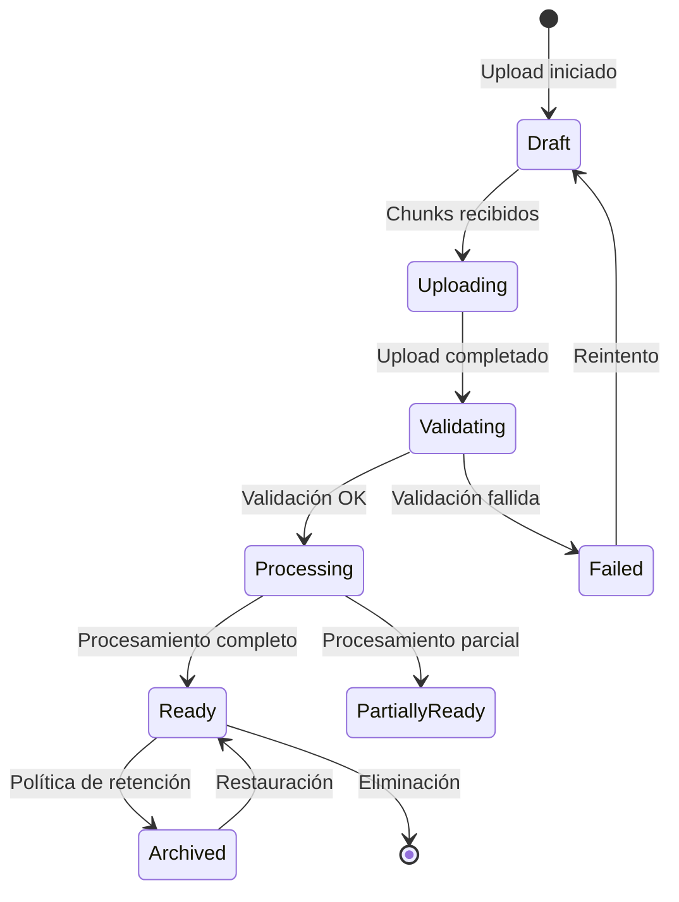

**Funcionalidades clave**:
- Upload resumable mediante protocolo tus (https://tus.io/).
- Validación de integridad mediante checksums SHA-256.
- Gestión de versiones de assets.
- Soft delete con período de retención configurable.

**Debilidades**:
- Punto central de coordinación que puede convertirse en cuello de botella.

**Mitigación**: Escalamiento horizontal stateless con load balancing. La base de datos PostgreSQL con connection pooling (PgBouncer) maneja la contención.

---

#### 4.2.1.4 Metadata Service

**Responsabilidad**: Gestionar metadatos descriptivos, técnicos y enriquecidos de los activos. Provee esquemas de metadatos configurables y validación.

**Implementación elegida**: Servicio en Go con esquemas JSON Schema para validación.

**Tipos de metadatos gestionados**:

| Tipo | Origen | Ejemplos |
|------|--------|----------|
| Técnico | Extracción automática | Codec, resolución, duración, bitrate, EXIF |
| Descriptivo | Ingreso manual | Título, descripción, tags, categoría, derechos |
| Enriquecido | Análisis IA | Labels, transcripción ASR, OCR, embeddings |
| Operacional | Sistema | Fecha creación, autor, estado, historial |

**Esquema extensible**: El servicio soporta esquemas de metadatos personalizados por tipo de asset o proyecto, permitiendo adaptar los campos requeridos según las necesidades editoriales.

---

#### 4.2.1.5 Object Storage

**Responsabilidad**: Almacenamiento persistente y durable de archivos binarios (masters y renditions). Debe garantizar durabilidad a largo plazo, disponibilidad y eficiencia en la recuperación.

**Implementación elegida**: Ceph Object Gateway (RGW) con erasure coding.

**Justificación**:
- Ceph es la solución de almacenamiento distribuido open source más robusta para escala enterprise.
- El Object Gateway expone una API S3-compatible, facilitando integración y evitando vendor lock-in.
- Erasure coding (configuración 8+3) provee durabilidad equivalente a 3 réplicas con ~37% menos espacio.
- Soporta tiering automático entre pools "hot" (SSD) y "cold" (HDD/archival).

**Opciones analizadas**:

| Opción | Ventajas | Desventajas | Decisión |
|--------|----------|-------------|----------|
| Ceph RGW | Escala masiva, erasure coding, maduro | Complejidad operacional alta | ✓ Elegido para escala PB |
| MinIO | Simple, rápido, S3-compatible | Menos features enterprise | Alternativa para escala menor |
| GlusterFS | Simple clustering | No optimizado para objetos | Descartado |
| AWS S3 | Managed, altamente durable | Vendor lock-in (IaaS restriction) | Descartado |

**Configuración propuesta**:

```yaml
# Ceph Pool Configuration
pool_hot:
  type: erasure
  profile: ec-8-3
  devices: nvme_ssd
  purpose: assets recientes, renditions de preview

pool_cold:
  type: erasure
  profile: ec-8-4
  devices: hdd_nearline
  purpose: masters archivados, assets >90 días sin acceso

lifecycle_policy:
  - transition:
      days_since_last_access: 90
      from_pool: hot
      to_pool: cold
```

**Organización de buckets**:
- `dam-masters`: Archivos originales, nunca modificados.
- `dam-renditions`: Derivados generados (previews, thumbnails, proxies).
- `dam-temp`: Uploads en progreso, limpieza automática.

**Debilidades**:
- Ceph requiere equipo especializado para operación.
- Overhead inicial de setup significativo.

**Mitigación**: 
- Documentación operacional detallada y runbooks.
- Contratación de soporte comercial (Red Hat Ceph Storage) si el presupuesto lo permite.
- Para despliegues iniciales o pruebas de concepto, MinIO como alternativa más simple.

---

#### 4.2.1.6 Message Broker

**Responsabilidad**: Comunicación asíncrona entre servicios, transporte de eventos de dominio y distribución de trabajos a workers.

**Implementación elegida**: Apache Kafka.

**Justificación**:
- Kafka provee un log de eventos durable y ordenado, fundamental para event sourcing parcial y auditoría.
- Permite múltiples consumidores independientes del mismo stream (fan-out).
- Capacidad de replay de eventos para reindexación o reprocesamiento.
- Throughput extremadamente alto (millones de mensajes/segundo).
- Retención configurable permite mantener historial de eventos.

**Topics principales**:

| Topic | Productores | Consumidores | Propósito |
|-------|-------------|--------------|-----------|
| `assets.created` | Asset Service | Workflow Orchestrator | Iniciar procesamiento |
| `assets.enriched` | AI Workers | Indexer | Actualizar índices |
| `assets.updated` | Asset/Metadata Service | Indexer, Distribution | Sincronizar cambios |
| `distribution.requested` | Workflow | Distribution Service | Iniciar publicación |
| `audit.events` | Todos los servicios | Audit Service | Trazabilidad |

**Opciones analizadas**:

| Opción | Ventajas | Desventajas | Decisión |
|--------|----------|-------------|----------|
| Apache Kafka | Durable, replay, alto throughput | Complejidad operacional | ✓ Elegido |
| RabbitMQ | Simple, flexible routing | Sin replay nativo, menos throughput | Descartado |
| Redis Streams | Muy simple, bajo overhead | Menos maduro, durabilidad limitada | Descartado |
| NATS JetStream | Ligero, fácil operación | Ecosistema más pequeño | Alternativa válida |

**Configuración de resiliencia**:
- Replication factor: 3 (cada mensaje en 3 brokers).
- Min in-sync replicas: 2 (garantiza durabilidad ante falla de 1 broker).
- Retención: 7 días para topics operacionales, 90 días para auditoría.

**Debilidades**:
- Curva de aprendizaje para el equipo.
- Requiere gestión de offsets y consumer groups.

**Mitigación**: Uso de frameworks como Sarama (Go) que abstraen complejidad. Monitoreo con Kafka UI y métricas en Prometheus.

---

#### 4.2.1.7 Workflow Orchestrator

**Responsabilidad**: Orquestar workflows de procesamiento de larga duración, garantizando ejecución completa, reintentos, manejo de timeouts y visibilidad del estado.

**Implementación elegida**: Temporal.io (self-hosted).

**Justificación**:
- Temporal es el estándar actual para orquestación de workflows durables.
- Garantiza exactly-once semantics para actividades.
- Manejo automático de reintentos con backoff configurable.
- Visibilidad completa del estado de cada workflow.
- Soporta versioning de workflows para actualizaciones sin interrumpir ejecuciones en curso.

**Workflows principales**:

```go
// Workflow de procesamiento de asset (pseudocódigo)
func AssetProcessingWorkflow(ctx workflow.Context, assetID string) error {
    // Fase 1: Validación
    err := workflow.ExecuteActivity(ctx, ValidateAsset, assetID).Get(ctx, nil)
    if err != nil {
        return err
    }
    
    // Fase 2: Procesamiento paralelo
    futures := []workflow.Future{
        workflow.ExecuteActivity(ctx, GenerateThumbnails, assetID),
        workflow.ExecuteActivity(ctx, GeneratePreview, assetID),
        workflow.ExecuteActivity(ctx, ExtractTechnicalMetadata, assetID),
    }
    
    // Esperar todas las actividades paralelas
    for _, f := range futures {
        if err := f.Get(ctx, nil); err != nil {
            // Continuar con procesamiento parcial
            workflow.GetLogger(ctx).Warn("Activity failed", "error", err)
        }
    }
    
    // Fase 3: Enriquecimiento IA (puede ser largo)
    err = workflow.ExecuteActivity(ctx, AIEnrichment, assetID,
        workflow.WithStartToCloseTimeout(30*time.Minute),
        workflow.WithRetryPolicy(&temporal.RetryPolicy{
            MaximumAttempts: 3,
        }),
    ).Get(ctx, nil)
    
    // Fase 4: Indexación
    err = workflow.ExecuteActivity(ctx, IndexAsset, assetID).Get(ctx, nil)
    
    return nil
}
```

**Opciones analizadas**:

| Opción | Ventajas | Desventajas | Decisión |
|--------|----------|-------------|----------|
| Temporal.io | Durable, visual, bien documentado | Requiere cluster dedicado | ✓ Elegido |
| Apache Airflow | Maduro, gran comunidad | Orientado a batch/ETL | Descartado |
| Jobs custom (DB+Cola) | Simple, menos componentes | Riesgo de edge cases, reinvención | Descartado |
| Cadence | Similar a Temporal | Menos activo (Temporal es fork mejorado) | Descartado |

**Debilidades**:
- Componente adicional que requiere operación (PostgreSQL + Elasticsearch propios de Temporal).
- Curva de aprendizaje del modelo de programación.

**Mitigación**: 
- Despliegue con Helm chart oficial en Kubernetes.
- Capacitación del equipo en el modelo de workflows durables.

---

#### 4.2.1.8 Transcode Workers

**Responsabilidad**: Generar renditions de video, audio e imagen en múltiples formatos, resoluciones y bitrates.

**Implementación elegida**: Pool de workers en Go que invocan FFmpeg para video/audio y libvips/ImageMagick para imágenes.

**Justificación**:
- FFmpeg es el estándar de la industria para procesamiento multimedia.
- libvips ofrece procesamiento de imágenes muy eficiente en memoria.
- Workers en Go permiten gestión eficiente de procesos externos y comunicación con Temporal.

**Renditions generadas por tipo de asset**:

| Tipo | Renditions |
|------|-----------|
| Video | Preview (720p H.264), Proxy (1080p), Thumbnail (JPG), Poster frame, Waveform audio |
| Audio | Preview (MP3 128kbps), Waveform visual (PNG), Transcripción (si ASR habilitado) |
| Imagen | Thumbnail (300px), Preview (1200px), WebP optimizado |

**Escalamiento**: Los workers son stateless y escalan horizontalmente según la cola de trabajos pendientes. Se utiliza Kubernetes Horizontal Pod Autoscaler basado en métricas de profundidad de cola.

---

#### 4.2.1.9 AI Enrichment Service

**Responsabilidad**: Extraer información semántica de los activos mediante modelos de inteligencia artificial.

**Implementación elegida**: Servicio en Python con FastAPI, ejecutando modelos localmente o delegando a servicios especializados.

**Capacidades de enriquecimiento**:

| Capacidad | Modelo/Herramienta | Output |
|-----------|-------------------|--------|
| Detección de objetos/escenas | YOLO v8 / CLIP | Labels, bounding boxes |
| OCR (texto en imágenes/video) | Tesseract / PaddleOCR | Texto extraído |
| ASR (speech-to-text) | Whisper (OpenAI, self-hosted) | Transcripción + timestamps |
| Embeddings semánticos | CLIP / Sentence Transformers | Vectores para búsqueda semántica |
| Detección de rostros | dlib / MTCNN | Coordenadas, opcionalmente identidad |

**Arquitectura del servicio**:

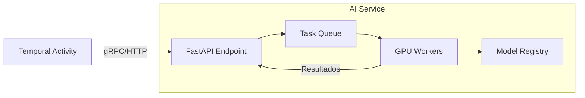

**Consideraciones de hardware**:
- Para volumen alto de procesamiento, se recomienda nodos con GPU (NVIDIA T4 o superior).
- Los modelos pueden ejecutarse en CPU con mayor latencia para volúmenes bajos.
- Uso de NVIDIA Triton Inference Server para optimizar serving de modelos en producción.

**Debilidades**:
- Modelos de IA pueden producir resultados incorrectos (false positives/negatives).
- Alto consumo de recursos (GPU/memoria).

**Mitigación**:
- Los resultados de IA se marcan como "sugeridos" para revisión editorial opcional.
- Queue management para evitar saturación de recursos GPU.

---

#### 4.2.1.10 Search Service

**Responsabilidad**: Proveer búsqueda rápida y relevante sobre el catálogo de activos, combinando búsqueda full-text, filtros estructurados y búsqueda semántica por vectores.

**Implementación elegida**: OpenSearch con plugin de vector search (k-NN).

**Justificación**:
- OpenSearch es el fork open source de Elasticsearch, sin riesgos de licenciamiento.
- Soporta nativamente búsqueda híbrida: BM25 (texto) + k-NN (vectores) + filtros.
- Agregaciones para facetas y analytics.
- Cluster escalable horizontalmente.

**Arquitectura del índice**:

```json
{
  "mappings": {
    "properties": {
      "asset_id": { "type": "keyword" },
      "title": { "type": "text", "analyzer": "spanish" },
      "description": { "type": "text", "analyzer": "spanish" },
      "tags": { "type": "keyword" },
      "transcript": { "type": "text" },
      "ocr_text": { "type": "text" },
      "ai_labels": { "type": "keyword" },
      "created_at": { "type": "date" },
      "file_type": { "type": "keyword" },
      "duration_seconds": { "type": "integer" },
      "project": { "type": "keyword" },
      "status": { "type": "keyword" },
      "embedding": {
        "type": "knn_vector",
        "dimension": 512,
        "method": {
          "name": "hnsw",
          "engine": "nmslib"
        }
      }
    }
  }
}
```

**Modos de búsqueda**:

1. **Búsqueda por texto**: Query match sobre título, descripción, tags, transcripción.
2. **Búsqueda por filtros**: Facetas por tipo, fecha, proyecto, estado, tags.
3. **Búsqueda semántica**: Query convertido a embedding, búsqueda k-NN sobre vectores.
4. **Búsqueda híbrida**: Combinación ponderada de BM25 + k-NN para mejores resultados.

**Debilidades**:
- Índice debe mantenerse sincronizado con la base de datos.
- Búsqueda semántica requiere generar embeddings para cada query.

**Mitigación**:
- Patrón de consistencia eventual aceptable para búsqueda.
- Cache de embeddings de queries frecuentes en Redis.

---

#### 4.2.1.11 Distribution Service

**Responsabilidad**: Automatizar la publicación de activos a múltiples canales de salida, adaptando formatos y respetando reglas de negocio.

**Implementación elegida**: Servicio en Go con arquitectura de plugins/conectores.

**Canales soportados**:

| Canal | Protocolo/API | Formato típico |
|-------|--------------|----------------|
| CMS Web | REST API | Imagen WebP, Video HLS |
| TV/Playout | MOS Protocol / FTP | Video MXF/ProRes |
| YouTube | YouTube Data API v3 | Video MP4 H.264 |
| Facebook/Instagram | Graph API | Video MP4, Imagen JPG |
| Twitter/X | Twitter API v2 | Video MP4, Imagen PNG |

**Flujo de distribución**:

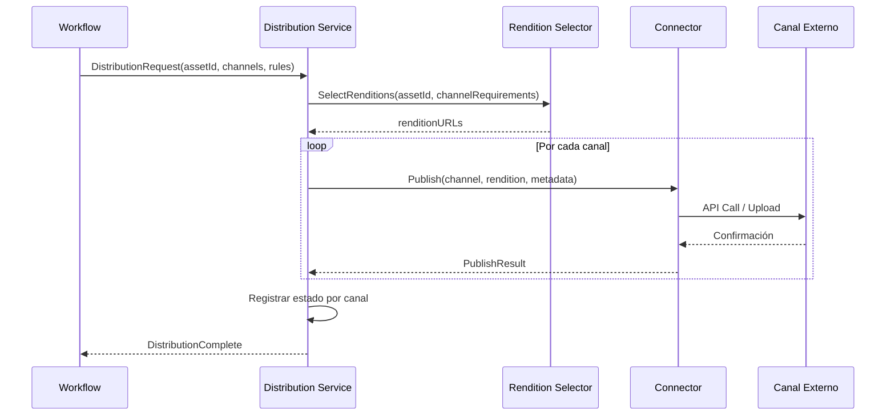

**Reglas de distribución**: El servicio soporta reglas configurables que determinan cuándo y cómo distribuir:
- Por tipo de asset (solo videos a TV, imágenes a redes).
- Por estado editorial (solo assets aprobados).
- Por metadata (tags específicos, proyectos).
- Por horario (embargo hasta fecha).

---

#### 4.2.1.12 Base de Datos Transaccional

**Responsabilidad**: Persistencia de datos estructurados: assets, metadatos, usuarios, permisos, workflows, configuración.

**Implementación elegida**: PostgreSQL 16 con configuración de alta disponibilidad.

**Justificación**:
- PostgreSQL es la base de datos relacional open source más robusta y completa.
- Soporte nativo de JSON para metadatos semi-estructurados.
- Extensiones útiles: pg_partman (particionado), pg_stat_statements (análisis de queries).
- Replicación streaming para alta disponibilidad.

**Esquema simplificado**:

```sql
-- Tabla principal de assets
CREATE TABLE assets (
    id UUID PRIMARY KEY DEFAULT gen_random_uuid(),
    title VARCHAR(500) NOT NULL,
    description TEXT,
    file_type VARCHAR(50) NOT NULL,
    status VARCHAR(50) NOT NULL DEFAULT 'draft',
    storage_path VARCHAR(1000) NOT NULL,
    checksum_sha256 CHAR(64),
    file_size_bytes BIGINT,
    owner_id UUID REFERENCES users(id),
    project_id UUID REFERENCES projects(id),
    created_at TIMESTAMPTZ DEFAULT NOW(),
    updated_at TIMESTAMPTZ DEFAULT NOW(),
    deleted_at TIMESTAMPTZ
) PARTITION BY RANGE (created_at);

-- Particiones por año
CREATE TABLE assets_2024 PARTITION OF assets
    FOR VALUES FROM ('2024-01-01') TO ('2025-01-01');
CREATE TABLE assets_2025 PARTITION OF assets
    FOR VALUES FROM ('2025-01-01') TO ('2026-01-01');

-- Metadatos como JSONB para flexibilidad
CREATE TABLE asset_metadata (
    asset_id UUID REFERENCES assets(id) ON DELETE CASCADE,
    metadata_type VARCHAR(50), -- technical, descriptive, ai_enriched
    data JSONB NOT NULL,
    PRIMARY KEY (asset_id, metadata_type)
);

-- Renditions
CREATE TABLE renditions (
    id UUID PRIMARY KEY DEFAULT gen_random_uuid(),
    asset_id UUID REFERENCES assets(id) ON DELETE CASCADE,
    rendition_type VARCHAR(50) NOT NULL,
    storage_path VARCHAR(1000) NOT NULL,
    format VARCHAR(50),
    resolution VARCHAR(20),
    file_size_bytes BIGINT,
    created_at TIMESTAMPTZ DEFAULT NOW()
);
```

**Alta disponibilidad**:
- Primary + 2 Replicas síncronas en distintas zonas de disponibilidad.
- PgBouncer para connection pooling.
- Patroni para failover automático.

**Opciones analizadas**:

| Opción | Ventajas | Desventajas | Decisión |
|--------|----------|-------------|----------|
| PostgreSQL | Robusto, maduro, JSONB, extensiones | Escalamiento horizontal complejo | ✓ Elegido |
| CockroachDB | SQL distribuido, escala horizontal | Más complejo, menos herramientas | Alternativa futura |
| MySQL | Popular, simple | Menos features que PostgreSQL | Descartado |
| MongoDB | Flexible, escala horizontal | Consistencia eventual, vendor concerns | Descartado |

---

#### 4.2.1.13 Cache Layer

**Responsabilidad**: Acelerar accesos frecuentes, almacenar sesiones, cachear resultados de queries costosos y decisiones de autorización.

**Implementación elegida**: Redis Cluster.

**Casos de uso**:
- Cache de sesiones JWT decodificadas.
- Cache de decisiones de autorización OPA.
- Cache de queries de búsqueda frecuentes.
- Cache de metadatos de assets populares.
- Rate limiting counters.

**Configuración**: Cluster de 6 nodos (3 masters + 3 replicas) con Redis Sentinel para alta disponibilidad.

---

## 4.3 Resolución de Atributos de Calidad

La siguiente tabla resume cómo la arquitectura propuesta resuelve cada atributo de calidad requerido:

| Atributo | Mecanismos Arquitectónicos | Componentes Involucrados |
|----------|---------------------------|-------------------------|
| **Disponibilidad** | Clusters replicados, failover automático, servicios stateless, health checks | PostgreSQL (Patroni), Kafka (replication), OpenSearch (cluster), Kubernetes (self-healing) |
| **Interoperabilidad** | APIs REST estándar, S3-compatible, conectores por canal, formatos abiertos | API Gateway, Distribution Service, Object Storage |
| **Performance** | Índices optimizados, caching multinivel, procesamiento asíncrono, CDN para delivery | OpenSearch, Redis, Kafka, Object Storage tiering |
| **Confiabilidad** | Workflows durables, reintentos con backoff, DLQ, checksums, idempotencia | Temporal, Kafka, Asset Service |
| **Escalabilidad** | Componentes horizontalmente escalables, storage distribuido, sharding | Workers (HPA), Ceph, OpenSearch, Kafka partitions |
| **Seguridad** | RBAC/ABAC, TLS everywhere, cifrado en reposo, URLs prefirmadas, auditoría | Keycloak, OPA, Object Storage encryption |
| **Tolerancia a fallos** | Circuit breakers, graceful degradation, aislamiento de fallas, retry patterns | Distribution Service, Workers, API Gateway |

---

## 4.4 Puntos Críticos del Sistema

### 4.4.1 Ingesta de Archivos Grandes

**Desafío**: Los archivos de video pueden alcanzar varios GB. Una carga interrumpida representa pérdida de tiempo y ancho de banda significativos.

**Solución**: Protocolo de upload resumable basado en tus (https://tus.io/).

**Flujo detallado**:

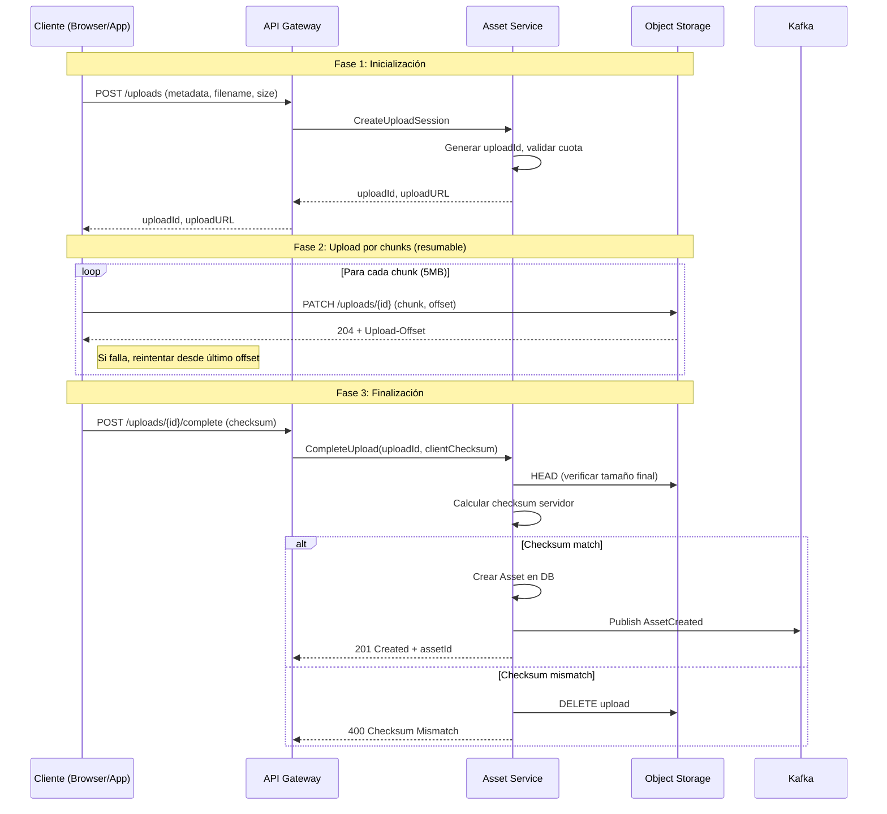

**Características clave**:
- Chunks de 5MB para balance entre overhead y recuperabilidad.
- El cliente puede consultar el offset actual y resumir desde ese punto.
- Verificación de integridad end-to-end mediante SHA-256.
- Limpieza automática de uploads abandonados (TTL 24h).

---

### 4.4.2 Recuperación Eficiente de Archivos Grandes

**Desafío**: Entregar archivos de varios GB a editores de forma rápida y eficiente, sin sobrecargar los servicios core.

**Solución**: URLs prefirmadas + HTTP Range requests + tiering de storage.

**Arquitectura de entrega**:

```mermaid
flowchart LR
    subgraph Cliente
        EDITOR[Editor Browser/App]
    end

    subgraph DAM Platform
        API[Asset Service]
        CACHE[(Redis: URL Cache)]
    end

    subgraph Storage
        HOT[(Hot Storage: SSD)]
        COLD[(Cold Storage: HDD)]
    end

    EDITOR -->|1. GET /assets/{id}/download| API
    API -->|2. Check permisos| API
    API -->|3. Lookup/Generate presigned URL| CACHE
    API -->|4. Presigned URL| EDITOR
    EDITOR -->|5. GET con Range headers| HOT
    HOT -->|6. Streaming response| EDITOR

    Note right of COLD: Assets >90 días sin acceso<br/>Restore on-demand (minutos)
```

**Mecanismos de optimización**:

1. **URLs prefirmadas**: El Asset Service genera URLs temporales (15min TTL) firmadas criptográficamente que permiten acceso directo al Object Storage, evitando que el tráfico de descarga pase por la aplicación.

2. **HTTP Range Requests**: El Object Storage soporta range requests, permitiendo:
   - Descarga paralela de múltiples rangos.
   - Resumir descargas interrumpidas.
   - Streaming sin descargar archivo completo.

3. **Tiering de storage**:
   - **Hot tier (SSD)**: Assets recientes y frecuentemente accedidos.
   - **Cold tier (HDD)**: Assets antiguos, acceso poco frecuente.
   - Restore automático de cold a hot ante acceso (latencia adicional de minutos).

4. **Previews y proxies**: Para navegación y edición, los editores usan renditions de preview (720p) en lugar del master, reduciendo transferencia de datos.

---

### 4.4.3 Búsqueda Rápida con Millones de Assets

**Desafío**: Proveer resultados de búsqueda en menos de 500ms sobre un índice de millones de documentos, combinando texto, filtros y semántica.

**Solución**: OpenSearch optimizado con búsqueda híbrida.

**Arquitectura de búsqueda**:

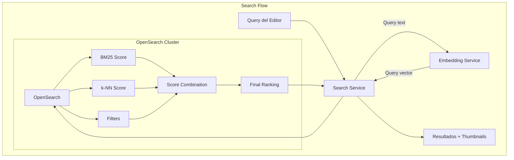

**Estrategia de búsqueda híbrida**:

```json
{
  "query": {
    "hybrid": {
      "queries": [
        {
          "multi_match": {
            "query": "protesta plaza mayo",
            "fields": ["title^3", "description^2", "tags^2", "transcript", "ocr_text"],
            "type": "best_fields"
          }
        },
        {
          "knn": {
            "embedding": {
              "vector": [0.1, 0.2, ...],
              "k": 100
            }
          }
        }
      ]
    }
  },
  "post_filter": {
    "bool": {
      "must": [
        { "term": { "status": "ready" } },
        { "range": { "created_at": { "gte": "2024-01-01" } } }
      ]
    }
  }
}
```

**Optimizaciones implementadas**:

1. **Índices dedicados por tipo**: Separar video, audio, imagen permite optimizar mappings.
2. **Caching de queries**: Queries frecuentes cacheados en Redis (TTL 5min).
3. **Pagination eficiente**: search_after en lugar de from/size para deep pagination.
4. **Filtros post-query**: Filtros aplicados después del scoring para no afectar relevancia.

---

### 4.4.4 Procesamiento Asíncrono Confiable

**Desafío**: Garantizar que todos los jobs de procesamiento (transcodificación, IA, indexación) se completen exitosamente, incluso ante fallas.

**Solución**: Orquestación con Temporal + patrones de confiabilidad.

**Patrones implementados**:

1. **Idempotencia**: Cada actividad puede re-ejecutarse sin efectos secundarios duplicados.
   ```go
   func GenerateThumbnail(ctx context.Context, assetID string) error {
       // Verificar si ya existe
       if thumbnailExists(assetID) {
           return nil // Idempotente: no regenerar
       }
       // Generar thumbnail...
   }
   ```

2. **Retry con backoff exponencial**:
   ```go
   retryPolicy := &temporal.RetryPolicy{
       InitialInterval:    time.Second,
       BackoffCoefficient: 2.0,
       MaximumInterval:    time.Minute * 5,
       MaximumAttempts:    5,
   }
   ```

3. **Dead Letter Queue**: Jobs que exceden reintentos van a DLQ para análisis manual.

4. **Compensación**: Workflows soportan rollback parcial si una fase crítica falla.

5. **Heartbeats**: Actividades de larga duración reportan progreso para detectar workers muertos.

---

### 4.4.5 Distribución Multicanal Automatizada

**Desafío**: Publicar contenido a múltiples canales con diferentes formatos, APIs y requisitos, manejando fallas parciales.

**Solución**: Arquitectura de conectores con circuit breaker y retry independiente por canal.

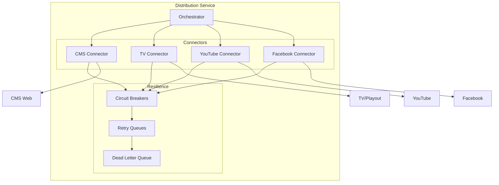

**Características**:
- Cada canal tiene su propio circuit breaker: si un canal falla repetidamente, se abre el circuit y no se intentan más publicaciones hasta recuperación.
- Fallas en un canal no afectan a otros.
- Estado de publicación trackeado por asset y canal.
- Reintentos automáticos con notificación al editor si fallan definitivamente.

---

## 4.5 Vista Física del Sistema

### 4.5.1 Diagrama de Despliegue

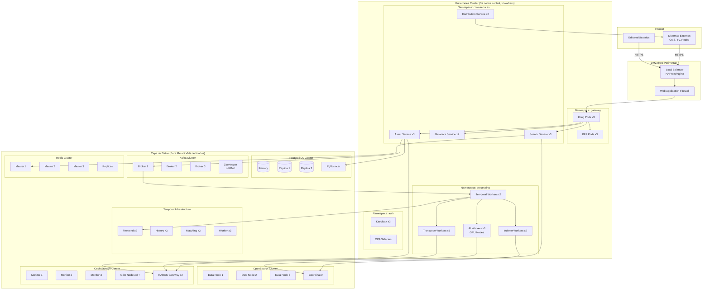

### 4.5.2 Especificación de Infraestructura

#### Kubernetes Cluster

| Componente | Cantidad | Especificación | Propósito |
|------------|----------|----------------|-----------|
| Control Plane | 3 | 4 vCPU, 8GB RAM, 100GB SSD | Alta disponibilidad del cluster |
| Worker Nodes (General) | 6+ | 8 vCPU, 32GB RAM, 200GB SSD | Servicios core |
| Worker Nodes (GPU) | 2-4 | 8 vCPU, 64GB RAM, NVIDIA T4/A10 | AI Enrichment |

#### Capa de Datos

| Componente | Cantidad | Especificación | Storage |
|------------|----------|----------------|---------|
| PostgreSQL | 3 | 16 vCPU, 64GB RAM | 2TB NVMe SSD |
| Kafka Brokers | 3 | 8 vCPU, 32GB RAM | 1TB SSD |
| OpenSearch Data | 3 | 16 vCPU, 64GB RAM | 2TB NVMe SSD |
| Redis | 6 | 4 vCPU, 16GB RAM | 100GB SSD |
| Ceph OSD | 6+ | 8 vCPU, 32GB RAM | 4x 10TB HDD + 1x 400GB NVMe |
| Ceph Monitor | 3 | 4 vCPU, 8GB RAM | 100GB SSD |
| Temporal | 7 | 4-8 vCPU, 16-32GB RAM | 500GB SSD |

#### Red

| Conexión | Protocolo | Puerto | Cifrado |
|----------|-----------|--------|---------|
| Clientes → Load Balancer | HTTPS | 443 | TLS 1.3 |
| Load Balancer → Kong | HTTP/2 | 8000 | mTLS opcional |
| Servicios → PostgreSQL | TCP | 5432 | TLS |
| Servicios → Kafka | TCP | 9092 | SASL_SSL |
| Servicios → OpenSearch | HTTPS | 9200 | TLS |
| Servicios → Ceph RGW | HTTPS | 443 | TLS |
| Servicios → Redis | TCP | 6379 | TLS |

### 4.5.3 Modelo de Escalamiento

```
┌─────────────────────────────────────────────────────────────────────────┐
│                         ESCALAMIENTO HORIZONTAL                         │
├─────────────────────────────────────────────────────────────────────────┤
│  Componente          │ Trigger                    │ Acción              │
├─────────────────────────────────────────────────────────────────────────┤
│  API Services        │ CPU > 70% o RPS > umbral   │ +1 pod (max 10)     │
│  Transcode Workers   │ Queue depth > 100          │ +1 pod (max 20)     │
│  AI Workers          │ Queue depth > 50           │ +1 pod (max 10)     │
│  Search Replicas     │ QPS > 1000 por nodo        │ +1 replica          │
│  Ceph OSDs           │ Capacidad > 70%            │ +2 OSDs             │
│  Kafka Partitions    │ Throughput > 80%           │ Repartition         │
└─────────────────────────────────────────────────────────────────────────┘
```

### 4.5.4 Estrategia de Disaster Recovery

**RPO (Recovery Point Objective)**: 1 hora para datos transaccionales, 24 horas para assets.

**RTO (Recovery Time Objective)**: 4 horas para servicio completo.

**Mecanismos**:

1. **PostgreSQL**: Streaming replication a sitio secundario + WAL archiving a Object Storage.
2. **Kafka**: MirrorMaker 2 para replicación cross-datacenter.
3. **Ceph**: Replicación asíncrona RBD a cluster secundario.
4. **OpenSearch**: Snapshots diarios a Object Storage.

---

## 4.6 Vista de Procesos: Flujos Principales

### 4.6.1 Flujo Completo de Ingesta

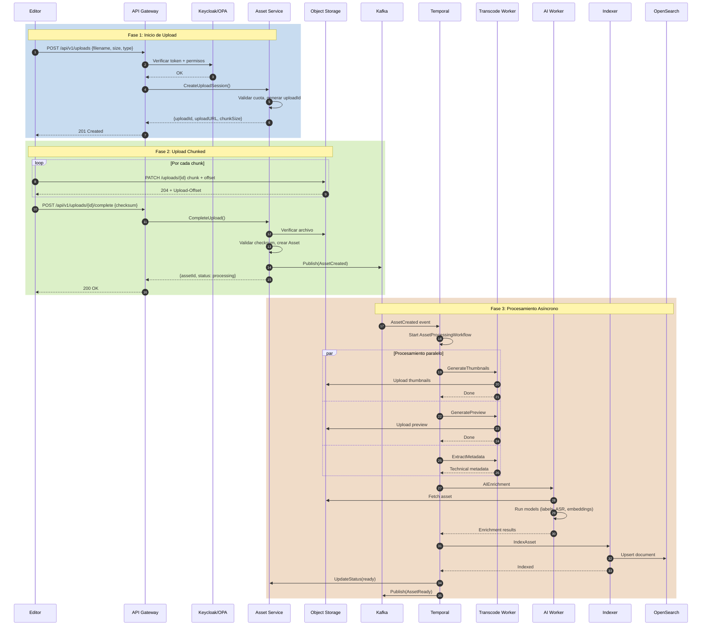

### 4.6.2 Flujo de Búsqueda

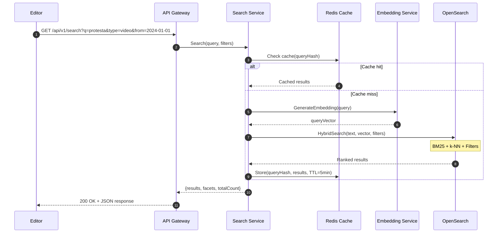

### 4.6.3 Flujo de Distribución

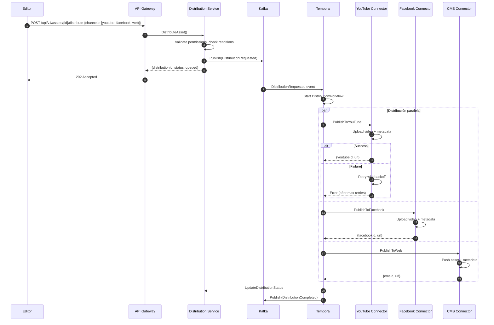

